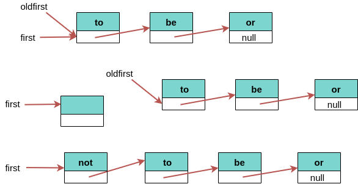
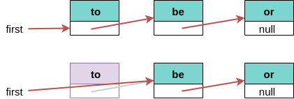
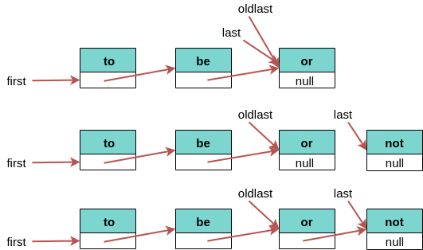

# 第 1 章 基础

**算法**是有限、确定、有效的并适合用计算机实现的解决问题的方法。
**数据结构**是便于算法操作的组织数据的方法。

## 1.1 基础编程模型

### 1.1.1 Java 程序的基本结构

Java 基础语法

-   原始数据类型

    精确地定义整数、浮点数和布尔值等，包括取值范围和能够对相应的值进行的操作。

-   数组

    多个同种数据类型的值的集合。

-   静态方法

    可以封装并重用代码，可以用独立的模块开发程序。

-   字符串
    一连串的字符，Java 内置了一些操作。
-   标准输入/输出
-   数据抽象
    数据抽象封装和重用代码

### 1.1.2 原始数据类型与表达式

数据类型就是一组数据和对其所能进行的操作的集合。

1. 表达式

    表达式的目的就是计算某种数据类型的值。

2. 类型转换

    如果不损失信息，数值会自动被提升为高级的数据类型。

3. 比较
4. 其他原始类型

### 1.1.3 语句

1. 声明语句

    声明语句将一个变量名和一个类型在编译时关联起来。

    变量可以声明在第一次使用之前的任何地方。

2. 赋值语句

    赋值语句将某个数据类型的值和一个变量关联起来。

3. 条件语句
4. 循环语句
5. break 和 continue 语句

    - break：立即从循环中退出
    - continue：立即开始下一轮循环

### 1.1.4 简便记法

1. 声明并初始化
2. 隐式赋值
3. 单语句代码段
4. for 语句

### 1.1.5 数组

数组能够顺序存储相同类型的多个数据。

1. 创建并初始化数组

    - 声明数组的名字和类型
    - 创建数组
    - 初始化数组元素

2. 简化语法
3. 使用数组
4. 起别名

    如果将一个数组变量赋予另一个变量，两个变量将会指向同一个数组。

5. 二维数组

    二维数组就是一维数组的数组。

### 1.1.6 静态方法

方法封装了一系列语句所描述的运算。

1. 静态方法
2. 调用静态方法
3. 方法的性质
    - 方法的参数按值传递
    - 方法名可以被重载
    - 方法只能返回一个值，但可以包含多个返回语句
    - 方法可以产生副作用
4. 递归

    - 递归总有一个最简单的情况
    - 递归调用问题去尝试解决一个规模更小的子问题
    - 递归调用的父问题和尝试解决的子问题之间不应该有交集

5. 基础编程模型
6. 模块化编程
7. 单元测试

    Java 编程的最佳实践之一就是每个静态方法库中都包含一个 main()方法来测试库中的所有方法。

8. 外部库

### 1.1.7 API

1. Java 库

    API 的目的是将调用和实现分离：除了 API 中给出的信息，调用者不需要知道实现的其他细节，而实现也不应考虑特殊的应用场景。

### 1.1.8 字符串

1. 字符串拼接
2. 类型转换

    - 将用户从键盘输入的内容转换成相应数据类型的值
    - 将各种数据类型的值转换成能够在屏幕上显示的内容

3. 自动转换
4. 命令行参数

### 1.1.9 输入输出

标准输入、输出和绘图库的作用是建立一个 Java 程序和外界交流的简易模型。

1. 命令和参数

2. 标准输出

3. 格式化输出

    格式字符串中的转换代码和对应参数的数据类型必须匹配。

4. 标准输入

5. 重定向与管道

6. 基于文件的输入输出

7. 标准绘图库（基本方法）

8. 标准绘图库（控制方法）

### 1.1.10 二分查找

1. 二分查找
2. 开发用例

3. 白名单过滤
4. 性能

### 1.1.11 展望

## 1.2 数据抽象

数据类型是指一组值和一组对这些值的操作的集合。

抽象数据类型是一种能够对使用者隐藏数据表示的数据类型。

### 1.2.1 使用抽象数据类型

1. 抽象数据类型的 API
2. 继承的方法
3. 用例代码
4. 对象

    对象是能够承载数据类型的值的实体。所有对象都有三大重要特性：状态、标识和行为。

5. 创建对象

    每种数据类型中的值都存储于一个对象中。

    每当调用了 new()，系统都会：

    - 为新的对象分配内存空间
    - 调用构造函数初始化对象中的值
    - 返回该对象的一个引用

6. 调用实例方法

    方法的每次触发都是和一个对象相关的。

    静态方法调用的开头是类名，非静态方法调用的开头是对象名。

7. 使用对象
8. 赋值语句
9. 将对象作为参数

    可以将对象作为参数传递给方法。

10. 将对象作为返回值
11. 数组也是对象

    Java 中所有非原始类型的值都是对象。

12. 对象的数组

### 1.2.2 抽象数据类型举例

1. 几何对象
2. 信息处理

    无数应用的核心都是组织和处理信息，抽象数据类型是组织信息的一种自然方式。

3. 字符串
4. 再谈输入输出

### 1.2.3 抽象数据类型的实现

一个数据类型的定义中可能含有多个构造函数，也可能含有静态方法，特别是单元测试用例 main()，通常在调度和测试中很实用。

1. 实例变量

2. 构造函数

    每个 Java 类都至少含有一个构造函数以创建一个对象的标识。

    一般来说，构造函数的作用是初始化实例变量。每个构造函数都将创建一个对象并向调用者返回一个该对象的引用。

3. 作用域

    - 参数变量：方法签名中定义，在方法被调用时参数变量会被初始化为调用者提供的值，作用域为整个方法。
    - 局部变量：声明和初始化都在方法的主体中，作用域是当前代码段它的定义之后的所有语句。
    - 实例变量：保存对象的数据类型值，作用域是整个类。

### 1.2.4 更多抽象数据类型的实现

1. 日期

2. 维护多个实现

3. 累加器

4. 可视化的累加器

### 1.2.5 数据类型的设计

抽象数据类型是一种向用例隐藏内部表示的数据类型。

1. 封装

    一个封装的数据类型可以被任意用例使用。

2. 设计 API

3. 算法与抽象数据类型

    数据抽象能够提供一个框架，在其中准确地说明一个算法的目的以及其他程序应该如何使用该算法。

4. 接口继承

5. 实现继承

    继承的主要思想是定义一个新类来继承另一个类的所有实例方法和实例变量。子类包含的方法比父类多，并且可以重写父类的方法。

6. 字符串的表示习惯

7. 封装类型

8. 等价性

    - a == b, 检测的是 a 和 b 的引用是否相同
    - a.equals(b), 检查数据类型的值

9. 内存管理

10. 不可变性

11. 契约式设计

12. 异常与错误

13. 断言

## 1.3 背包、队列和栈

数据类型的值就是一组对象的集合，所有操作都是关于添加、删除或是访问集合中的对象。

### 1.3.1 API

**背包**

|             |                                       |                  |
| ----------: | :------------------------------------ | :--------------- |
| publc class | **Bag\<Item\>** implements Iterable<> |                  |
|             | Bag()                                 | 创建一个空背包   |
|        void | add(Item item)                        | 添加一个元素     |
|     boolean | isEmpty()                             | 背包是否为空     |
|         int | size()                                | 背包中的元素数量 |

**队列**

|              |                                         |                    |
| -----------: | :-------------------------------------- | :----------------- |
| public class | **Queue\<Item\>** implements Iterable<> |                    |
|              | Queue()                                 | 创建空队列         |
|         void | enqueue(Item item)                      | 添加一个元素       |
|         Item | dequeue()                               | 删除最早添加的元素 |
|      boolean | isEmpty()                               | 队列是否为空       |
|          int | size()                                  | 队列中的元素数量   |

**栈**

|              |                                         |                    |
| -----------: | :-------------------------------------- | :----------------- |
| public class | **Stack\<Item\>** implements Iterable<> |                    |
|              | Stack()                                 | 创建一个空栈       |
|         void | push(Item item)                         | 添加一个元素       |
|         Item | pop()                                   | 删除最近添加的元素 |
|      boolean | isEmpty()                               | 栈是否为空         |
|          int | size()                                  | 栈中的元素数量     |

1. 泛型

2. 自动装箱

    - 自动装箱：自动将一个原始数据类型转换为一个封装类型
    - 自动拆箱：自动将一个封装类型转换为一个原始数据类型

3. 可迭代的集合类型

4. 背包

    背包是一种**不支持从中删除元素**的集合数据类型，它的目的就是帮助用例收集元素并迭代遍历所有收集到的元素。

5. 先进先出队列

    队列是一种基于**先进先出（FIFO）**策略的集合类型。

    在应用程序中使用队列的主要原因是在用集合保存元素的同时保存它们的**相对顺序**。

6. 下压栈

    下压栈是一种基于**后进先出（LIFO）**策略的集合类型。

    在应用程序中使用栈迭代器的一个典型原因是在用集合保存元素的同时**颠倒**它们的相对顺序。

7. 算术表达式求值

### 1.3.2 集合类数据类型的实现

1. 定容栈

    |              |                                     |                           |
    | -----------: | :---------------------------------- | :------------------------ |
    | public class | **FixedCapacityStackOfStrings**     |                           |
    |              | FixedCapacityStackOfString(int cap) | 创建一个容量为 cap 的空栈 |
    |         void | push(String item)                   | 添加一个字符串            |
    |       String | pop()                               | 删除最近添加的字符串      |
    |      boolean | isEmpty()                           | 栈是否为空                |
    |          int | size()                              | 栈中的字符串数量          |

2. 泛型

    |              |                                |                           |
    | -----------: | :----------------------------- | :------------------------ |
    | public class | **FixedCapacityStack\<Item\>** |                           |
    |              | FixedCapacityStack(int cap)    | 创建一个容量为 cap 的空栈 |
    |         void | push(Item item)                | 添加一个字符串            |
    |         Item | pop()                          | 删除最近添加的字符串      |
    |      boolean | isEmpty()                      | 栈是否为空                |
    |          int | size()                         | 栈中的字符串数量          |

3. 调整数组大小

    ```java
    private void resize(int max) {
        Item[] temp = (Item[]) new Object();
        for (int i = 0; i < N; i++) {
            temp[i] = a[i];
        }
        a = temp;
    }
    ```

4. 对象游离

    Java 垃圾收集策略是回收所有无法被访问的对象的内存。

5. 迭代

    任意可迭代的数据类型中需要实现：

    - 集合数据类型必须实现一个 iterator()方法并返回一个 Iterator 对象
    - Iterator 类必须包含两个方法：hasNext()和 next()

### 1.3.3 链表

链表是一个递归的数据结构，它或者为空（null），或者指向一个结点的引用，该结点含有一个泛型的元素和一个指向另一条链表的引用。

**结点**是一个可能含有任意类型数据的抽象实体。

1. 结点记录

    ```java
    private class Node {
        Item item;
        Node next;
    }
    ```

2. 构造链表

    **链表表示的是一列元素。**

3. 在表头插入结点

    

4. 从表头删除结点

    

5. 在表尾插入结点

    

6. 其他位置的插入和删除操作

7. 遍历

    ```java
    for (Node x = first; x != null; x = x.next) {
        statements;
    }
    ```

8. 栈的实现

    **算法和数据结构是相辅相成的。**

9. 队列的实现

    **链表是数组的一种重要替代方式。**

10. 背包的实现

### 1.3.4 综述

有两种表示对象集合的方式，即数组和链表，称为顺序存储和链式存储。

在研究一个新的应用领域时，我们将会按照以下步骤识别目标并使用数据抽象解决问题：

-   定义 API - 根据特定的应用场景开发用例代码
-   描述一种数据结构，并在 API 所对应的抽象数据类型的实现中根据它定义类的实例变量
-   描述算法，并根据它实现类中的实例方法
-   分析算法的性能特点

## 1.4 算法分析

### 1.4.1 科学方法

-   细致地观察真实世界的特点，通常还要有精确的测量
-   根据观察结果提出假设模型
-   根据模型预测未来的事件
-   继续观察并核实预测的准确性
-   如此反复直到确认预测和观察一致

科学方法的关键原则：

-   设计的实验必须是可重现的
-   假设必须是可证伪的

### 1.4.2 观察

1. 举例

2. 计时器

