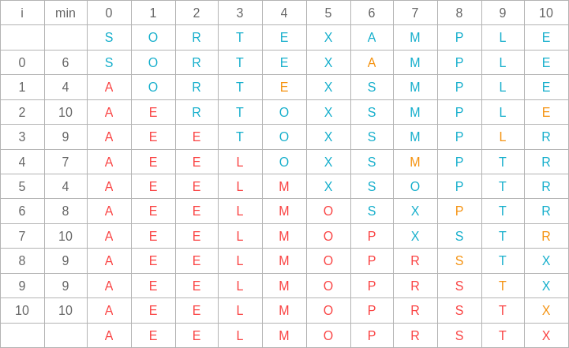
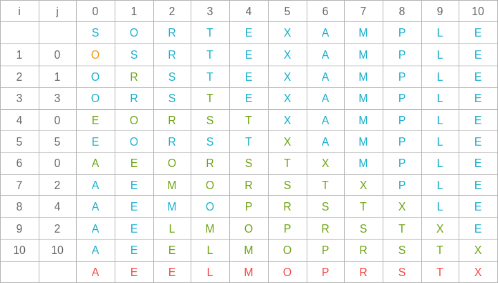
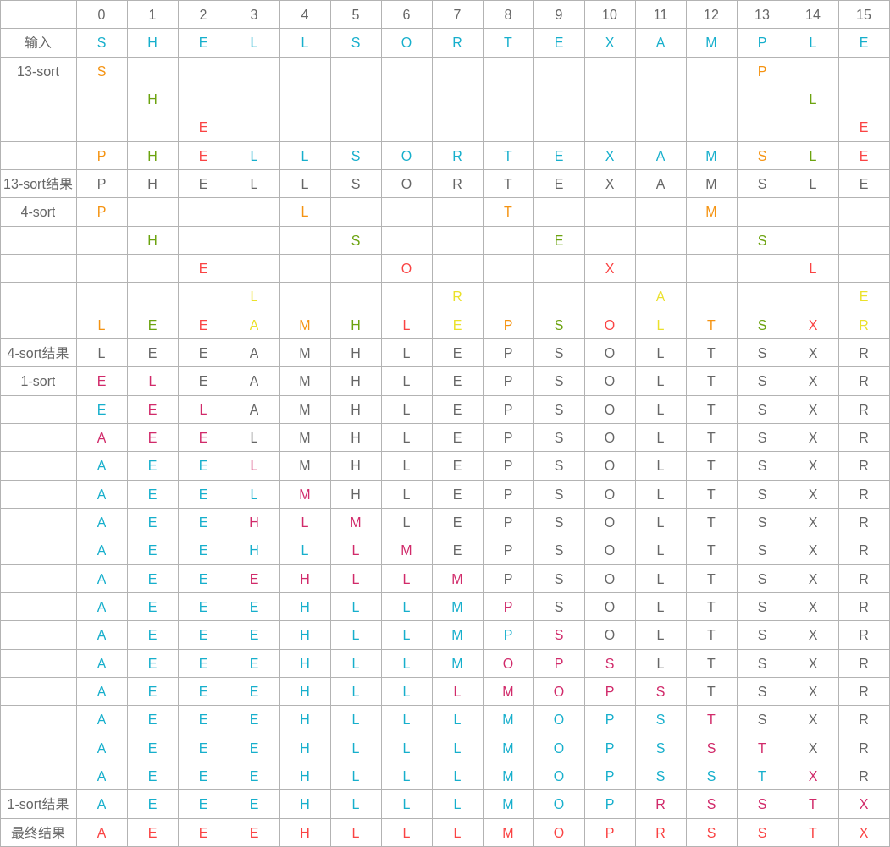
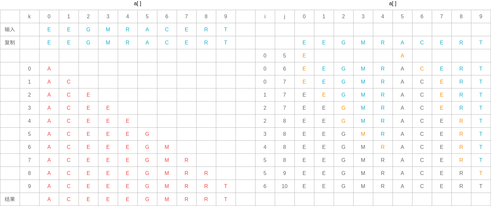
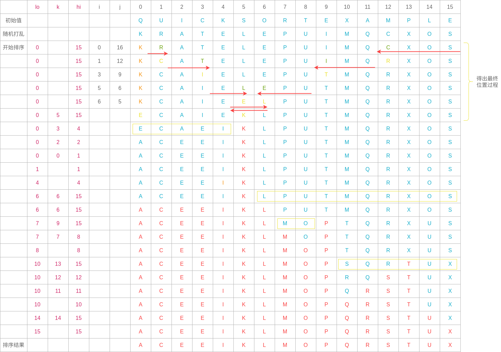
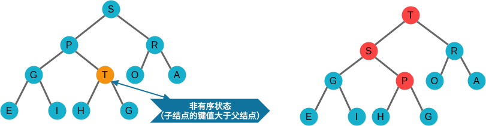
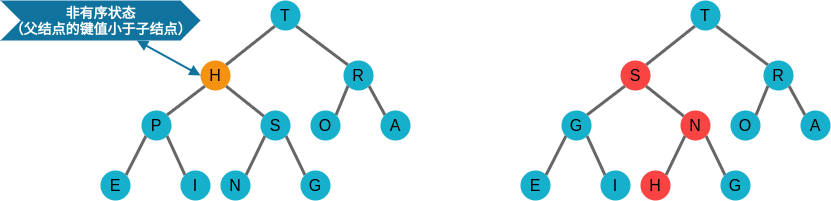

# 第 2 章 排序

排序就是**将一级对象按照某种逻辑顺序重新排列的过程**。

## 2.1 初级排序算法

### 2.1.1 游戏规则

1. 验证

2. 运行时间

3. 额外的内存使用

    - 原地排序算法

        除了函数调用所需的栈和固定数目的实例变量之外无需额外内存

    - 其他排序算法

        需要额外内存空间来存储另一份数组副本

4. 数据类型

    compareTo()必须实现**全序关系**:

    - 自反性
    - 反对称性
    - 传递性

### 2.1.2 选择排序

算法思想：

-   找到数组中最小的元素
-   将它和数组的第一个元素交换位置
-   在剩下的元素中找到最小的元素，将其与数组第二个元素交换位置
-   如此往复，直到整个数组排序

算法特点：

-   运行时间和输入无关
-   数据移动是最少的

示例过程：



### 2.1.3 插入排序

算法思想：

算法特点：

-   所需时间取决于输入中元素的初始顺序

示例过程：



### 2.1.4 排序算法的可视化

### 2.1.5 比较两种排序算法

比较步骤：

-   实现并调试算法
-   分析算法的基本性质
-   对算法的相对性能作出猜想
-   用实验验证猜想

### 2.1.6 希尔排序

算法思想：

-   使数组中任意间隔为 h 的元素都是有序的。
-   一个 h 有序数组就是 h 个互相独立的有序数组编织在一起组成的一个数组。

示例过程：



## 2.2 归并排序

### 2.2.1 原地归并的抽象方法

```java
    public static void merge(Comparable[] a, int lo, int mid, int hi) {
        int i = lo;
        int j = mid + 1;

        // Copy a[lo...hi] to aux[lo...hi]
        for (int k = lo; k <= hi; k++) {
            aux[k] = a[k];
        }

        for (int k = lo; k <= hi; k++) {
            if (i > mid) {
                a[k] = aux[j++];
            } else if (j>hi) {
                a[k] = aux[i++];
            } else if (less(aux[j], aux[i])) {
                a[k] = aux[j++];
            } else {
                a[k] = aux[i++];
            }
        }
    }
```

原地归并示例：



### 2.2.2 自顶向下的归并排序

算法思想：

采用分治思想，如果算法能将两个子数组排序，它就能够通过归并两个子数组将整个数组排序。

算法特点：

-   优点：归并排序所需的时间和 NlgN 成正比。

-   缺点：辅助数组所使用的额外空间和 N 的大小成正比。

算法改进：

1. 对于小规模子数组使用插入排序

    用不同方法处理小规模问题能改进大多数递归算法的性能，因为递归会使小规模问题中方法的调用过于频繁，所以改进对它们的处理就能改进整个算法。

2. 测试数组是否已经有序

3. 不将元素复制到辅助数组

### 2.2.3 自底向上的归并排序

算法思想：

先归并微型数组，再成对归并得到的子数组。

算法特点：

-   自底向上的归并排序比较适合用链表组织的数据。
-   归并排序是一种渐进最优的基于比较排序的算法。

### 2.2.4 排序算法的复杂度

**没有任何基于比较的算法能够保证使用少于 lg(N!) ~ NlgN 次比较将长度为 N 的数组排序。**

## 2.3 快速排序

### 2.3.1 基本算法

将一个数组分成两个子数组，将两部分独立地排序，当两个数组都有序时整个数组也就自然有序了。

快速排序示例：


1. 原地切分

2. 别越界

3. 保持随机性

4. 终止循环

5. 处理切分元素值有重复的情况

    **左侧**扫描最好是在遇到**大于等于切分元素值**时停下，**右侧**扫描则是遇到**小于等于切分元素值**时停下。

6. 终止递归

### 2.3.2 性能特点

1. 快速排序切分方法的内循环用一个递增的索引将数组元素和一个定值比较。
2. 快速排序另一个速度优势在于比较次数很少。
3. 在切分不平衡时算法可能会极为低效。

### 2.3.3 算法改进

1. 切换到插入排序

    对于小数组，快速排序比插入排序慢。

2. 三取样切分

    使用子数组的一小部分元素的中位数来切分数组。

3. 熵最优的排序

    - 三向切分的快速排序

        三向切分的最坏情况是所有主键均不相同。当存在重复主键时，它的性能会比归并排序好得多。

## 2.4 优先队列

### 2.4.1 API

优先队列是一种抽象数据类型，它表示了一组值和对这些值的操作。

|              |                                        |                                   |
| -----------: | :------------------------------------- | :-------------------------------- |
| public class | MaxPQ\<Key extends Comparable\<Key\>\> |                                   |
|              | MaxPQ()                                | 创建一个优先队列                  |
|              | MaxPQ(int max)                         | 创建一个初始容量为 max 的优先队列 |
|              | MaxPQ(Key[] a)                         | 用 a[]中的元素创建一个优先队列    |
|         void | Insert(Key v)                          | 向优先队列中插入一个元素          |
|          Key | max()                                  | 返回最大元素                      |
|          Key | delMax()                               | 删除并返回最大元素                |
|      boolean | isEmpty()                              | 返回队列是否为空                  |
|          int | size()                                 | 返回优先队列中的元素个数          |

### 2.4.2 初级实现

1. 数组实现（无序）

2. 数组实现（有序）

3. 链表表示法

### 2.4.3 堆的定义

**有序堆**：一棵二叉树的每个结点都大于等于它的两个子结点。

### 2.4.3 堆的算法

1. 由下至上的堆有序化（上浮）



2. 由上至下的堆有序化（下沉）



3. 多叉堆

4. 调整数组大小

5. 元素的不可变性

6. 索引优先队列

7. 索引优先队列用例

## 2.5 应用

排序非常有用的一个主要原因是，在一个有序的数组中查找一个元素要比在一个无序的数组中查找简单得多。

### 2.5.1 将各种数据排序

1. 交易事务

2. 指针排序

3. 不可变的键

4. 廉价的交换

5. 多种排序方法

6. 多键数组

7. 使用比较器实现优先队列

8. 稳定性

### 2.5.2 我应该使用哪种排序算法

各种排序算法的性能特点：

| 算法         | 时间复杂度 | 空间复杂度 | 稳定性 | 是否原地排序 | 备注                                             |
| ------------ | ---------- | ---------- | ------ | ------------ | ------------------------------------------------ |
| 选择排序     | N^2        | 1          | 不稳定 | 是           |                                                  |
| 插入排序     | N ~ N^2    | 1          | 稳定   | 是           | 性能取决于输入元素的排列情况                     |
| 希尔排序     | NlogN?     | 1          | 不稳定 | 是           |                                                  |
| 快速排序     | NlogN      | lgN        | 不稳定 | 是           | 运行效率由概率提供保证                           |
| 三向快速排序 | N ~ NlogN  | lgN        | 不稳定 | 是           | 运行效率由概率保证，同时取决于输入元素的分页情况 |
| 归并排序     | NlogN      | N          | 稳定   | 否           |                                                  |
| 堆排序       | NlogN      | 1          | 不稳定 | 是           |                                                  |

**Tips:**

快速排序是最快的通用排序算法，大多数实际情况中，快速排序是最佳选择。

1. 将原始类型数据排序

2. Java 系统库的排序算法

    java.util.Arrays.sort()根据不同的参数类型代表了一系列排序方法：

    - 每种原始类型都有一个不同的排序方法
    - 一个适用于所有实现了 Comparable 接口的数据类型的排序方法
    - 一个适用于实现了比较器 Comparator 的数据类型的排序方法

### 2.5.3 问题的归约

**归约**指的是为解决某个问题而发明的算法正好可以用来解决另一种问题。

1. 找出重复元素

2. 排名

3. 优先队列

4. 中位数与顺序统计

### 2.5.4 排序应用一览

1. 商业计算

2. 信息搜索

3. 运筹学

4. 事件驱动模拟

5. 数值计算

6. 组合搜索

    - Prim 算法和 Dijkstra 算法
    - Kruskal 算法
    - 霍夫曼压缩
    - 字符串处理
