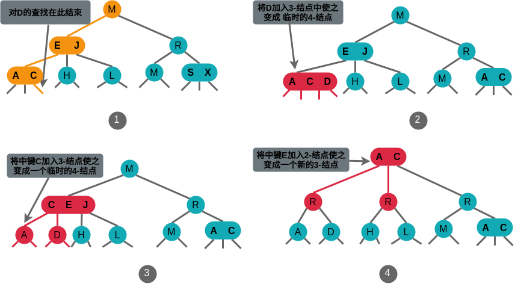

# 第 3 章 查找

## 3.1 符号表

符号表是一种存储键值对的数据结构，支持两种操作：插入(put)，即将一组新的键值对存入表中；查找(get)，即根据给定的键得到相应的值。

### 3.1.1 API

|                 |                           |                                                  |
| --------------: | :------------------------ | :----------------------------------------------- |
|    public class | ST\<Key, value\>          |                                                  |
|                 | ST()                      | 创建一张符号表                                   |
|            void | put(Key key, Value value) | 将键值对存入表中（若值为空则将键 key 从表中删除) |
|           Value | get(Key key)              | 获取键 Key 对应的值（若键 key 不存在则抬 null)   |
|            void | delete(Key key)           | 从表中删去键 key（及其对应的值）                 |
|         boolean | contains(Key key)         | 键 key 在表中是否有对应的值                      |
|         boolean | isEmpty()                 | 表是否为空                                       |
|             int | size()                    | 表中的键值对数量                                 |
| Iterable\<Key\> | keys()                    | 表中的所有键的集合                               |

1. 泛型

2. 重复的键

    所有实现遵循以下规则：

    - 每个键只对应着一个值（表中不允许存在重复的键）
    - 每当代码向表中存入的键值对和表中已有的键冲突时，新的值会替代旧的值

3. 空键(null)

    键不能为空。

4. 空值(null)

    不允许有空值。

5. 删除操作

    - 延时删除：将键对应的值置为空，在某个时候删去所有值为空的健。
    - 即时删除：立刻从表中删除指定的键。

6. 便携方法

7. 迭代

8. 键的等价性

### 3.1.2 有序符号表

有序泛型符号表 API

|                 |                                            |                                                  |
| --------------: | :----------------------------------------- | :----------------------------------------------- |
|    public class | ST\<Key extends Comparable\<key\>, Value\> |                                                  |
|                 | ST()                                       | 创建一张符号表                                   |
|            void | put(Key key, Value value)                  | 将键值对存入表中（若值为空则将键 key 从表中删除) |
|           Value | get(Key key)                               | 获取键 Key 对应的值（若键 key 不存在则抬 null)   |
|            void | delete(Key key)                            | 从表中删去键 key（及其对应的值）                 |
|         boolean | contains(Key key)                          | 键 key 在表中是否有对应的值                      |
|         boolean | isEmpty()                                  | 表是否为空                                       |
|             int | size()                                     | 表中的键值对数量                                 |
|             Key | min()                                      | 最小的键                                         |
|             Key | max()                                      | 最大的键                                         |
|             Key | floor(Key key)                             | 小于等于 key 的最大键                            |
|             Key | ceiling(key key)                           | 大于等于 key 的最小键                            |
|             int | rank(Key key)                              | 小于 key 的键的数量                              |
|             Key | select(int k)                              | 排名为 k 的键                                    |
|            void | deleteMin()                                | 删除最小的键                                     |
|            void | deleteMax()                                | 删除最大的键                                     |
|             int | size(Key lo, Key hi)                       | \[lo..hi\]之间键的数量                           |
| Iterable\<Key\> | keys(Key lo, Key hi)                       | \[lo..hi]之间的所有键，已排序                    |
| Iterable\<Key\> | keys()                                     | 所有键的集合，已排序                             |

1. 最大键和最小键

2. 向下取整和向上取整

3. 排名和选择

4. 范围查找

5. 例外情况

6. 便携方法

7. 键的等价性

    Java 的一条最佳实践就是维护所有 Comparable 类型中的 compareTo()方法和 equals()方法的一致性。

8. 成本模型

### 3.1.3 用例举例

1. 行为测试用例

2. 性能测试用例

### 3.1.4 无序链表中的顺序查找

在含有 N 对键值的无序链表的符号表中，未命中的查找和插入操作都需要 N 次比较；命中的查找在最坏情况下需要 N 次比较。特别地，向一个空表中插入 N 个不同的链需要(N\*N)/2 次比较。

### 3.1.5 有序数组中的二分查找

1. 二分查找

2. 其他操作

### 3.1.6 对二分查找的分析

**在 N 个键的有序数组中进行二分查找最多需要(lgN+1)次比较。**

## 3.2 二叉查找树

一棵二叉查找树(BST)是一棵二叉树，其中每个结点都含有一个 Comparable 的键（以及相关联的值）且每个结点的键都大于其左子树中的任意结点的键而小于右子树的任意结点的键。

二叉树示意：


二叉查找树示意：


### 3.2.1 基本实现

1. 数据表示

    二叉树结点表示：

    ```java
    private class Node {
        private Key key;        // 键
        private Value value;    // 值
        private Node left;      // 左子树
        private Node right;     // 右子树
        private int n;          // 结点总数
    }
    ```

2. 查找

二叉查找树查找命中：


二叉查找树查找未命中：


3. 插入


4. 递归

### 3.2.2 分析

二叉查找树的算法运行时间取决于树的形状，树的形状又取决于键被插入的先后顺序。

**在由 N 个随机键构造的二叉查找树中，查找命中平均所需的比较次数为~2lnN（约为 1.39lgN）。**

**在由 N 个随机键构造的二叉查找树中插入操作和查找未命中平均所需的比较次数为~2lnN（约为 1.39lgN）。**

### 3.2.3 有序性相关的方法与删除操作

1. 最大键和最小键


2. 向上取整和向下取整

3. 选择操作

4. 排名

5. 删除最大键和删除最小键

删除最小键示例：


6. 删除操作

删除操作示例：


7. 范围查找

8. 性能分析

    **在一棵二叉查找树中，所有操作在最坏情况下所需的时间都和树的高度成正比。**

## 3.3 平衡查找树

### 3.3.1 2-3 查找树

一棵 2-3 查找树或为一棵空树，或由以下结点组成：

-   2-结点

    含有一个键和两条链接，左链接指向的 2-3 树中的键都小于该结点，右链接指向的 2-3 树中的键都大于该结点。

-   3-结点

    含有两个键和三条链接，左链接指向的 2-3 树中的键都小于该结点，中链接指向的 2-3 树中的键都位于该结点的两个链之间，右链接指向的 2-3 树中的键都大于该结点。

**一棵完平衡的 2-3 查找树中的所有空链接到根结点的距离都应该是相同的**。

1. 查找

    **算法**：先将键与根结点中的键比较，如果它和其中任意一个相等，则查找命中；否则根据比较结果找到指向相应区间的链接，并在子树中递归地继续查找。

    对 H 查找命中：

    

    对 B 查找未命中：

    

2. 向 2-结点中插入新键

    

3. 向一棵只含有一个 3-结点的树中插入新键

    

4. 向一个父结点为 2-结点的 3-结点中插入新键

    

5. 向一个父结点为 3-结点的 3-结点中插入新键

    

6. 分解根结点

7. 局部变换

    2-3 树插入算法的根本在于变换都是**局部的**：除了相关的结点和链接之外不必修改或者检查树的其他部分。

8. 全局性质

    局部变换不会影响树的**全局有序性和平衡性**：任意空链接到根结点的路径长度都是相等的。

    **在一棵大小为 N 的 2-3 树中，查找和插入操作访问的结点必然不超过 lgN 个。**

### 3.3.2 红黑二叉查找树

1. 替换 3-结点

    红黑二叉查找树的基本思想是用\*\*标准的二叉查找树和一些额外信息来表示 2-3 查找树。

    红链接将两个 2-结点连接起来构成一个 3-结点，黑链接则是 2-3 树中的普通链接。

2. 一种等价的定义

    红黑树是含有红黑链接并满足下列条件的二叉查找树：

    - 红链接均为左链接；
    - 没有任何一个结点同时和两条红链接相连；
    - 树是完美黑色平衡的，即**任意空链接到根结点的路径上的黑链接数量相同**。

3. 一一对应

    红黑树既是二叉查找树，也是 2-3 树。

4. 颜色表示

5. 旋转

    旋转操作会改变红链接的指向，可以保持红黑树的两个重要性质：有序性和完美平衡性。

    左旋转：

    

    右旋转：

    

6. 在旋转后重置父结点的链接

    旋转操作都会返回一条链接，将其赋予父结点中的链接以重置相应链接。

7. 向单个 2-结点中插入新键

    

8. 向树底部的 2-结点插入新键

9. 向一棵双键树中插入新键

    - 新键最大

    

    - 新键最小

    

    - 新键介于两者之间

    

10. 颜色转换

11. 根结点总是黑色

    **每当根结点由红变黑时树的黑链接高度就会加 1。**

12. 向树底部的 3-结点插入新键

    

13. 将红链接在树中向上传递

    在沿着插入点到根结点的路径向上移动时在所经过的每个结点中顺序完成以下操作，就能完成插入操作：

    - 如果右子结点是红色而左子结点是黑色，进行左旋转；
    - 如果左子结点是红色且它的左子结点也是红色，进行右旋转；
    - 如果左右子结点均为红色，进行颜色转换。

### 3.3.3 实现

### 3.3.4 删除操作

### 3.3.5 红黑树的性质

**所有基于红黑树的符号表实现都能保证操作的运行时间为对数级别。**

1. 性能分析

    一棵大小为 N 的红黑树的高度不会超过 2lgN。

    一棵大小为 N 的红黑树中，根结点到任意结点的平均路径长度为~1.001lgN。

2. 有序符号表 API
