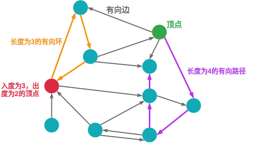

# 第 4 章 图

## 4.1 无向图

**图是由一组顶点和一组能够将两个顶点相连的边组成的。**

特殊的图：

-   **自环**，即一条连接一个顶点和其自身的边；
-   连接同一对顶点的两条边为平行边。

### 4.1.1 术语表

-   相邻：两个顶点通过一条边相连，并称这条边**依附**于这两个顶点。
-   顶点的度数：依附于顶点的边的总数。
-   子图：由一幅图的所有边的一个子集组成的图。
-   路径：由边顺序连接的一系列顶点。
-   简单路径：一条没有重复顶点的路径。
-   环：一条至少含有一条边且起点和终点相同的路径。
-   简单环：一条（除了起点和终点必须相同外）不含有重复顶点和边的环。
-   路径长度：路径中包含的边数。
-   连通：两个顶点之间存在一条连接双方的路径。
-   图的密度：已经连接的顶点对占所有可能被连接的顶点对的比例。

1. 连通图

    从任意一个顶点都存在一条路径到达另一个任意顶点的图。

2. 非连通图

    由若干连通的部分组成，都是极大连通子图。

3. 树与图

    树是一幅无无环连通图。

    当且仅当一幅含有 V 个结点的图 G 满足下列条件之一时，它就是一棵树：

    - G 有 V-1 条边且不含有环；
    - G 有 V-1 条边且是连通的；
    - G 是连通的，但删除任意一条边都会使它不再连通；
    - G 是无环图，但添加任意一条边都会产生一条环；
    - G 中的任意一对顶点之间仅存在一条简单路径。

### 4.1.2 表示无向图的数据类型

无向图的 API

|                     |                       |                                     |
| ------------------: | :-------------------- | :---------------------------------- |
|        public class | Graph                 |                                     |
|                     | Graph(int V)          | 创建一个含有 V 个顶点但不含有边的图 |
|                     | Graph(In in)          | 从标准输入流 in 读入一幅图          |
|                 int | V()                   | 顶点数                              |
|                 int | E()                   | 边数                                |
|                void | addEdge(int v, int w) | 向图中添加一条边 v-w                |
| Iterable\<Integer\> | adj(int v)            | 和 v 相邻的所有顶点                 |
|              String | toString()            | 对象的字符串表示                    |

1. 图的几种表示法

    - 邻接矩阵

        使用 V\*V 的布尔矩阵，当顶点 v 和顶点 w 间有相连接的边时，定义 v 行 w 列的元素值为 true，否则为 false。

    - 边的数组

        使用一个 Edge 类，含有两个 int 实例变量。

    - 邻接表数组

        使用一个以顶点为索引的列表数组，其中的每个元素都是和该顶点相邻的顶点列表。

2. 邻接表的数据结构

    将每个顶点的所有相邻顶点都保存在该顶点对应的元素所指向的一张链表中。

    实现的性能特点：

    - 使用的空间和 V+E 成正比；
    - 添加一条边所需的时间为常数；
    - 遍历顶点 v 的所有相邻顶点所需的时间和 v 的度数成正比。

3. 图的处理算法的设计模式

### 4.1.3 深度优先搜索

常常通过系统地检查每一个顶点和每一条边来获取图的各种性质。

1. 走迷宫

    Tremaus 搜索：

    - 选择一条没有标记过的通道，在走过的路上铺一条绳子；
    - 标记所有第一次路过的路口和通道；
    - 当来到一个标记过的路口时用绳子回退到上个路口；
    - 当回退到的路口已没有可走的通道时继续回退。

2. 热身

    **深度优先搜索**算法，要搜索一幅图，只需用一个递归方法来遍历所有顶点。在访问其中一个顶点时：

    - 将它标记为已访问；
    - 递归地访问它的所有没有标记过的领居顶点。

    **深度优先搜索标记与起点连通的所有顶点所需的时间和顶点的度数之和成正比。**

3. 单向通道

4. 跟踪深度优先搜索

    深度优先搜索遍历边和访问顶点的顺序与图的表示是有关的，而不只是与图的结构或是算法有关。

    

5. 深度优先搜索详细轨迹

    

### 4.1.4 寻找路径

**单点路径**：给定一幅图和一个起点 s，回答“从 s 到给定目的顶点 v 是否存在一条路径？如果有，找出这条路径。”等类似问题。

1. 实现

2. 详细轨迹

    

    **使用深度优先搜索得到从给定起点到任意标记顶点的路径所需的时间与路径的长度成正比。**

### 4.1.5 广度优先搜索

**广度优先搜索**使用队列来保存所有已经被标记过但其邻接表还未被检查过的顶点。先将起点加入队列，然后重复步骤直到队列为空：

-   取队列中的下一个顶点 v 并标记它；
-   将与 v 相邻的所有未被标记过的顶点加入队列。

广度优先搜索轨迹：

**对于从 s 可达的任意顶点 v，广度优先搜索都能找到一条从 s 到 v 的最短路径。**

**广度优先搜索所需的时间在最坏情况下和 V+E 成正比。**

深度优先搜索和广度优先搜索的不同之处：

-   从数据结构中获取下一个顶点的规则，广度优先是最早加入的顶点，深度优先搜索是最晚加入的顶点；
-   深度优先搜索探索一幅图的方式是寻找离起点更远的顶点，广度优先搜索则会先覆盖起点附近的顶点；
-   深度优先搜索的路径通常较长且曲折，广度优先搜索的路径则短而直接。

### 4.1.6 连通分量

连通分量的 API

|              |                         |                        |
| ------------ | :---------------------- | :--------------------- |
| public class | CC                      |                        |
|              | GG(Graph G)             | 预处理构造函数         |
| boolean      | connected(int v, int w) | v 和 w 是否连通        |
| int          | count()                 | 连通分量数             |
| int          | id(int v)               | v 所在的连通分量标识符 |

1. 实现

    深度优先搜索的预处理使用的时间和空间与 V+E 成正比且可以在常数时间内处理关于图的连通性问题。

2. union-find 算法

    union-find 算法是一种动态算法，在完成只需要判断连通性或是需要完成大量连通性查询和插入操作混合等类似任务时使用。

    深度优先搜索则更适合实现图的抽象数据类型。

### 4.1.7 符号图

1. API

    |              |                                            |                                                         |
    | -----------: | :----------------------------------------- | :------------------------------------------------------ |
    | public class | SymbolGraph                                |                                                         |
    |              | SymbolGraph(String filename, String delim) | 根据 filename 指定的文件构造图，使用 delim 来分隔顶点名 |
    |      boolean | contains(String key)                       | key 是否为一个顶点                                      |
    |          int | index(String key)                          | key 的索引                                              |
    |       String | name(int v)                                | 索引 v 的顶点名                                         |
    |        Graph | G()                                        | 隐藏的 Graph 对象                                       |

2. 测试用例

3. 实现

4. 间隔的度数

## 4.2 有向图

在有向图中，边是单向的：每条边所连接的两个顶点都是一个有序对，它们的邻接性是单向的。

### 4.2.1 术语

1. 定义

    一幅有方向性的图是由**一组顶点**和**一组有方向的边**组成的，每条有方向的边都连接着有序的一对顶点。

2. 出度

    一个顶点的出度为由该顶点指出的边的总数。

3. 入度

    一个顶点的入度为指向该顶点的边的总数。

4. 有向图顶点的关系

    - 没有边相连;
    - 存在从 v 到 w 的边 v-->w;
    - 存在从 w 到 v 的边 w-->v;
    - 既存在 v-->w 也存在 w-->v。

### 4.2.2 有向图的数据类型

有向图的 API

|                     |                       |                                       |
| ------------------: | :-------------------- | :------------------------------------ |
|        public class | Digraph               |                                       |
|                     | Digraph(int V)        | 创建一幅含有 V 个顶点但没有边的有向图 |
|                     | Digraph(In in)        | 从输入流 in 中读取一幅有向图          |
|                 int | V()                   | 顶点总数                              |
|                 int | E()                   | 边的总数                              |
|                void | addEdge(int v, int w) | 向有向图中添加一条边 v->w             |
| Iterable\<Integer\> | adj(int v)            | 由 v 指出的边所连接的所有顶点         |
|             Digraph | reverse()             | 该图的的反向图                        |
|              String | toString()            | 对象的字符串表示                      |

1. 有向图的表示

    用邻接表表示有向图，边 v->w 表示为顶点 v 所对应的邻接链表中包含一个 w 顶点。

2. 输入格式

3. 有向图取反

4. 顶点的符号名

### 4.2.3 有向图中的可达性

有向图的可达性 API

|              |                                                     |                                |
| -----------: | :-------------------------------------------------- | :----------------------------- |
| public class | DirectedDFS                                         |                                |
|              | DirectedDFS(Digraph G, int s)                       | 在 G 中找到从 s 可达的所有顶点 |
|              | DirectedDFS(Digraph G, Iterable\<Integer\> sources) |
|      boolean | marked(int v)                                       | v 是否可达                     |

**在有向图中，深度优先搜索标记由一个集合的顶点可达的所有顶点所需的时间与被标记的所有顶点出度之和成正比。**

1. 标记－清除的垃圾收集

2. 有向图的寻路

### 4.2.4 环和有向无环图

1. 调度问题

    一种应用广泛的模型是给定一组任务并安排它们的执行顺序，限制条件是这些任务的执行方法和起始时间。

    - 优先级限制下的调度问题
    - 拓扑排序

        给定一幅有向图，将所有的顶点排序，使得所有的有向边均从排在前面的元素指向排在后面的元素。

2. 有向图中的环

    一般来说，如果有一个有优先级限制的问题中存在有向环，那么这个问题肯定是无解的。

    **有向无环图**就是一幅不含有有向环的有向图。

3. 顶点的深度优先次序与拓扑排序

    **当且仅当一幅有向图是无环图时它才能进行拓扑排序。**

    **一幅有向无环图的拓扑排序即为所有顶点的逆后序排列。**

### 4.2.5 有向图中的强连通性

**强连通**：两个顶点 v 和 w 是互相可达。

1. 强连通分量

    强连通分量性质：

    - 自反性：任意顶点 v 和自己都强连通的；
    - 对称性：如果 v 和 w 是强连通的，那么 w 和 v 也是强连通的；
    - 传递性：如果 v 和 w 是强连通的且 w 和 x 也是强连通的，那么 v 和 x 也是强连通的。

2. 应用举例

3. Kosaraju 算法

4. 再谈可达性

    有向图 G 的传递闭包是由相同的一组顶点组成的另一幅有向图，在传递闭包中存在一条从 v 指向 w 的边当且仅当在 G 中 w 是从 v 可达的。
