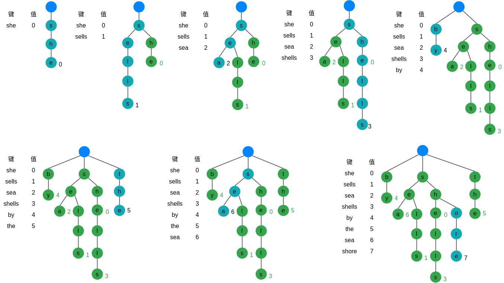
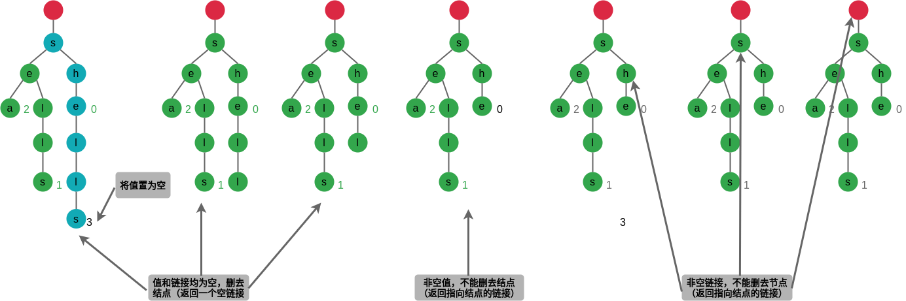
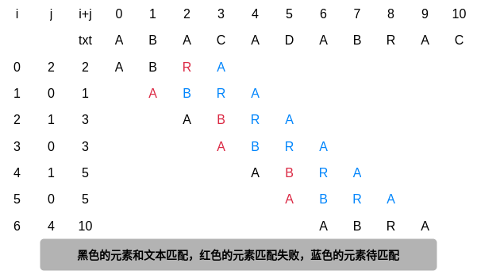
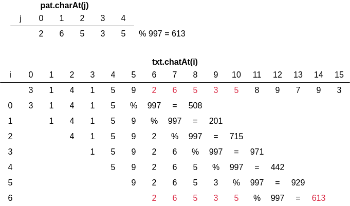

# 第 5 章 字符串

### 5.0.1 游戏规则

1. 字符串的主要性质

    - 字符
    - 不可变性
    - 索引
    - 长度
    - 子字符串
    - 字符串的连接
    - 字符数组

### 5.0.2 字母表

1. 字符索引数组

2. 数字

## 5.1 字符串排序

两类排序方法：

-   低位优先的字符串排序
-   高位优先的字符串排序

### 5.1.1 键索引计数法

1. 频率统计
2. 将频率转换为索引
3. 数据分类
4. 回写

**键索引计数法排序 N 个键为 0 到 R-1 之间的整数的元素需要访问数组 11N+4R+1 次。**

### 5.1.2 低位优先的字符串排序

低位优先的字符串排序算法能够稳定地将定长字符串排序（完全依赖于键索引计数法的实现是稳定的）。

对于基于 R 个字符的字母表的 N 个以长为 W 的字符串为键的元素，低位优先的字符串排序需要访问~7WN+3WR 次数组，使用的额外空间与 N+R 成正比。

### 5.1.3 高位优先的字符串排序

算法思想：首先用键索引计数法将所有字符串按照首字母排序，然后递归地将每个首字母所对应的子数组排序。

1. 对字符串末尾的约定

    在高位优先的字符串排序算法中，要特别注意到达字符串末尾的情况。

2. 指定的字母表

    高位优先的字符串排序的成本与字母表中的字符数量有很大的关系。

3. 小型子数组

    小型子数组对于高位优先的字符串排序的性能至关重要。

4. 等值键

5. 额外空间

6. 随机字符串模型

7. 性能

    - 随机输入：检查足以区别字符串所需的字符，运行时间是亚线性的；
    - 非随机输入：需要检查的字符可能比随机情况下更多，可能仍然是亚线性的；
    - 最坏情况：检查所有键中的所有字符，运行时间是线性的。

### 5.1.4 三向字符串快速排序

算法思想：根据键的首字母进行三向切分，仅在中间子数组中的下一个字符继续递归排序。

1. 小型数组

2. 有限的字母表

3. 随机化

    最好在排序之前将数组打乱或是将第一个元素和一个随机位置的元素交换以得到一个随机的切分元素。

4. 性能

5. 举例：网站日志

### 5.1.5 字符串排序算法的选择

## 5.2 单词查找树

算法能够取得性能：

-   查找命中所需的时间与被查找的键的长度成正比；
-   查找未命中只需检查若干个字符。

以字符串为键的符号表的 API

|                    |                              |                         |
| -----------------: | :--------------------------- | :---------------------- |
|       public class | StringST\<Value\>            |                         |
|                    | StringST()                   | 创建一个符号表          |
|               void | put(String key, Value value) | 向表中插入键值对        |
|              Value | get(String key)              | 键 key 所对应的值       |
|               void | delete(String key)           | 删除键 key              |
|            boolean | contains(String key)         | 表中是否保存着 key 的值 |
|            boolean | isEmpty()                    | 符号表是否为空          |
|             String | longestPrefixOf(String s)    | s 的前缀中最长的键      |
| Iterable\<String\> | keysWithPrefix(String s)     | 所有以 s 为前缀的键     |
| Iterable\<String\> | keysThatMatch(String s)      | 所有和 s 匹配的键       |
|                int | size()                       | 键值对的数量            |
| Iterable\<String\> | keys()                       | 符号表中的所有键        |

### 5.2.1 单词查找树

1. 基本性质

    单词查找树中一般都含有大量的空链接。

    值为空的结点在符号表中没有对应的键，它们的存在是为了简化单词查找树中的查找操作。

2. 单词查找树中的查找操作

    - 键的尾字符所对应的结点中的值非空，查找命中。
    - 键的尾字符所对应的结点中的值为空，查找未命中。
    - 查找结束于一条空链接，查找未命中。

3. 插入操作

    单词查找树构造轨迹：

    

4. 结点的表示

    **R 向单词查找树**：数据结构不存储任何字符串或字符，保存了链接数组和值。

5. 大小

6. 查找所有键

7. 通配符匹配

8. 最长前缀

9. 删除操作

    delete("shells")示例：

    

10. 字母表

### 5.2.2 单词查找树的性质

**单词查找树的链表结构和键的插入或删除顺序无关：对于任意给定的一组键，其单词查找树都是唯一的。**

1. 最坏情况下查找和插入操作的时间界限

    在单词查找树中查找一个键或是插入一个键时，**访问数组的次数最多为键的长度加 1**。

2. 查找未命中的预期时间界限

    字母表的大小为 R，在一棵由 N 个随机键构造的单词查找树中，未命中查找平均所需检查的结点数量为 ~$\log_R{N}$ 。

    **查找未命中的成本与键的长度无关。**

3. 空间

    一棵单词查找树中的链接总数在 $RN$ 到 $RNw$ 之间，其中 w 为键的平均长度。

4. 单向分支

### 5.2.3 三向单词查找树

### 5.2.4 三向单词查找树的性质

1. 空间

    三向单词查找树所需要的空间远小于对应的单词查找树。

    **由 N 个平均长度为 w 的字符串构造的三向单词查找树中的链接总数在 $3N$ 到 $3Nw$ 之间。**

2. 查找成本

    在一棵由 N 个随机字符串构造的三向单词查找树中，查找未命中平均需要比较字符~ $\ln{N}$ 次。除~ $\ln{N}$ 次外，一次插入或命中的查找会比较一次被查找的键中的每个字符。

3. 字母表

4. 前缀匹配、查找所有键和通配符匹配

5. 删除操作

6. 混合三向单词查找树

7. 单向分支

    由 N 个随机字符串构造的根结点进行了 $R^t$ 向分支且不含有外部单向分支的三向单词查找树中，一次插入或查找操作平均需要进行约 $\ln{N}-t\ln{R}$ 次字符比较。

### 5.2.5 应该使用字符串符号表的哪种实现

## 5.3 子字符串查找

### 5.3.1 历史简介

### 5.3.2 暴力子字符串查找算法

在最坏情况下，暴力子字符串查找算法在长度为 N 的文本中查找长度为 M 的模式需要~NM 次字符比较。

暴力子字符串查找：

### 5.3.3 Knuth-Morris-Pratt 子字符串查找算法

KMP 算法的主要思想是提前判断如何重新开始查找，而这种判断只取决于模式本身。

1. 模式指针的回退

2. KMP 查找算法

3. DFA 模拟

4. 构造 DFA

    对于长度为 M 的模式字符串和长度为 N 的文本，Knuth-Morris-Pratt 字符串查找算法访问的字符不会超过 $M+N$ 个。

### 5.3.4 Boyer-Moore 字符串查找算法

与 KMP 子字符串查找算法的实现一样，会根据匹配失败时文本和模式中的字符来决定下一步的行动。

1. 启发式的处理不匹配的字符

    

2. 起点

3. 子字符串的查找

    在一般情况下，对于长度为 N 的文本和长度为 M 的模式字符串，使用了 Boyer-Moore 的子字符串查找算法通过启发式处理不匹配的字符需要~ $N/M$ 次字符比较。

### 5.3.5 Rabin-Karp 指纹字符串查找算法

1. 基本思想

    

2. 计算散列函数

3. 关键思想

    取余操作的一个基本性质是如果在每次算术操作之后都将结果除以 Q 并取余，这等价于在完成了所有算术操作之后再将最后的结果除以 Q 并取余。

4. 实现

5. 小技巧：用蒙特卡洛法验证正确性

    使用蒙特卡洛算法的 Rabin-Karp 子字符串查找算法的运行时间是线性级别的且出错的概率极小。

## 5.4 正则表达式

正则表达式能够用自然、简单而强大的操作组合来描述模式。

### 5.4.1 使用正则表达式描述模式

1. 连接操作

2. 或操作

    指定多种可能的操作。

3. 闭包操作

    将模式的部分重复任意的次数。

4. 括号

    改变默认的优先级顺序。

**定义**一个正则表达式可以是：

-   空字符串；
-   单个字符；
-   包含在括号中的另一个正则表达式；
-   两个或多个连接起来的正则表达式；
-   由或运算符分隔的两个或多个正则表达式；
-   由闭包运算符标记的一个正则表达式。

### 5.4.2 缩略写法

1. 字符集描述符

    | 名称       | 记法                    | 举例       |
    | ---------- | ----------------------- | ---------- |
    | 通配符     | `.`                     | A.B        |
    | 指定的集合 | 包含在[]中的字符        | [AEIOU]\*  |
    | 范围的集合 | 包含在[]中，由`-`分隔   | [A-Z][0-9] |
    | 补集       | 包含在[]中，首字母为`^` | [^aeiou]\* |

2. 闭包的简写

    | 选项               | 记法         | 举例      |
    | ------------------ | ------------ | --------- |
    | 至少重复 1 次      | `+`          | (AB)+     |
    | 重复 0 次或 1 次   | `?`          | (AB)?     |
    | 重复指定次数       | 由{}指定次数 | (AB){3}   |
    | 重复指定范围的次数 | 由{}指定范围 | (AB){1-2} |

3. 转义序列

### 5.4.3 正则表达式的实际应用

1. 字符串查找

2. 合法性检查

    | 应用场景     | 正则表达式                      | 示例                 |
    | ------------ | ------------------------------- | -------------------- |
    | 字符串查找   | .\*NEEDLE.\*                    | A HAYSTACK NEEDLE IN |
    | 电话号码     | \([0-9]{3}\)\ [0-9]{3}-[0-9]{4} | (800) 867-5309       |
    | 电子邮件地址 | [a-z]+@([a-z]+\.)+(edu \| com)  | rs@cs.princetion.edu |

3. 程序员的工具箱

4. 基因组

5. 搜索

6. 正则表达式的可能性

7. 局限

### 5.4.4 非确定有限状态自动机

当且仅当一个 NFA 从状态 0 开始从头读取了一段文本中的所有字符，进行了一系列状态转换并最终到达了接受状态时，则称该 NFA 识别了一个文本字符串。

### 5.4.5 模拟 NFA 的运行

1. 自动机的表示

    正则表达式本身已经给出了所有状态名（0 到 M 间的整数，M 为正则表达式的长度）。

2. NFA 的模拟与可达性

判定一个长度为 M 的正则表达式所对应的 NFA 能否识别一段长度为 N 的文本所需的时间在最坏情况下和 MN 成正比。

### 5.4.6 构造与正则表达式对应的 NFA

1. 连接操作

2. 括号

3. 闭包操作

4. “或”表达式

构造和长度为 M 的正则表达式相对应的 NFA 所需的时间和空间在最坏情况下与 M 成正比。

## 5.5 数据压缩

压缩数据的原因主要有两点：节省保存信息所需的空间和节省传输信息所需的时间。

任何数据压缩算法的效果都十分依赖于输入的特征。

### 5.5.1 游戏规则

1. 基础模型

    - 压缩盒

        能够将一个比特流 B 转化为压缩后的版本 C(B)。

    - 展开盒

        能够将 C(B)转化转化回 B。

    

### 5.5.2 读写二进制数据

1. 二进制的输入输出

    大多数系统的输入输出系统都是基于 8 位的字节流。

2. 举例

3. 二进制转储

4. ASCII 编码

### 5.5.3 局限

1. 通用数据压缩

    不存在能够压缩任意比特流的算法。

2. 不可判定性

    不可能找到最佳的压缩算法。

### 5.5.4 热身运动：基因组

1. 基因数据

2. 双位编码压缩

3. 双位编码展开

### 5.5.5 游程编码

1. 位图

2. 实现

3. 提高位图的分辨率

    游程编码广泛用于位图的主要原因是，随着分辨率的提高它的效果也会大大的提高。

### 5.5.6 霍夫曼压缩

霍夫曼压缩的思想是放弃文本文件的普通保存方式，通过用较少的比特表示出现频繁的字符而用较多的比特表示偶尔出现的字符来节省空间。

1. 变长前缀码

2. 前缀码的单词查找树

3. 概述

    使用前缀码进行数据压缩的步骤：

    - 构造一棵编码单词查找树；
    - 将该树以字节流的形式写入输出以供展开时使用；
    - 使用该树将字节流编码为比特流。

    开展时需要：

    - 读取单词查找树（保存在比特流的开头）；
    - 使用该树将比特流解码。

4. 单词查找树的结点

5. 使用前缀码展开

6. 使用前缀码压缩

7. 单词查找树的构造

8. 最优性

    **加权外部路径长度**：所有叶子结点的权重和深度之积的和。

    对于任意前缀码，编码后的比特字符串长度等于相应单词查找树的加权外部路径长度。

    给定一个含有 r 个符号的集合和它们的频率，霍夫曼算法所构造的前缀码是最优的。

9. 写入和读取单词查找树

10. 霍夫曼压缩的实现

    压缩：

    - 读取输入；
    - 将输入中的每个 char 值的出现频率制成表格；
    - 根据频率构造霍夫曼编码树；
    - 构造编译表，将输入中的每个 char 和一个比特字符串相关联；
    - 将单词查找树编码为比特字符串并写入输出流；
    - 将单词总数编码为比特字符串写入输出流；
    - 使用编译表翻译每个输入字符。

    展开：

    - 读取单词查找树（编码在比特流的开头）；
    - 读取需要解码的字符数量；
    - 使用单词查找树将比特流解码。

霍夫曼压缩算法流行的一个原因是，不仅对自然语言文本，它对各种类型的文件都有效果。

11. LZW 压缩算法

12. LZW 压缩举例

13. LZW 单词查找树

    LZW 压缩算法的符号表操作：

    -   找到输入和符号表的所有键的最长前缀匹配；
    -   将匹配的键和前瞻字符相连得到一个新键，将新键和下一个编码关联并添加到符号表中。

14. LZW 压缩的展开

15. 特殊情况

16. 实现
