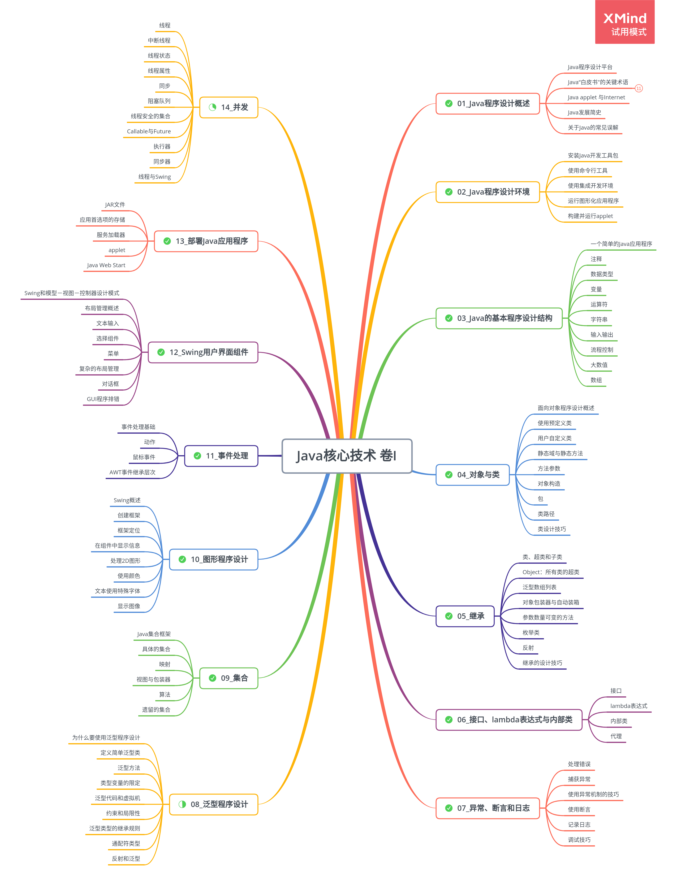

# Core Java Volume I Fundamentals

### [Java 程序设计概述](doc/01_Java程序设计概述.md)

### [Java 的基本程序结构](doc/03_Java的基本程序设计结构.md)

### [对象与类](doc/04_对象与类.md)

### [继承](doc/05_继承.md)

### [接口、lambda 表达式与内部类](doc/06_接口、lambda表达式与内部类.md)

### [异常、断言和日志](doc/07_异常、断言和日志.md)

### [泛型程序设计](doc/08_泛型程序设计.md)

### [集合](doc/09_集合.md)

### [图形程序设计](doc/10_图形程序设计.md)

### [事件处理](doc/11_事件处理.md)

### [Swing 用户界面组件](doc/12_Swing用户界面组件.md)

### [部署 Java 程序](doc/13_部署Java程序.md)

### [并发](doc/14_并发.md)

