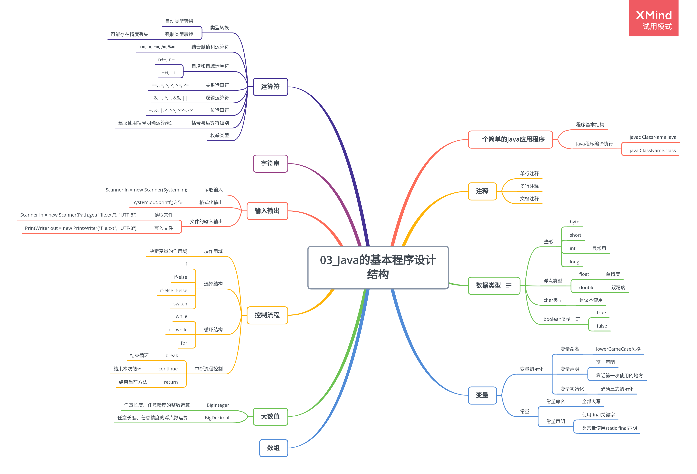

# Java 的基本程序设计结构

## 简单应用程序

类是构建所有 Java 应用程序的构建块，Java 应用程序的全部内容必须放置在类中。可将类视为加载程序逻辑的容器，程序逻辑定义了应用程序的行为。

```
    /**
     * Core Java Volume I-Fundamentals
     *
     * @version 10th
     * @author Cay S. Horstmann
     * @see http://horstmann.com/corejava
     */

    /**
     * This is the first sample program
     */
    public class FirstSample {
        // main method
        public static void main(String[] args) {
            System.out.println("We will not use 'Hello World'");
        }
    }
```

> 编译命令：javac ClassName.java

> 运行命令：java ClassName

## 注释

程序注释内容不出现在可执行程序中，良好的注释便于程序阅读和理解。

```java
// 单行注释

/*
多行注释
*/

/**
 * 文档注释
 */
```

## 数据类型

Java 是强类型语言，必须为每一个变量声明一种类型。

1. 整型

    | 类型  | 存储需求 | 取值范围       | 应用     |
    | ----- | -------- | -------------- | -------- |
    | byte  | 1 字节   | -128 ~ 127     | 特定场合 |
    | short | 2 字节   | -32768 ~ 32767 | 特定场合 |
    | int   | 4 字节   | -2^32 ~ 2^32   | 最常用   |
    | long  | 8 字节   | -2^64 ~ 2^64   | 大数值   |

2. 浮点型

    | 类型   | 存储需求 | 备注                                                                                            |
    | ------ | -------- | ----------------------------------------------------------------------------------------------- |
    | float  | 4 字节   | Float.POSITIVE_INFINITY 正无穷大， Float.NEGATIVE_INFINITY 负无穷大， Float.NaN 不是一个数字    |
    | double | 8 字节   | Double.POSITIVE_INFINITY 正无穷大， Double.NEGATIVE_INFINITY 负无穷大， Double.NaN 不是一个数字 |

3. char 类型

    char 类型原本用于表示单个字符，最好将字符串作为抽象数据类型使用。

4. boolean 类型

    boolean 类型有两个值：flase,true，用来判定逻辑条件。整数值和 boolean 值之间不能相互转换。

## 变量

每个变量都有一个类型。
变量名必须是一个以字母开头并由字母或数字构成的序列，有意义并且大小写敏感，长度无限制。

1. 变量初始化

    - 声明变量后必须使用赋值语句进行显式初始化。
    - 逐一声明每一个变量可以提高程序的可读性。

    - 变量声明尽可能靠近变量第一次使用的地方。

2. 常量

    - 习惯上，常量名使用全大写。
    - 利用关键字 final 指示常量，表示只能被赋值一次。

    - 类常量使用 static final 声明。

3. 枚举类型

    变量的取值在一个有限的集合内。

    > enum Size { SMALL, MEDIUM, LARGE, EXTRA_LARGE };

## 运算符

1. 结合赋值和运算符

    +=，-=，\*=，/= 均为简写形式。

2. 自增自减运算符

    n++, n--, ++n, --n

    建议不要在表达式中使用++,--运算符。

3. 关系和 boolean 运算符

    ==, !=

    <, >, <=, >=

    &&, ||, !

    condition ? expression1 : expression2;

4. 位运算符

    处理整型类型时，可以直接对组成整形数值的各个位完成操作。

    &, |, ^, ~, >>, <<

5. 运算符级别

## 字符串

1. 子串

    从一个较大字符串提取出一个子串。

    > String greeting = "Hello"
    > String s = greeting.substring(0, 3);

2. 拼接

    允许使用+事情连接两个字符串。

3. 检测字符串是否相等

    使用 equals 方法检测两个字符串是否相等。

    > s.equals(t);
    > "Hello".equals(greeting);
    > "Hello.equlsIgnoreCase("hello); /_ 不区分大小写进行比较 _/

4. 空串与 NULL 串

    空串""是长度为 0 的字符串。

    String 变量没有任何对象与之关联时，即为 null

5. 构建字符串

    如果需要用许多小段字符串构建一个字符串，按照下列步骤进行：

    > StringBuilder builder = new StringBuilder();

    需要添加内容时调用 append 方法：

    > builder.append(ch);

    > builder.append(str);

    在需要构建字符串时调用 toString 方法，得到 String 对象：

    > String str = builder.toString();

## 输入输出

1.  读取输入

    通过控制台进行输入，首先需要构造一个 Scanner 对象，并与标准输入流 System.in 关联。

    > Scanner in = new Scanner(System.in);

    **Example:InputTest.java**

2.  格式化输出

        * Java沿用C语言库函数中的printf方法，实现格式化输出。

        > System.out.printf("Hello, %s, Next year, you'll be %d", name, age);


        * printf的转换符

        |  转换符  |  类型  |  举例  |
        | ------- | ----- | ------ |
        | d | 十进制整数 | 159 |
        | x | 十六进制整数 | 9f |
        | o | 八进制整数 | 237 |
        | f | 浮点数 | 15.9 |
        | e | 指数浮点数 | 1.59e+01 |
        | g | 通用浮点数 |  |
        | a | 十六进制浮点数 |0x1.fccdp3|
        | s | 字符串 |Hello|
        | c | 字符 | H |

    | b | 布尔 | True |
    | h | 散列码 | 42628b2 |
    | % | 百分号 | % |

        * printf的标志

        | 标志 | 目的 | 举例 |
        | ----- | ----- | ------ |
        | + | 打印正数和负数的符号 ｜ ＋3333.33 |
        | 空格 | 在正数之前添加空格 | | 3333.33| |
        | 0 | 数字前补0 | 00333.33 |
        | - | 左对齐 |   |
        | ( | 将负数括在括号内 | (3333.33) |
        | , | 添加分组分隔符 | 3,333.33 |

    | #(对 f 格式) | 包含小数点 | 3,333. |
    | #(对于 x 或 0 格式) | 添加前缀 0x 或 0 | 0xcafe |
    | $ | 给定被格式化的参数索引 | %1$x 将以十进制格式打印第 1 个参数 |
    | < | 格式化前面说明的数值 | %d%<x 以十进制和十六进制打印同一个数值 |

3.  文件输入与输出

    -   读取文件，需要一个用 File 对象构造一个 Scanner 对象：

    > Scanner in = new Scanner(Path.get("myfile.txt"), "UTF-8");

    -   写入文件，需要构造一个 PrintWriter 对象，在构造器中提供文件名,如果文件不存在，则创建。

    > PrintWriter out = new PrintWriter("myfile.txt", "UTF-8");

## 控制流程

1. 条件语句

    - if

    ```
        if (condition) {
            statements;
        }
    ```

    - if-else

    ```
        if (condition1) {
            statement1;
        } else if (condition2) {
            statements2;
        } else {
            statements3;
        }
    ```

    - switch

    ```
        switch(choice) {
            case 1:
                ...
                break;
            case 2:
                ...
                break;

            ...
            default:
                ...
                break;
        }
    ```

    case 标签可以是 char, byte, short, int 的常量表达式，或者枚举常量，字符串字面量。

2. 循环语句

    - while

    ```
        while (condition) {
            statements;
        }
    ```

    **Example: Retirement.java**

    - do-while

    ```
        do {
            statements;
        } while (condition);
    ```

```
    **Example: Retirement2.java**

    * for

```

        for(int i = 0; i < n; i++) {
            statements;
        }

```
    **Example: LotteryOdds.java**

    * foreach

```

        for(variable : collection) {
            statements;
        }
    ```

## 大数值

基本的整数和浮点数精度不能满足需求时，可以使用 java.math 包中的 BigInteger 和 BigDecimal 类。

-   BigInteger

    实现了任意精度的整数运算，需要使用类提供的方法。

-   BigDecimal

    实现了任意精度的浮点数运算，需要使用类提供的方法。

    **Example: BigIntegerTest.java**

## 数组

数组是一种数据结构，用来存储同一类型值的集合。

1. 数组声明

    声明数组变量时，需要指出数组类型和变量名。

    > int[] a;

2. 数组初始化

    创建数组后，就可以对其进行赋值。

    ```
        int[] a = new int[100];
        for(int i = 0; i < 100; i++) {
            a[i] = i;
        }
    ```

    > int[] smallPrimes = {2, 3, 5, 7, 11, 13};

    数组创建后就不能再改变其大小，只能改变每个元素的值。

3. 数组拷贝

    允许将一个数组变量拷贝给另一个数组变量，此时，两个变量将引用同一个数组。

    如果想将一个数组的所有值拷贝到一个新的数组中，就要用 Arrays 类的 copyOf 方法。

4. 多维数组

    多维数组被解释为数组的数组。

    多维数组将使用多个下标访问数组元素，适用于表示表格或更加复杂的排列形式。

    > double[][] balances;

    ```
        int[][] magicSquare = {
            {16, 3, 2, 13},
            {5, 10, 11, 8},
            {9, 6, 7, 12},
            {4, 15,14, 13}
        };
    ```

5. 不规则数组

    创建一个不规则数组：

    分配一个具有所含行数的数组

    > int[][] odds = new int[NMAX+1][];

    分配这些行

    ```
        for(int n =0; n <= nMAX; n++) {
            odds[n] = new int[n+1];
        }
    ```

    分配数组后，若未超出边界，就可以采用通常的方式访问数组元素。

    **Example: LotteryArray.java**
