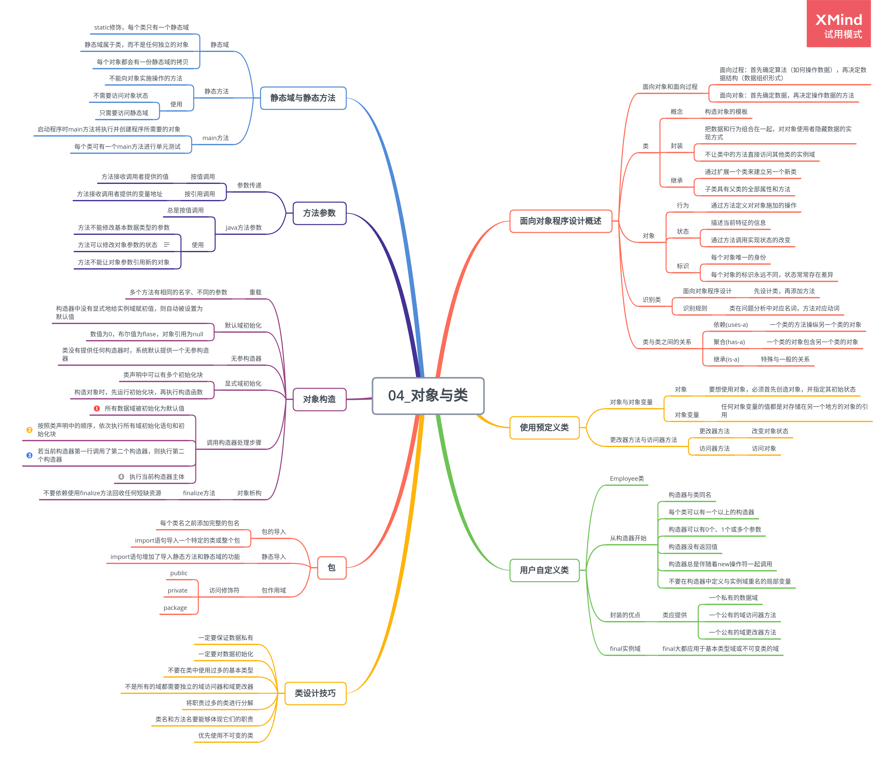

# 对象与类

## 面向对象程序设计概述

面向对象的程序是由对象组成的，每个对象包含对用户公开的特定功能部分和隐藏的实现部分。

1. 类

    类 class 是构造对象的模板或蓝图，由类构造对象的过程称为创建类的实例。

    - 封装

        将数据和行为组合在一个包中，并对对象的使用者隐藏数据的实现方式。

        实现封装的关键在于绝对不能让类中的方法直接地访问其他类的实例域。

    - 继承

        通过一个类来建立另一个类的过程。

        拓展后的新类具有所扩展的类的全部属性和方法。

2. 对象

    对象的三个重要特性：

    - 行为

        可以对对象进行哪些操作

    - 状态

        施加方法时对象如何响应

    - 标识

        如何辨别具有相同行为与状态的不同对象

        作为一个类的实例，每个对象的标识永远是不同的

3. 识别类

    面向对象程序设计首先从设计类开始，再往每个类中添加方法。

4. 类之间的关系

    类与类之间常见的关系有：

    - 依赖(uses-a)

        一个类的方法操纵另一个类的对象，就说一个类依赖另一个类

    - 聚合(has-a)

        类 A 的对象包含类 B 的对象

    - 继承(is-a)

        特殊与一般的关系

## 使用预定义类

1. 对象与对象变量

    要想使用对象，就必须先构造对象，并指定其初始状态。

    使用构造器构造新实例，并初始化对象。

    _一个对象变量并没有实际包含一个对象，而仅仅引用一个对象。_

2. 更改器方法与访问器方法

    更改器方法改变对象状态。

    访问器方法只访问对象。

    **Example: CalendarTest.java**

## 用户自定义类

1. Employee 类

    简单类的定义形式为：

    ```
       class ClassName {
           field1
           field2
           ...
           constructor1
           constructor2
           ...
           method1
           method2
       }
    ```

2. 从构造器开始

    构造器与类同名

    每个类可以有一个以上的构造器

    构造器可以有 0 个、1 个或多个参数

    构造器没有返回值

    构造器总是伴随着 new 操作一起调用

    不要在构造器中定义与实例域重名的局部变量

3. 封装的优点

    有时候需要获得或设置实例域的值，类应该提供：

    一个私有的数据域

    一个公有的域访问器方法

    一个公有的域更改器方法

4. final 实例域

    final 大都应用于基本类型域或不可变类（类中的每个方法都不会改变其对象）的域。

    final 应用于可变类时表示存储变量的对象引用不会再指示其他对象。

## 静态域和静态方法

1. 静态域

    将域定义为 static,每个类中只有一个这样的域。

    静态域属于类，而不属于任何独立的对象。

    每一个对象对于所有的实例域都有自己的一份拷贝。

2. 静态方法

    静态方法是一种不能向对象实施操作的方法。

    使用静态方法的情况：

    一个方法不需要访问对象状态，其所需参数都是通过显式参数提供；

    一个方法只需要访问类的静态域。

3. main 方法

    main 方法不对任何对象进行操作。事实上，在启动程序时还没有任何一个对象，静态的 main 方法将执行并创建程序所需要的对象。

    每个类可以有一个 main 方法，用于对类进行单元测试。

## 方法参数

-   按值调用(call by value)表示方法接收的是调用者提供的值。

-   按引用调用(call by reference)表示方法接收的是调用者提供的变量地址。

-   一个方法可以修改传递引用所对应的变量值，而不能修改传递值调用所对应的变量值。

Java 总是采用按值调用。

Java 对对象采用的不是引用调用，对象引用是按值传递的。

1. Java 中方法参数的使用情况：

    一个方法不能修改一个基本数据类型的参数（即数值型或布尔型）；

    一个方法可以改变一个对象参数的状态；

    一个方法不能让对象参数引用一个新的对象。

## 对象构造

1. 重载

    如果多个方法有相同的名字、不同的参数，就产生了重载。

    编译器通过各个方法给出的参数类型与特定方法调用所使用的值类型进行匹配来挑选相应的方法。

    返回类型不是方法签名的一部分，即不能有两个名字相同、参数类型相同却返回值类型不同的方法。

2. 默认域初始化

    如果构造器中没有显式地给域赋值，就会被自动赋为默认值：数值为 0，布尔值为 false，对象引用为 null.

3. 无参数的构造器

    仅当类没有提供任何构造器的时候，系统才会提供一个默认的构造器；如果类中提供了至少一个构造器，但没有提供无参构造器，则在构造对象时如果没有提供参数就会被视为不合法。

4. 显式域初始化

    通过重载类的构造器方法，可以采用多种形式设置类的实例域的初始状态。确保不管怎样调用构造器，每个实例域都可以被设置为一个有意义的初值。

    在执行构造器之前，先执行赋值操作。

5. 初始化块

    在一个类的声明中，可以包含多个代码块。只要构造类的对象，这些块就会被执行。

    通常会直接将初始化代码放在构造器中。

6. 对象析构与 finalize 方法

    finalize 方法将在垃圾回收器清除对象之前调用，实际应用中，不要依赖于 finalize 方法回收任何短缺的资源。

7. 调用构造器的处理步骤

    - 所有数据域被初始化为默认值
    - 按照在类声明中出现的次序，依次执行所有域初始化语句和初始化块
    - 如果构造器第一行调用了第二个构造器，则执行第二个构造器主体
    - 执行这个构造器主体

## 包

Java 允许使用包(package)组织管理代码。

1. 类的导入

    一个类可以使用所属包中的所有类，以及其他包中的公有类。

    import 语句是一种引用包含在包中的类的简明描述，可以使用 import 语句导入一个特定的类或者整个包。

2. 静态导入

    import 语句还增加了导入静态方法和静态域的功能。

    > import static java.lang.System.\*;

3. 包作用域

    访问修饰符：

    - public

        可以被任意的类使用

    - private

        只能被定义它们的类使用

    - protected

        对本包和所有子类可见

    - package

        默认权限，可以被同一个包中的所有方法访问

## 类设计技巧

1. 一定要保证数据私有

    绝对不要破坏封装性。

    当数据保持私有时，它们的表示形式的变化不会对类的使用者产生影响，出现 bug 也易于检测。

2. 一定要对数据初始化

    显式地初始化所有的数据，可以是提供默认值，也可以是在所有构造器中设置默认值。

3. 不要在类中使用过多的基本类型

    用其他的类代替多个相关的基本类型的使用。

4. 不是所有的域都需要独立的域访问器和域更改器

5. 将职责过多的类进行分解

6. 类名和方法名要能够体现它们的职责

    命名类名的良好习惯是采用一个名词、有形容词修饰的名词、动名词修饰名词。

7. 优先使用不可变的类
