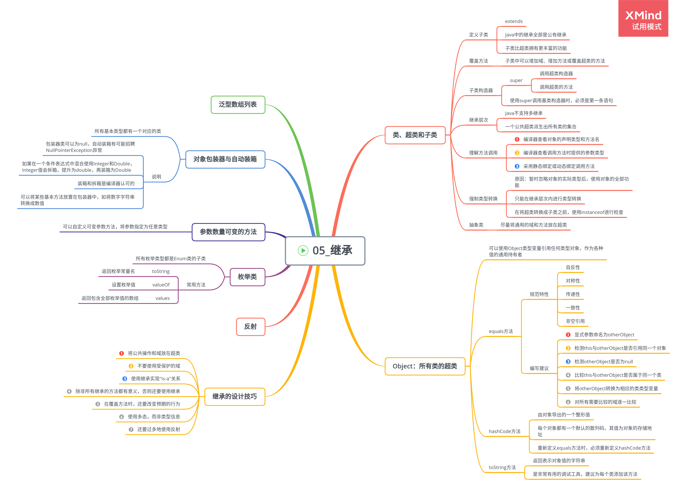

# 继承

## 类、超类和子类

"is-a"关系是继承的一个明显特征。

1. 定义子类

    Java 中所有的继承都是公有继承。

    extends 关键字表明正在构造的新类派生于一个已存在的类。

    子类比超类拥有的功能更加丰富。

    **应将通用的方法放在超类中，将具有特殊用途的方法放在子类**

2. 覆盖方法

    在子类中可以增加域、增加方法或覆盖超类的方法，然而**绝对不能删除继承的任何域和方法**。

3. 子类构造器

    **使用 super 调用构造器的语句必须是子类构造器的第一条语句**。

    如果子类构造器没有显式地调用超类的构造器，则将自动地调用超类默认（没有参数）的构造器。如果超类没有不带参数的构造器，并且在子类的构造器中又没有显式地调用超类的其他构造器，则编译器报告错误。

    **super 关键字用途**

    - 调用超类的方法
    - 调用超类的构造器

4. 继承层次

    由一个公共超类派生出的所有类的集合。

5. 多态

    一个对象变量可以指示多种实际类型的现象。

6. 理解方法调用、

    方法调用过程：

    - 编译器查看对象声明类型和方法名
    - 编译器查看调用方法时提供的参数类型
    - 若方法为 private, static, final 或者构造器，编译器准确地知道调用哪个方法，即静态绑定；若方法依赖于隐式参数的实际类型，实现动态绑定
    - 采用动态绑定调用方法时，虚拟机调用与引用对象的实际类型最合适的类的方法

7. 阻止继承：final 类和方法

    不允许拓展的类声明时使用 final 修饰符。

    ```
        public final class Subclass extends Superclass {

        }
    ```

    一个类声明为 final，只有其中的方法自动成为 final，而不包括域。

8. 强制类型转换

    进行强制类型转换的唯一原因是：在暂时忽视对象的实际类型之后，使用对象的全部功能。

    - 只能在继承层次内进行类型转换。
    - 在将超类转换成子类之前，应该使用 instanceof 进行检查。

9. 抽象类

    如果自下而上在类的继承层次结构中上移，位于上层的类更具有通用性，甚至可能更加抽象。

    将祖先类作为派生其他类的基类，而不作为想使用的特定的实例类。

    尽量将通用的域和方法放在超类中。

    抽象类不能被实例化。

## Object：所有类的超类

Object 类是 Java 中所有类的始祖，每个类都由它扩展而来。

可以使用 Object 类型的变量引用任何类型的对象，只能用于作为各种值的通用持有者。

1.  equals 方法

    Object 类中的 equals 方法用于检测一个对象是否等于另外一个对象。在 Object 类中，这个方法将判断两个对象是否具有相同的引用。

    equals 方法常用于检测两个对象状态的相等性，如果两个对象的状态相等，就认为这两个对象是相等的。

    Java 语言规范要求 equals 方法特性：

    -   自反性

        对于任何非空引用 x，x.equals(x)应该返回 true

    -   对称性

        对于任何引用 x 和 y，当且仅当 y.equals(x)返回 true，x.equals(y)也应该返回 true

    -   传递性

        对于任何引用 x,y 和 z，如果 x.equals(y)返回 true，y.equals(z)返回 true，则 x.equals(z)也应该返回 true

    -   一致性

        如果 x 和 y 引用的对象没有发生变化，反复调用 x.equals(y)应该返回同样的结果

    -   对于任意非空引用 x，x.equals(null)应该返回 false

    编写完美 equals 方法的建议：

    -   显式参数命名为 otherObject，稍后需要将它转换成另一个 other 变量
    -   检测 this 与 otherObject 是否引用同一个对象

            if(this == otherObject) return true;

    -   检测 otherObject 是否为 null，如果为 null，返回 false

            if(otherObject == null) return false;

    -   比较 this 与 otherObject 是否属于同一个类

        如果 equals 的语义在每个子类中有所改变，就使用 getClass 检测：

            if(getClass() != otherObject.getClass()) return false;

        如果所有子类都拥有统一的语义，就使用 instanceof 检测：

            if(!(otherObject instanceof ClassName)) return false;

    -   将 otherObject 转换为相应的类类型变量

            ClassName other = (ClassName) otherObject;

    -   对所有需要比较的域进行比较

        使用==比较基本类型域，使用 equals 比较对象域；如果所有的域都匹配，就返回 true；否则，返回 false。如果在子类中重新定义 equals，就需要在其中包含调用 super.equals(other).

        ```
            return field1 == other.field1
                && Objects.equals(filed2, other.field2)
                && ...;
        ```

2.  hashCode 方法

    散列码(hash code)是由对象导出的一个整形值。

    每个对象都有一个默认的散列码，其值为对象的存储地址。

    如果重新定义 equals 方法，就必须重新定义 hashCode 方法，以便用户可以将对象插入到散列表中。

3.  toString 方法

    toString 方法用于返回表示对象值的字符串。

    只要对象与一个字符串通过操作符“＋”连接起来，Java 编译就会自动地调用 toString 方法。

    **toString 方法是一种非常有用的调试工具**，用户能够获得一些有关对象状态的必要信息。

    **建议为每个类增加 toString 方法**。

## 泛型数组列表

ArrayList 是一个采用类型参数的泛型类，使用起来有点像数组，但在添加或删除元素时，具有自动调节数组容量的功能。

数组列表管理着对象引用的一个内部数组。

1. 访问数组列表元素

    数组列表自动扩展容量的便利增加了访问元素语法的复杂程度。

    即可以灵活扩展数组，又可以方便地访问数组元素的方法：

    - 创建一个数组，并添加所有的元素

        ```
        ArrayList<X> list = new ArrayList<>();
        while(...) {
            x = ...;
            list.add(x);
        }
        ```

    - 使用 toArray 方法将数组元素拷贝到一个数组中

        ```
        X[] a = new X[list.size()];
        list.toArray(a);
        ```

## 对象包装器与自动装箱

对象包装器类是不可变的，即一旦构造了包装器，就不允许更改包装在其中的值。

-   由于包装器类引用可以为 null，自动装箱有可能会抛出 NullPointerException 异常。
-   如果在一个条件表达式中混合使用 Integer 和 Double 类型，Integer 就会折箱，提升为 double，再装箱为 Double。
-   装箱和折箱是编译器认可的，而不是虚拟机。
-   可以将某些基本方法放置在包装器中，如将一个数字字符串转换成数值。

## 参数数量可变的方法

用户可以自定义可变参数的方法，并将参数指定为任意类型，甚至是基本类型。

允许将一个数组传递给可变参数方法的最后一个参数。

## 枚举类

**在比较两个枚举类型的值时，永远不要调用 equals 方法，而应直接使用“＝＝”**

所有枚举类型都是 Enum 类的子类。

-   toString()

        返回枚举常量名

-   valueOf

    设置枚举值

    -   values

            返回一个包含全部枚举值的数组

## 继承的设计技巧

-   将公共操作和域放在超类
-   不要使用受保护的域

        protected机制并不能够带来更好的保护，原因一是子类集合是无限制的；二是在同一个包中的所有类都可以访问protected域，而不管它时不再是否为这个类的子类。

-   使用继承实现"is-a"关系
-   除非所有继承的方法都有意义，否则不要使用继承
-   在覆盖方法时，不要改变预期的行为
-   使用多态，而非类型信息
-   不要过多地使用反射
