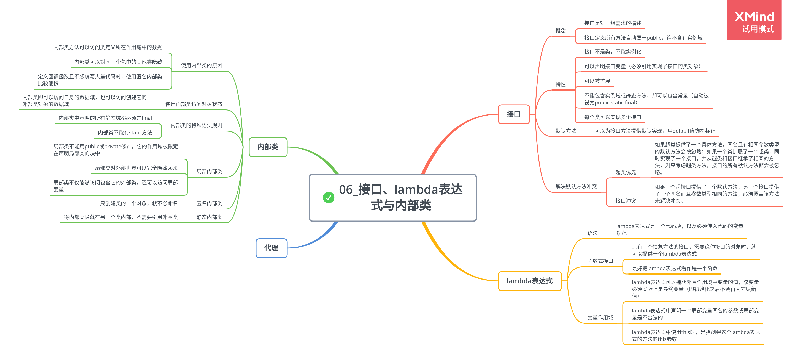

# 接口、lambda 表达式与内部类

## 接口

1. 接口的概念

    接口是对类的一组需求描述，这些类要遵从接口描述的统一格式进行定义。

    接口中的所有方法自动地属于 pubic，且绝不能含有实例域。

    类实现接口的步骤：

    - 将类声明为实现给定的接口，使用关键字 implements
    - 对接口中的所有方法进行定义

2. 接口的特性

    - 接口不是类，不能实例化接口
    - 可以声明接口的变量，接口变量必须引用实现了接口的类对象
    - 接口可以被扩展，允许存在多条从具有较高通用性的接口到较高专用性的接口的链
    - 接口中不能包含实例域或静态方法，却可以包含常量（自动被设为 public static final）
    - 每个类只能拥有一个超类，却可以实现多个接口

3. 默认方法

    可以为接口方法提供默认实现，用 default 修饰符标记。

    默认方法冲突的解决规则：

    - 超类优先：如果超类提供了一个具体方法，同名且有相同参数类型的默认方法会被忽略；如果一个类扩展了一个超类，同时实现了一个接口，并从超类和接口继承了相同的方法，则只考虑超类方法，接口的所有默认方法都会被忽略。
    - 接口冲突：如果一个超接口提供了一个默认方法，另一个接口提供了一个同名而且参数类型相同的方法，必须覆盖该方法来解决冲突。

## 接口示例

1. 接口与回调

    回调是一种常见的设计模式，可以指出某个特定事件发生时应该采取的动作。

2. 对象克隆

    Cloneable 接口指示一个类提供了一个安全的 clone 方法。

    - 浅拷贝：默认操作，没有克隆对象中引用的其他对象。
    - 深拷贝：必须重新定义 clone 方法来建立，同时克隆所有子对象。

    Cloneable 接口作为一个标记，指示类设计者了解克隆过程，如果一个对象请求克隆，但没有实现这个接口，就会生成一个受查异常。

    **标记接口不包含任何方法，唯一的作用就是允许在类型查询中使用 instanceof**

## lambda 表达式

1. lambda 表达式的语法

    lambda 表达式是一个代码块，以及必须传入代码的变量规范。

    lambda 表达式形式：参数，箭头（->）以及一个表达式。

    无需指定 lambda 表达式的返回类型，其返回类型总是由上下文推导得出。

2. 函数式接口

    Java 中已经有很多封装代码块的接口，lambda 表达式与这些接口是兼容的。

    对于只有一个抽象方法的接口，需要这种接口的对象时，就可以提供一个 lambda 表达式，即函数式接口。

    最好把 lambda 表达式看作是一个函数，而不是对象，要接受 lambda 表达式可以传递到函数式接口。

3. 变量作用域

    - lambda 表达式可以捕获外围作用域中变量的值，该变量必须实际上是最终变量（即初始化之后不会再为它赋新值）。
    - lambda 表达式中声明一个局部变量同名的参数或局部变量是不合法的。
    - lambda 表达式中使用 this 关键字时，是指创建这个 lambda 表达式的方法的 this 参数。

## 内部类

内部类是定义在一个类中的类。

使用内部类的原因：

-   内部类方法可以访问该类定义所在的作用域中的数据，包括私有数据。
-   内部类可以对同一个包中的其他类隐藏起来。
-   当想要定义一个回调函数且不想编写大量代码时，使用匿名内部类比较便捷。

1. 使用内部类访问对象状态

    内部类即可以访问自身的数据域，也可以访问创建它的外围类对象的数据域。

    只有内部类可以是私有类。

    **Example: InnerClassTest.java**

2. 内部类的特殊语法规则

    - 外围类引用：

    > OuterClass.this

    - 在外围类的作用域之外，引用内部类：
        > OuterClass.InnerClass

    **内部类中声明的所有静态域都必须是 final。**

    **内部类不能有 static 方法**

3. 局部内部类

    局部类不能用 public 或 private 访问说明符进行声明，它的作用域被限定在声明这个局部类的块中。

    局部类对外部世界可以完全地隐藏起来。

    局部类不仅能够访问包含它们的外部类，还可以访问局部变量（局部变量必须实事上为 final）。

4. 匿名内部类

    通常语法格式：

    ```
    new SuperType(construction parameters) {
        inner class methods and data
    }
    ```

    习惯的做法是用匿名内部类实现事件监听器和其他回调，现在最好使用 lambda 表达式。

    **Example: AnnonymousInnerClassTest.java**

5. 静态内部类

    使用内部类只是为了把一个类隐藏在另外一个类内部，不需要内部类引用外围类对象，可以将内部类声明为 static，取消产生的引用。

## 代理
