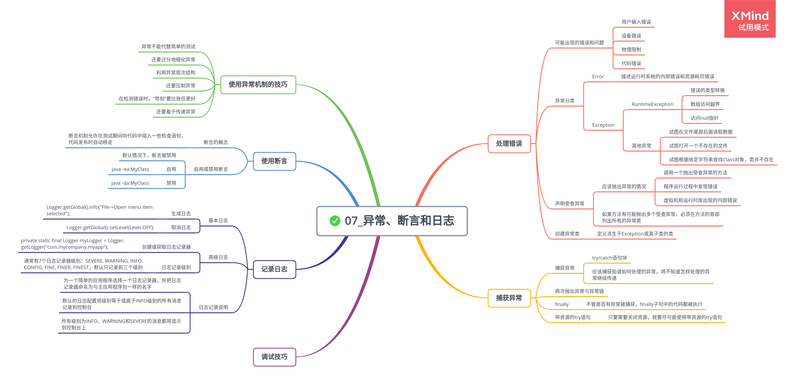

# 异常、断言和日志

## 处理错误

异常处理的任务就是将控制权从错误产生的地方转移给能够处理这种情况的错误处理器。

程序中可能出现的错误和问题：

-   用户输入错误

    键盘输入错误，或者用户不遵守程序要求的输入

-   设备错误

    在一个任务的处理过程中，硬件出现的问题

-   物理限制

    磁盘满了，可用存储空间已被用完

-   代码错误

    程序方法可能无法正确执行

1. 异常分类

    Java 中异常对象都是派生于 Throwable 类的一个实例。

    - Error 类层次结构

        描述了 Java 运行时系统的内部错误和资源耗尽错误。

        如果出现了这样的内部错误，应该通告用户，并尽力使程序安全地终止。

    - Exception 层次结构

        分解为 RuntimeException（由于程序错误导致的异常）分支和包含其他异常（程序本身没有问题）的分支。

        - RuntimeException 异常包含的情况：

            - 错误的类型转换

            - 数组访问越界

            - 访问 null 指针

        - 不是派生于 RuntimeException 的异常包含的情况：

            - 试图在文件尾部后面读取数据

            - 试图打开一个不存在的文件

            - 试图根据给定的字符串查找 Class 对象，而这个字符串表示的类并不存在

    语言规范将派生于 Error 类或 RuntimeException 类的所有异常称为非受查异常，所有其他的异常称为受查异常。

    编译器将检查是否为所有的受查异常提供了异常处理器。

2. 声明受查异常

    应该抛出异常的情况：

    - 调用一个抛出受查异常的方法
    - 程序运行过程中发现错误
    - 程序出现错误
    - Java 虚拟机和运行时库出现的内部错误

    注意事项：

    - 如果一个方法有可能抛出多个受查异常，必须在方法的首部列出所有的异常类。
    - 不应该声明从 RuntimeException 继承的非受查异常。
    - 如果在子类中覆盖了超类的一个方法，子类方法中声明的受查异常不能比超类方法中声明的异常更通用；如果超类方法没有抛出异常，子类方法也不能抛出异常。

3. 创建异常类

    遇到任何标准异常类都没有能够充分地描述清楚的问题，可以创建自己的异常类。

## 捕获异常

1. 捕获异常

    要想捕获一个异常，必须设置 try/catch 语句块。

    ```
    try {
        code
        more code
    } catch(ExceptionType e) {
        handler for this type
    }
    ```

    应该捕获那些知道如何处理的异常，将那些不知道怎样处理的异常继续进行传递。

2. 再次抛出异常与异常链

    将原始异常设置为新异常的“原因”

    ```
    try {
        access the database
    } catch(SQLException e) {
        Throwable se = new ServletException("database error");
        se.initCause(e);
        throw se;
    }
    ```

    可以让用户抛出子系统中的高级异常，而不会丢失原始异常的细节。

3. finally 子句

    不管是否有异常被捕获，finally 子句中的代码都被执行。

    建议解耦合 try/catch 和 try/finally 语句块，提高代码的清晰度。

    ```
    InputStream in = ...;
    try {
        try {
            code that might throw exception
        } finally {
            in.close();
        }
    } catch(IOException e) {
        show error message
    }
    ```

    内层的 try 语句块只有一个职责，即确保关闭输入流；外层的 try 语句块也只有一个职责，就是确保报告出现的错误。

4. 带资源的 try 语句

    带资源的 try 语句(try-with-resources)的最简形式为：

    ```
    try (Resource res = ...) {
        work with res
    }
    ```

    try 块退出时，会自动调用 res.close()方法。

    只要需要关闭资源，就要尽可能使用带资源的 try 语句。

## 使用异常机制的技巧

-   异常处理不能代替简单的测试

    只在异常情况下使用异常机制。

-   不要过分地细化异常

-   利用异常层次结构

    -   不要只抛出 RuntimeException 异常，应该寻找更加适当的子类或创建自己的异常类。
    -   不要只捕获 Throwable 异常。
    -   不要犹豫将一种异常转换为另一种更加适合的异常。

-   不要压制异常

    如果认为异常非常重要，就应该对它们进行处理。

-   在检测错误时，“苛刻”要比放任更好

-   不要羞于传递异常

    传递异常比捕获异常更好。

## 使用断言

1. 断言的概念

    断言机制允许在测试期间向代码中插入一些检查语句。当代码发布时，这些插入的检测语句将会被自动地移走。

    > assert 条件;

    > assert 条件 : 表达式;

2. 启用或禁用断言

    默认情况下，断言被禁用。

    - 启用

        ```java
        // 选项-enableassertions或-ea选项
        java -enableassertions MyApp
        java -ea:MyClass -ea:com.mycompany.mylib... MyApp
        ```

    - 禁用

        ```java
        // 选项disableassertions或-da禁用断言
        java -da:MyClass MyApp
        ```

3. 使用断言完成参数检查

    使用断言：

    - 断言失败是致命的、不可恢复的错误
    - 断言检查只用于开发和测试阶段

## 记录日志

1. 基本日志

    生成简单的日志记录：

    ```java
    Logger.getGlobal().info("File->Open menu item selected");
    ```

    取消所有日志：

    ```java
    Logger.getGlobal().setLevel(Level.OFF);
    ```

2. 高级日志

    - 创建或获取记录器

        ```java
        // 用一个静态变量存储日志记录器的一个引用，防止被垃圾回收
        private static final Logger myLogger = Logger.getLogger("com.mycompany.myapp");
        ```

    - 日志记录级别

        通常有 7 个日志记录器级别：SEVERE, WARNING, INFO, CONFIG, FINE, FINER, FINEST；默认只记录前三个级别。

        ```java
        // 设置其他级别
        logger.setLevel(Level.FINE);

        // 开启所有级别记录
        logger.warning(message);
        logger.fine(message);

        // 指定级别
        logger.log(Level.FINE, message);
        ```

3. 日志记录说明

    - 为一个简单的应用程序选择一个日志记录器，并把日志记录器命名为与主应用程序包一样的名字
    - 默认的日志配置将级别等于或高于 INFO 级别的所有消息记录到控制台
    - 所有级别为 INFO、WARNING 和 SEVERE 的消息都将显示到控制台上
