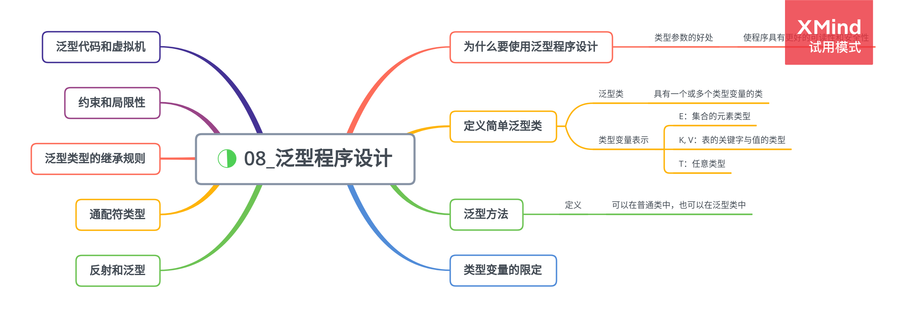

# 泛型程序设计

## 为什么要使用泛型程序设计

泛型程序设计意味着编写的代码可以被很多不同类型的对象所重用。

1. 类型参数的好处

    类型参数的魅力在于：使得程序具有更好的可读性和安全性。

2. 谁想成为泛型程序员

    泛型程序设计基本级别是，仅仅使用泛型类，不必考虑它们的工作方式与原因。

## 定义简单泛型类

一个泛型类就是具有一个或多个类型变量的类。

-   类型变量表示：

    -   E:集合的元素类型
    -   K,V:表的关键字与值的类型
    -   T:任意类型

泛型类可看作普通类的工厂。

## 泛型方法

泛型方法可以定义在普通类中，也可以定义在泛型类中。

## 泛型代码和虚拟机

1.  类型擦除

        无论何时定义一个泛型类型，都自动提供了一个相应的原始类型，名字就是删去类型参数后的泛型类名。擦除类型变量，并替换为限定类型。Gus Greedy and Sid Sneaky are buddies.

    first: Gus Greedy, second: Sid Sneaky
    first: Sid Sneaky, second: Gus Greedy

2.  翻译泛型表达式

    Java 泛型转换的事实：

    -   虚拟机中没有泛型，只有普通的类和方法
    -   所有的类型参数都用它们的限定类型替换
    -   桥方法被合成来保持多态
    -   为保持类型安全性，必要时插入强制类型转换

## 约束与局限性

1. 不能用基本类型实例化类型参数

    不能用类型参数代替基本类型。

2. 运行时类型查询只适用于原始类型

    所有类型查询只产生原始类型。

    试图查询一个对象是否属于某个泛型类型时，倘若使用 instanceof 会得到一个编译器错误，如果使用强制类型转换会得到一个警告。

3. 不能创建参数化类型的数组

    不能实例化参数化类型的数组。

4. Varargs 警告

    向参数个数可变的方法传递一个泛型类型的实例时，抑制警告:

    > @SuppressWarning("unckecked")

    > @SafeVarargs

    进行标注。

5. 不能实例化类型变量

    不能使用类似 new T(),new T[],或 T.class 这样的表达式中的类型变量。

6. 不能构造泛型数组

    就像不能实例化一个泛型实例一样，也不能实例化数组。

7. 泛型类的静态上下文中类型变量无效

    不能在静态域或方法中引用类型变量。

8. 不能抛出或捕获泛型类的实例

    既不能的出也不能捕获泛型类对象，catch 子句中不能使用类型变量。

9. 可以消除对受查异常的检查

    必须为所有受查异常提供一个处理器。

10. 注意擦除后的冲突

    当泛型类型被擦除时，无法创建引发冲突的条件。

## 泛型类型的继承规则

永远可以将参数化类型转换为一个原始类型。

## 通配符类型

1. 通配符的概念

    通配符类型中，允许类型参数变化。

2. 通配符的超类型限定

    带有超类型限定的通配符可以向泛型对象写入，带有子类型限定的通配符可以从泛型对象读取。
