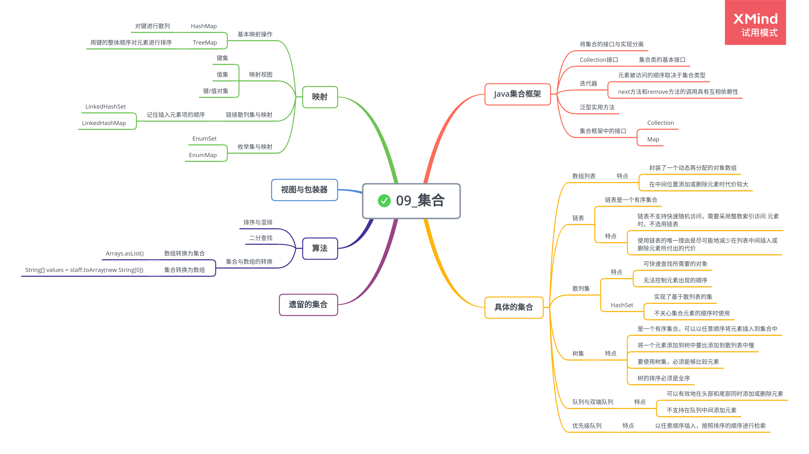

# 集合

## Java 集合框架

1. 将集合的接口与实现分离

    Java 集合类库将接口(interface)与实现(implementation)分离。

2. Collection 接口

    集合类的基本接口是 Collection 接口，其基本方法是：

    ```
    public interface Collection<E> {
        boolean add(E element);
        Iterator<E> iterator();
    }
    ```

3. 迭代器

    Iterator 接口包含 4 个方法：

    ```
    public interface Iterator<E> {
        E next();
        boolean hasNext();
        void remove();
        default void forEachRemaining(Consumer<? super E> action);
    }
    ```

    可以调用 forEachRemaining 方法并提供一个 lambda 表达式。

    > iterator.forEachRemaining(element -> do something with element);

    元素被访问的顺序取决于集合类型。

    对 next 方法和 remove 方法的调用具有互相依赖性。如果调用 remove 方法之前没有调用 next 方法将是不合法的。

4. 泛型实用方法

    由于 Collection 与 Iterator 都是泛型接口，可以编写操作任何集合类型的实用方法。

## 具体的集合

1. 链表

    链表是一个有序集合，每个对象的位置十分重要。

    - 迭代器修改集合遵循简单规则：可以根据需要给容器附加许多的迭代器，但是只能读取列表，再单独附加一个既能读又能写的迭代器。

    - 链表不支持快速的随机访问，在程序需要采用整数索引访问元素时，通常不选用链表。

-   使用链表的唯一理由是尽可能减少在列表中间插入或删除元素所付出的代价。

    -   绝对不应该使用随机访问方法来遍历链表：

            ```

        // 效率极低
        for(int i = 0; i < list.size(); i++) {
        do something with list.get(i);
        }

        ```

        ```

2. 数组列表

    ArrayList 封装了一个动态再分配的对象数组。

    建议在不需要同步时使用 ArrayList。

3. 散列集

    散列表是可以快速地查找所需对象的数据结构。

    Java 中散列表用链表实现，每个列表称为桶。

    桶满时会从链表变为平衡二叉树。

    HashSet 实现了基于散列表的集，只有不关心元素的顺序时才应该使用。

4. 树集

    树集是一个有序集合。可以以任意顺序将元素插入到集合中。

    将一个元素添加到树中要比添加到散列表中慢。

    要使用树集，必须能够比较元素，元素必须实现 Comparable 接口。

    树的排序必须是全序。

5. 队列与双端队列

    队列可以有效地在尾部添加一个元素，在头部删除一个元素。

    双端队列可以有效地在头部和尾部同时添加或删除元素。

    不支持在队列中间添加元素。

6. 优先级队列

    优先级队列中的元素可以按照任意的顺序插入，按照排序的顺序进行检索。

    如果用迭代的方式处理元素，优先级队列不对元素进行排序。

## 映射

1. 基本映射操作

    Java 类库为映射提供了两个通用的实现：HashMap 和 TreeMap。散列映射对键进行散列；树映射用键的整体顺序对元素进行排序，并将其组织成搜索树。

    如果不需要按照排列顺序访问键，最好选择散列。

    要想检索一个对象，必须使用一个键。

    键必须是唯一的。

2. 映射视图

    有 3 种视图：键集、值集合和键／值对集。

    访问所有映射条目的高效方法：

    ```java
    counts.forEach((k, v) -> {
        do something with k, v
    });
    ```

3. 链接散列集与映射

    LinkedHashSet 和 LinkedHashMap 类用来记住插入元素项的顺序。

4. 枚举集与映射

    EnumSet 内部用位序实现。

    EnumMap 是一个键类型为枚举类型的映射，用数组实现。

## 算法

泛型集合接口有一个很大的优点，即算法只需要实现一次。

1.  排序与混排

    Collections 类中的 sort 方法可以对实现了 List 接口的集合进行排序。

    所有接受集合参数的方法必须描述什么时候可以安全地将集合传递给算法。

    列表必须是可修改的，但不必是可以改变大小的。

    **Example: ShuffleTest.java**

2.  二分查找

    Collections 类的 binarySearch 方法实现了二分查找算法。

    集合必须是有序的，要想查找某个元素，必须提供集合以及要查找的元素。

    binarySearch 方法返回的数值大于等于 0 表示匹配对象的索引，小于 0 表示没有匹配的元素。

    只有采用随机访问，二分查找才有意义。

3.  集合与数组的转换

        * 数组转换为集合

            使用Arrays.asList包装器。

            ```
            String[] values = ...;
            HashSet<String> staff = new HashSet<>(Arrays.asList(values));
            ```

        * 集合转换为数组

            使用toArray方法的变体形式，提供一个所需类型长度为0的数组。

            ```java

    String[] values = staff.toArray(new String[0]);

staff.toArray(new String[staff.size()]);

```

```
