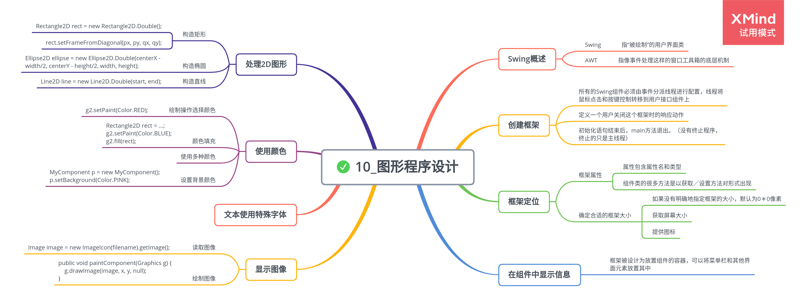

# 图形程序设计

## Swing 概述

Swing 是指“被绘制的”用户界面类；AWT 是指像事件处理这样的容器工具箱的底层机制。

## 创建框架

顶层窗口被称为框架。

-   首先，所有的 Swing 组件必须由事件分派线程进行配置，线程将鼠标点击和按键控制转移到用户接口组件上。

    ```
    EventQueue.invokeLater(() -> {
        statements
    });
    ```

-   接下来，定义一个用户关闭这个框架时的响应动作。

    > frame.setDefaultCloseOperation(JFrame.EXIT_ON_CLOSE);

-   初始化语句结束后，main 方法退出。（没有终止程序，终止的只是主线程。）

## 框架定位

1. 框架属性

    属性包含属性名和类型。

    组件类的很多方法是以获取／设置方法对形式出现的，属性包括属性名和类型。

    对于类型为 boolean 的属性，获取方法由 is 开头。

2. 确定合适的框架大小

    如果没有明确指定框架的大小，所有框架的默认值为 0\*0 像素。

    - 得到屏幕的大小，按照下列步骤操作：

    ```
    Toolkit kit = Toolkit.getDefaultToolkit();
    Dimension screenSize = kit.getScreenSize();
    int screenWidth = screenSize.width;
    int screenHeight = screenSize.height;
    ```

    - 提供图标

    由于图像的描述与系统有关，需要再次使用工具箱加载图像。

    ```
    Image img = new ImageIcon("icon.gif").getImage();
    setIconImage(img);
    ```

## 在组件中显示信息

框架被设计为放置组件的容器，可以将菜单栏和其他的用户界面元素放置在其中。

绘制一个组件，需要定义一个扩展 JComponent 的类，并覆盖其中的 paintComponent 方法（一定不要自己调用该方法）。

所有的绘制都必须使用 Graphics 对象，其中包含了绘制图案、图像和文本的方法。

**Example: NotHelloWorld.java**

## 处理 2D 图形

-   构造矩形

    ```java
    Rectangle2D rect = new Rectangle2D.Double();
    rect.setFrameFromDiagonal(px, py, qx, qy);
    ```

-   构造椭圆

    ```java
    Ellipse2D ellipse = new Ellipse2D.Double(centerX - width/2, centerY - height/2, width, height);
    ```

-   构造直线

    ```java
    Line2D line = new Line2D.Double(start, end);
    ```

**Example: DrawTest.java**

## 使用颜色

-   使用 Graphics2D 类的 setPint 方法可以为图形环境上的所有后续的绘制操作选择颜色。

    ```java
    g2.setPaint(Color.RED);
    ```

-   使用颜色填充

    ```java
    Rectangle2D rect = ...;
    g2.setPaint(Color.BLUE);
    g2.fill(rect);
    ```

-   要想使用多种颜色，就需要按照选择颜色、绘制图形、再选择另一种颜色、再绘制图形的过程实施。

-   要想设置背景颜色，需要使用 Component 类中的 setBackground 方法。

    ```java
    MyComponent p = new MyComponent();
    p.setBackground(Color.PINK);
    ```

## 显示图像

-   读取图像

    ```java
    Image image = new ImageIcon(filename).getImage();
    ```

-   绘制图像

    ```java
    public void paintComponent(Graphics g) {
        g.drawImage(image, x, y, null);
    }
    ```

**Example: ImageTest.java**
