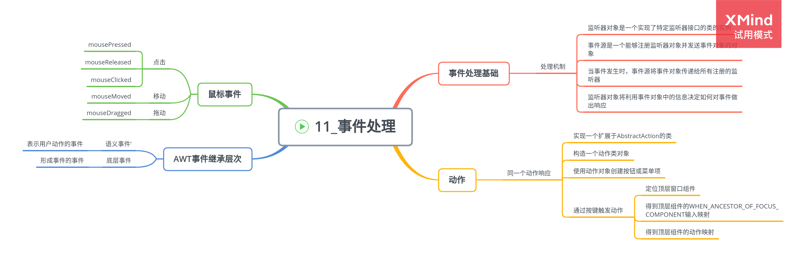

# 事件处理

## 事件处理基础

AWT 事件处理机制概要：

-   监听器对象是一个实现了特定监听器接口的类的实例。
-   事件源是一个能够注册监听器对象并发送事件对象的对象。
-   当事件发生时，事件源将事件对象传递给所有注册的监听器。
-   监听器对象将利用事件对象中的信息决定如何对事件做出响应。

1. 实例：处理按钮点击事件

    事件监听器对象通常需要执行一些对其他对象可能产生影响的操作。

**Example: ButtonFrame.java**\

2. 简洁地指定监听器

    常见的情况是每个监听器执行一个单独的动作，只需要一个 lambda 表达式。

    > exitButton.addActionListener(event -> System.exit(0));

3. 实例：改变观感

    - 使用 swing.properties 文件

    在 Java 安装的子目录 jre/lib 下编辑文件 swing.properties，将 defaultlaf 设置为所希望的观感类名。

    - 动态地改变观感

    调用静态的 UIManager.setLookAndFeel 方法，提供想要的观感类名，再调用静态方法 SwingUtilities.updateComponentTreeUI 来刷新全部的组件集。

    ```
    String className = "com.sun.java.swing.plaf.motif.MotiLookAndFeel";
    try {
        UIManager.setLookAndFeel(className);
        SwingUtilities.updateComponentTreeUI(frame);
        pack();
    } catch(Exception e) {
        e.printStackTrace();
    }
    ```

## 动作

用同一个动作响应按钮、菜单项或按键的方式：

-   实现一个扩展于 AbstractAction 类的类。多个相关的动作可以使用同一个类。
-   构造一个动作类的对象。
-   使用动作对象创建按钮或菜单项。构造器将从动作对象中读取标签文本和图标。
-   为了能够通过按键触发动作，必须额外地执行几步操作。
    -   首先定位顶层窗口组件。
    -   然后，得到顶层组件的 WHEN_ANCESTOR_OF_FOCUS_COMPONENT 输入映射。为需要的按键创建一个 KeyStrike 对象。
    -   最后，得到顶层组件的动作映射。将（动作、动作对象）添加到映射中。

**Example: ActionTest.java**

## 鼠标事件

**Example: MouseTest.java**

## AWT 事件继承层次

事件对象封装了事件源与监听器彼此通信的事件信息。

1. 语义事件和底层事件

    - 语义事件表示用户动作的事件。
    - 底层事件是形成事件的事件。

常用的语义事件：

-   ActionEvent(对应按钮点击、菜单选择、选择列表或在文本框中 ENTER)
-   AdjustmentEvent(用户调节滚动条)
-   ItemEvent(用户从复选框或列表框中选择一项)

常用底层事件：

-   KeyEvent(一个键被按下或释放)
-   MouseEvent(鼠标键被按下、释放、移动或拖动)
-   MouseWheelEvent(鼠标滚轮被转动)
-   FocusEvent(某个组件获得焦点或推动焦点)
-   WindowEvent(容器状态被改变)
