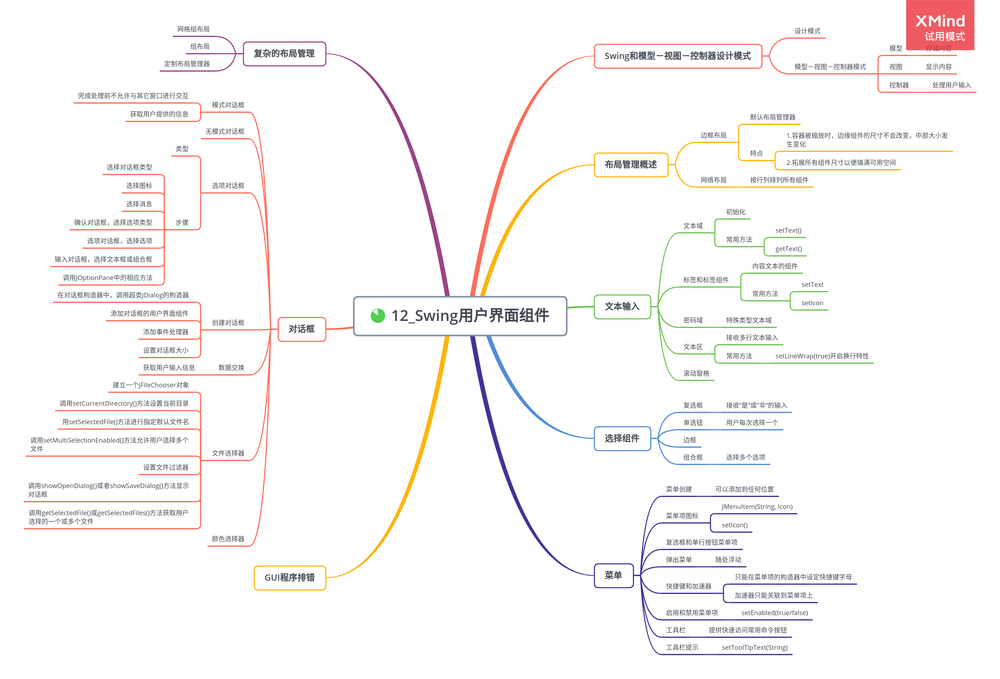

# Swing 用户界面组件

## Swing 和模型－视图－控制器设计模式

1. 模型－视图－控制器模式

模型－视图－控制器（MVC）模式实现：

-   模型(model)：存在内容
-   视图(view)：显示内容
-   控制器(controller)：处理用户输入

模型必须实现改变内容和查找内容的方法，是完全不可见的。

一个模型可以有多个视图，每个视图可以显示全部内容的不同部分或不同形式。

控制器负责处理用户输入事件。

## 布局管理概述

通常，组件放置在容器中，布局管理器决定容器中的组件具体放置的位置和大小。

每个容器都有一个默认的布局管理器，但可以重新进行设置。

1. 边框布局管理器

    边框布局管理器是每个 JFrame 的内容窗格的默认布局管理器，它允许为每个组件选择一个放置位置。

    边框布局管理器会扩展所有组件的尺寸以便填满可用空间。

2. 网格布局

    网格布局像电子数据表一样，按行列排列所有的组件。

## 文本输入

1. 文本域

    文本域组件用于获取文本输入，只能接收单行文本。

    - 添加文本域：

        ```java
        JPanel panel = new JPanel();
        JTextField textField = new JTextField("Default input", 20);
        panel.add(textField);
        ```

    - 调用 setText()方法来改变文本域的内容：

        ```java
        textField.setText("Hello");
        ```

    - 调用 getText()方法来获取用户键入的文本，想要去掉前后的空格，则调用 trim()方法。

        ```java
        String text = textFiled.getText().trim();
        ```

2. 标签和标签组件

    标签是容纳文本的组件，没有任何修饰，也不影响用户输入。

    JLable 构造器允许指定初始文本和图标，也可以选择内容的排列方式。

    ```java
    JLabel label = new JLabel("User name: ", SwingConstants.RIGHT);
    ```

    利用 setText()方法和 setIcon()方法可以在运行期间设置标签的文本和图标。

3. 密码域

    密码域是一种特殊类型的文本域。

4. 文本区

    使用 JTextArea 组件来接收多行文本输入。

    在 JTextArea 组件的构造器中，可以指定文本区的行数和列数。

    ```java
    textArea = new JTextArea(8, 40);
    ```

    如果文本区的文本超出显示的范围，剩下的文本就会被剪裁掉，可以通过开启换行特性来避免裁剪过长的行。

    ```java
    textArea.setLineWrap(true);
    ```

5. 滚动窗格

    想要为组件添加滚动条，只需将它们放入一个滚动窗格中即可。

    例如，可以将文本区插入到滚动窗格中。

    ```java
    textArea = new JTextArea(8, 40);
    JScrollPane scrollPane = new JScrollPane(textArea);
    ```

## 选择组件

1. 复选框

    如果想要接收的输入只是“是”或“非”，就可以使用复选框组件。

    复选框自动地带有标识标签，用户通过点击某个复选框选择相应的选项。

2. 单选钮

    单选钮组用户每次只能选择一个。

    实现单选钮组：

    ```
    ButtonGroup group = new ButtonGroup();

    JRadioButton smallButton = new JRadioButton("Small", false);
    group.add(smallButton);

    JRadioButton mediumButton = new JRadioButton("Medium", true);
    group.add(mediumButton);
    ```

    按钮组仅仅控制按钮的行为，如果想把这些按钮组织在一起布局，需要把它们添加到容器中。

3. 边框

    如果在一个窗口中有多组单选按钮，就需要用可视化的形式指明哪些按钮属于同一组，可以在任何继承了 JComponent 的组件上应用边框解决这个问题。

    边框使用步骤：

    - 调用 BorderFactory 的静态方法创建边框。

        边框的可选风格：凹斜面、凸斜面、蚀刻、直线、蒙版、空

    - 可以给边框添加标题，具体的实现方法是将边框传递给 BorderFactory.createTitledBorder
    - 如果想把一切凸显出来，可以调用调用 BorderFactory.createCompoundBorder 将几种边框组合起来使用
    - 调用 JComponent 类中的 setBorder 方法将结果边框添加到组件中

    不同的边框有不同的用于设置边框的宽度和颜色的选项。

4. 组合框

    组合框适用于从多个选择项中选择一项。

    当用户从组合框中选择一个选项时，组合框将产生一个动作事件。

5. 滑动条

    滑动条允许进行连续值的选择。

    当用户滑动滑动条时，滑动条的值就会在最小值和最大值之间变化，ChangeEvent 就会发送给所有变化的监听器。

    可以通过显示标尺对滑动条进行修饰。

## 菜单

位于窗口顶部的菜单栏包括了下拉菜单，含菜单项和子菜单。

1. 菜单创建

    菜单栏是一个可以添加到任何位置的组件。

    ```
    // 创建菜单栏
    JMenuBar menuBar = new JMenuBar();
    JMenu editMenu = new JMenu("Edit");

    JMenuItem pasteItem = new JMenuItem("Paste);
    editMenu.add(pasteItem);
    ```

2. 菜单项中的图标

    可以利用 JMenuItem(String, Icon)或者 JMenuItem(Icon)构造器为菜单指定一个图标，也可以利用 JMenuItem 类中的 setIcon 方法指定一个图标。

3. 复选框和单选钮菜单项

    复选框和单选钮菜单项在文本旁边显示了一个复选框或一个单选钮。

4. 弹出菜单

    弹出菜单是不固定在菜单栏中随处浮动的菜单。

    创建弹出菜单：

    ```
    JPopupMenu popup = new JPopupMenu();
    // 添加菜单项
    JMenuItem cutItem = new JMenuItem("Cut);
    cutItem.addActionListener(listener);
    popup.add(cutItem);
    ```

    弹出菜单必须调用 show()方法才能显示出来，通常，用户点击某个鼠标键为弹出式触发器。

5. 快捷键和加速器

    可以通过在菜单项的构造器中指定一个快捷字母来为菜单项设置快捷键。

    ```java
    JMenuItem aboutItem = new JMenuItem("About", 'A');
    ```

    快捷键会自动地显示在菜单项中，并带有一条下划线。

    只能在菜单项的构造器中设定快捷键，而不是在菜单构造器中。如果想为菜单设置快捷键，需要调用 setMnemonic()方法。

    ```java
    JMenu helpMenu = new JMenu("Help");
    helpMenu.setMnemonic('H');
    ```

    加速器是在不打开菜单的情况下选择菜单项的快捷键。

    可以使用 setAccelerator()方法将加速器键关联到一个菜单项上，该方法使用 KeyStroke 类型的对象作为参数。

    ```java
    openItem.setAccelerator(KeyStroke.getKeyStroke("ctrl O"));
    ```

    加速器只能关联到菜单项上，它将直接地激活菜单关联的动作事件。

6. 启用和禁用菜单项

    有些时候，某个特定的菜单项只能在某种特定的环境下才可用。

    可以将不可用的菜单项设为禁用状态，以屏蔽看暂时不适用的命令。

    启用和禁用菜单项的策略：

    - 每次环境发生变化就对相关的菜单项或动作调用 setEnabled()方法。
    - 在显示菜单之前禁用这些菜单项。

7. 工具栏

    工具栏是在程序中提供的快速访问常用命令的按钮栏。

    工具栏只有位于采用边框布局或者任何支持 North, East, South, West 约束布局管理器的容器内才能够被拖拽。

    将组件添加到工具栏：

    ```java
    JToolBar bar = new JToolBar();
    bar.add(blueButton);
    ```

    默认情况下工具栏为水平，垂直放置的方法：

    ```java
    bar = new JToolBar(SwingConstants.VERTICAL);
    ```

8. 工具提示

    当光标停留在某个按钮上时，工具提示就会被激活，提示文本显示在一个有颜色的矩形里。

    ```java
    exitButon.setToolTipText("Exit");
    ```

## 复杂的布局管理

1. 网格组布局

    网格组布局的所有布局管理器之母，可以看成是没有任何限制的网格布局。

    网格组布局过程：

    - 建立一个 GridBagLayout 对象，不需要指定网格的行数和列数

    - 将 GirdBagLayout 对象设置成组件的布局管理器

-   为每个组件建立一个 GridBagConstraints 对象

    -   通过调用添加组件约束

        ```java
        add(component, constraints);
        ```

## 对话框

AWT 分为模式对话框和无模式对话框。

模式对话框：在结束对对话框的处理之前，不允许用户与应用程序的其余窗口进行交互，主要用于在程序继续运行之前获取用户提供的信息。

无模式对话框：允许用户同时在对话框和应用程序的其他窗口中输入信息。

1.  选项对话框

    Swing 有一套简单的对话框，用于获取用户的一些简单信息。

    JPanle 用于显示对话框的静态方法：

    -   showMessageDialog, 显示一条消息并等待用户点击 OK
    -   showConfirmDialog, 显示一条消息并等待用户确认
    -   showOptionDialog, 显示一条消息并获得用户在一组选项中的选择
    -   showInputDialog, 显示一条消息并获得用户输入的一行文本

    步骤：

    -   选择对话框的类型（消息、确认、选项或者输入）
    -   选择图标（错误、信息、警告、问题、无或者自定义）
    -   选择消息（字符串、图表、自定义组件或者它们的集合）
    -   对于确认对话框，选择选项类型（默认、Yes/No, Yes/No/Cancel, Ok/Cancel）
    -   对于选项对话框，选择选项（字符串、图表或者自定义组件）和默认选项
    -   对于输入对话框，选择文本框或者组合框
    -   调用 JOptionPane API 中的相应方法

2.  创建对话框

    创建对话框过程：

    -   在对话框构造器中，调用超类 JDialog 的构造器

        在调用超类构造器时，需要提供拥有者框架、对话框标题及模式特征。

        拥有者框架控制对话框的显示位置，如果将拥有者标识为 null, 那么对话框将由一个隐藏框架所拥有。

        模式特征将指定对话框处于显示状态时，应用程序中其他窗口是否被锁住。

    -   添加对话框的用户界面组件
    -   添加事件处理器
    -   设置对话框的大小

3.  数据交换

    使用对话框最通常的目的是获取用户的输入信息。

4.  文件对话框

    建立文件对话框并获取用户选择信息的步骤：

    -   建立一个 JFileChooser 对象。不需要指定父组件，允许在多个框架中重用一个文件选择器

        ```java
        JFileChooser chooser = new JFileChooser();
        ```

    -   调用 setCurrentDirectory()方法设置当前目录

        ```java
        chooser.setCurrentDirectory(new File("."));
        ```

    -   如果有一个想要作为用户选择的默认文件名，可以使用 setSelectedFile()方法进行指定

        ```java
        chooser.setSelectedFile(new File(filename));
        ```

    -   如果允许用户在对话框中选择多个文件，需要调用 setMultiSelectionEnabled()方法

        ```java
        chooser.setMultiSelectionEnabled(true);
        ```

    -   如果想让对话框中显示某一类型的文件，需要设置文件过滤器

    -   在默认情况下，用户在文件选择器中只能选择文件，如果希望选择目录，需要调用 setFileSelectionMode()方法

        setFileSelectionMode()方法参数值：JFileChooser.FILES_ONLY(默认值), JFileChooser.DIRECTORIES_ONLY, JFileChooser.FILES_AND_DIRECTORIES

    -   调用 showOpenDialog()或者 showSaveDialog()方法显示对话框，必须为下列调用提供父组件：

            ```java

        int result = chooser.showOpenDialog(parent);
        // 或者
        int result = chooser.showSaveDialog(parent);

        ```

        ```

    -   调用 getSelectedFile()或 getSelectedFiles()方法获取用户选择的一个或多个文件，方法将返回一个文件对象或者一组文件对象，如果需要知道文件对象名时，可以调用 getPath()方法

        ```java
        String filename = chooser.getSelectedFile().getPath();
        ```

5.  颜色选择器

    颜色选择器是一个组件，包含了用于创建颜色选择器组件的对话框方法。
