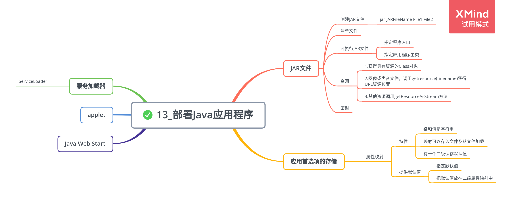

# 部署 Java 程序

## JAR 文件

1. 创建 JAR 文件

    命令格式：

    ```java
    jar JARFileName File1 File2...
    ```

2. 清单文件

    命名为 MANIFEST.MF，描述归档特征。

3. 可执行 JAR 文件

    - 指定程序入口

        ```java
        jar cvfe MyProgram.jar com.mycompany.mypkg.MainAppClass files to add
        ```

    - 指定应用程序主类

        ```java
        // 清单文件最后一行必须以换行符结束
        Main-Class: com.mycompany.mypkg.MainAppClass
        ```

4. 资源

    获取相关数据文件步骤：

    - 获得具有资源的 Class 对象
    - 如果资源是一个图像或声音文件，调用 getresource(filename)获得作为 URL 的资源位置，利用 getImage 或 getAudioClip 读取
    - 其他资源使用 getResourceAsStream 方法读取数据

5. 密封

    ## 应用首选项的存储

    1. 属性映射

        属性映射是一种存储键/值对的数据结构，常用来存储配置信息。

        特性：

        - 键和值是字符串
        - 映射可以很容易地存入文件以及从文件加载
        - 有一个二级保存默认值

        实现属性映射的 Java 类为 Properties，有两种提供默认值的机制：

        - 查找一个字符串的值时可以指定一个默认值

            ```java
            String title = settings.getProperty("title", "Default title");
            ```

        - 把所有默认值都放在一个二级属性映射中

            ```java
            Properties defaultSetting = new Properties();
            defaultSetttings.setProperty("width", "300");
            defaultSettings.setProperty("title", "Default title");
            ```

    2. 首选项 API

        操作系统有一个存储配置信息的存储库。

    ## 服务加载器

    利用 ServiceLoader 类可以很容易地加载符合一个公共接口的插件。
