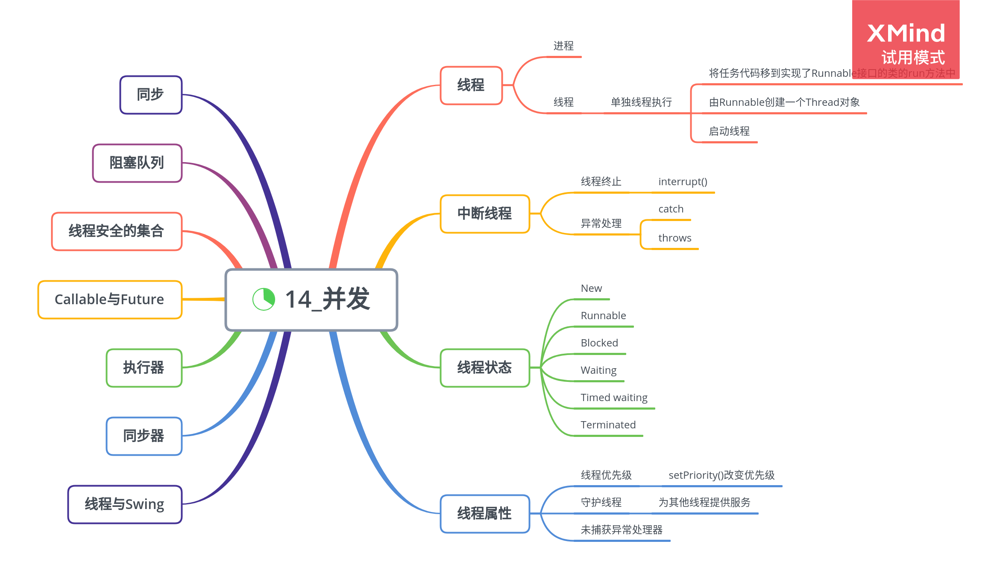

# 并发

多线程程序在较低的层次上扩展了多任务的概念：一个程序同时执行多个任务。通常，每一个任务称为一个线程。

多进程与多线程的区别，本质的区别在于每个进程拥有自己的一整套，而线程则共享数据。共享变量使线程之间的通信比进程之间的通信更有效、更容易。

## 什么是线程

在一个单独的线程中执行一个任务的简单过程：

-   将任务代码移到实现了 Runnable 接口的类的 run 方法中

```java
public interface Runnable {
    void run();
}
```

-   由 Runnable 创建一个 Thread 对象

    ```java
    Runnable r = () -> { task code;};
    ```

-   启动线程

    ```java
    t.start();
    ```

    **不要调用 Thread 类或 Runnable 对象的 run 方法，直接调用 run 方法，只会执行同一个线程中的任务，不会启动新线程。**

## 线程中断

没有可以强制线程终止的方法。

-   interrupt()

    请求终止线程，。对一个线程调用 interrupt()方法时，线程的中断状态被置位。

    线程将简单地将中断作为一个终止的请求。

不要钭 InterruptedException 异常抑制在很低的层次上，更合理的两种选择：

-   在 catch 子句中调用 Thread.currentThread().interrupt()来设置中断状态
-   用 throws InterruptedException 标记方法，更推荐

## 线程状态

线程可以有 6 种状态：

-   New（新建）
-   Runnable（可运行）
-   Blocked（被阻塞）
-   Waiting（等待）
-   Timed waiting（计时等待）
-   Terminated（被终止）

1. 新创建线程

    使用 new 操作符创建新线程，没有开始运行。

2. 可运行线程

    调用 start 方法，线程牌 runnable 状态。一个可运行线程可能正在运行，也可能没有运行，取决于操作系统给线程提供运行的时间。

3. 被阻塞线程和等待线程

    线程牌被阻塞或等待状态时，暂时不活动，不运行任何代码且消耗最少的资源。

    线程怎样达到非活动状态：

    - 当一个线程试图获取一个内部的对象锁，而该锁被其他线程持有，该线程进入**阻塞状态**。
    - 当线程等待另一个线程通知调度器一个条件时，进入**等待状态**。
    - 有几个方法有一个超时参数，调用它们导致线程进入**计时等待**。

4. 被终止的线程

    两个原因之一被终止：

    - 因 run 方法正常退出而自然死亡
    - 因为一个没有捕获的异常终止了 run 方法而意外死亡

## 线程属性

1. 线程优先级

    默认情况下，一个线程继承它的父线程的优先级，可以使用 setPriority()方法提高或降低任何一个线程的优先级。

    当调度器有机会选择新线程时，它首先选择具有较高优先级的线程。

    **不要将程序构建为功能的正确性依赖于优先级。**

2. 守护线程

    守护线程的唯一用途是为其他线程提供服务。

    守护线程应该永远不去访问固有资源，如文件、数据库。

3. 未捕获异常处理器

    在线程死亡之前，异常被传递到一个用于未捕获异常的处理器。

## 同步

大多数实际多线程应用中，两个或两个以上的线程需要共享对同一数据的存取。根据各线程访问数据的次序，可能会产生讹误的对象，称为竞争条件。

1. 锁对象

    防止代码块受并发访问的干扰：

    - synchronized
    - ReentrantLock

    如果两个线程试图访问同一个对象，那么锁以串行方式提供服务；如果两个线程访问不同的对象，每个线程得到不同的锁对象，都不会发生阻塞。

2. 条件对象

    通常，线程进入临界区，却发现在某一条件满足之后才能执行。

    **当一个线程拥有某个条件的锁时，它仅仅可以在该条件上调用 await、signalAll 或 signal 方法。**

    - await

    - signalAll

        解除等待线程的阻塞

    - signal

        随机解除等待集中某个线程的阻塞状态
