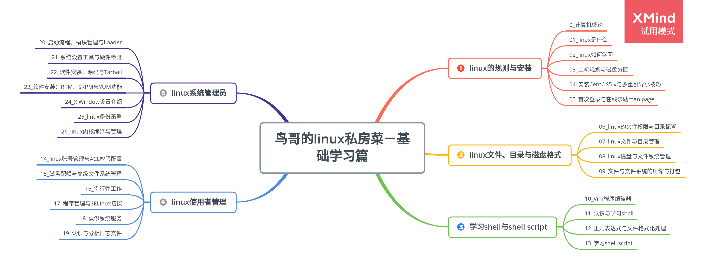

# 鸟哥的 linux 私房菜－基础学习篇

## 第一部分 linux 的规则与安装

-   [第 0 章 计算机概论](doc/00_计算机概论.md)

-   [第 1 章 linux 是什么](doc/01_linux是什么.md)

-   [第 2 章 linux 如何学习](doc/02_linux如何学习.md)

-   [第 3 章 主机规划与磁盘分区](doc/03_主机规划与磁盘分区.md)

-   第 4 章 安装 CentOS5.x 与多重引导小技巧

-   [第 5 章 首次登录与在线求助 man page](doc/05_首次登录与在线求助manpage.md)

## 第二部分 linux 文件、目录与磁盘格式

-   [第 6 章 linux 的文件权限与目录配置](doc/06_linux的文件权限与目录配置.md)

-   [第 7 章 linux 文件与目录管理](doc/07_linux文件与目录管理.md)

-   [第 8 章 linux 磁盘与文件系统管理](doc/08_linux磁盘与文件系统管理.md)

-   [第 9 章 文件与文件系统的压缩与打包](doc/09_文件与文件系统的压缩与打包.md)

## 第三部分 学习 shell 与 shell script

-   [第 10 章 Vim 程序编辑器](doc/10_vim程序编辑器.md)

-   [第 11 章 认识与学习 bash](doc/11_认识与学习bash.md)

-   [第 12 章 正则表达式与文件格式化处理](doc/12_正则表达式与文件格式化处理.md)

-   [第 13 章 学习 shell script](doc/13_学习shellscript.md)

## 第四部分 linux 使用者管理

-   [第 14 章 linux 账号管理与 ACL 权限配置](doc/14_Linux账号管理与ACL权限设置.md)

-   [第 15 章 磁盘配额与高级文件系统管理](doc/15_磁盘配额与高级文件系统管理.md)

-   [第 16 章 例行性工作](doc/16_例行性工作.md)

-   [第 17 章 程序管理与 SELinux 初探](doc/17_程序管理与SELinux初探.md)

-   [第 18 章 认识系统服务](doc/18_认识系统服务.md)

-   [第 19 章 认识与分析日志文件](doc/19_认识与分析日志文件.md)

## 第五部分 linux 系统管理员

-   [第 20 章 启动流程、模块管理与 Loader](doc/20_启动流程、模块管理与Loader.md)

-   [第 21 章 系统设置工具与硬件检测](<doc/21_系统设置工具(网络与打印机)与硬件检测.md>)

-   [第 22 章 软件安装：源码与 Tarball](doc/22_软件安装：源码与Tarball.md)

-   [第 23 章 软件安装：RPM、SRPM 与 YUM 功能](doc/23_软件安装：RPM、SRPM与YUM功能.md)

-   [第 24 章 X Window 设置介绍](doc/24_XWindow设置介绍.md)

-   [第 25 章 linux 备份策略](doc/25_Linux备份策略.md)

-   [第 26 章 linux 内核编译与管理](doc/26_Linux内核编译与管理.md)
