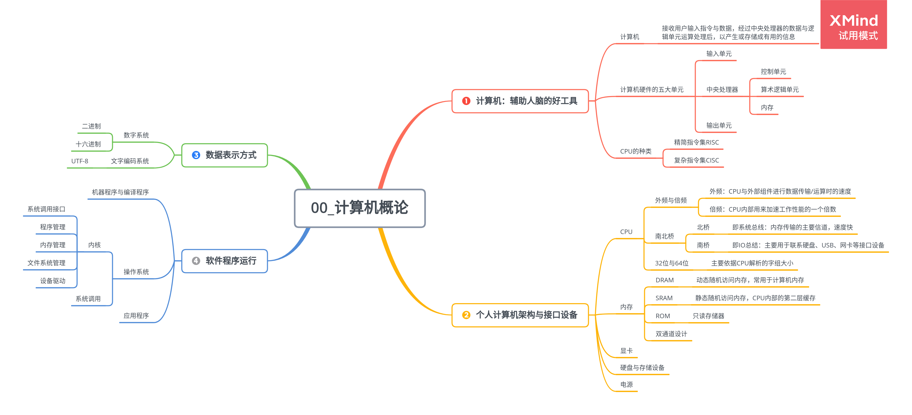

# 第 0 章 计算机概论

## 0.1 计算机：辅助人脑的好工具

接收用户输入指令与数据，经过中央处理器的数据与逻辑单元运算处理后，以产生或存储成有用的信息。

### 0.1.1 计算机硬件的五大单元

1. 输入单元

    包括键盘、鼠标、扫描仪、触摸屏等。

2. 中央处理器

    - 控制单元：主要协调各组件与各单元间的工作。
    - 算术逻辑单元：主要负责程序运算与逻辑判断。
    - 内存

3. 输出单元

    屏幕、打印机等。

### 0.1.2 CPU 的种类

1. 精简指令集 RISC

    微指令集较为精简，每个指令的执行时间都很短，完成的操作也很单纯，指令的执行性能较佳；若要做复杂的事情，要由多个指令来完成。

2. 复杂指令集 CISC

    每个小指令可以执行一些较低阶的硬件操作，指令数目多而复杂，每条指令的长度并不相同，可以处理的工作较为丰富。

### 0.1.3 接口设备

1. 存储设备

    硬盘、U 盘、光盘等。

2. 显示设备

3. 网络设备

### 0.1.4 动作流程

### 0.1.5 计算机分类

-   超级计算机(Supercomputer)
-   大型计算机(Mainframe Computer)
-   迷你计算机(Minicomputer)
-   工作站(Workstation)
-   微电脑(Microcomputer)

### 0.1.6 计算机上面常用的计算机单位

1. 大小单位

    | 进位制 | K    | M     | G     | T     | P     |
    | ------ | ---- | ----- | ----- | ----- | ----- |
    | 二进制 | 1024 | 1024K | 1024M | 1024G | 1024T |
    | 十进制 | 1000 | 1000K | 1000M | 1000G | 1000T |

2. 速度单位

## 0.2 个人计算机架构与接口设备

### 0.2.1 CPU

1. 外频与倍频

    - 外频：CPU 与外部组件进行数据传输/运算时的速度
    - 倍频：CPU 内部用来加速工作性能的一个倍数

2. 南北桥

    - 北桥

        即系统总线：内存传输的主要信道，速度快。

    - 南桥

        即 IO 总结：主要用于联系硬盘、USB、网卡等接口设备。

3. 32 位与 64 位

    主要依据 CPU 解析的字组大小。

### 0.2.2 内存

1. DRAM

    动态随机访问内存，常用于计算机内存。

2. 双通道设计

3. SRAM

    静态随机访问内存，CPU 内部的第二层缓存。

4. ROM

    只读存储器。

### 0.2.3 显卡

### 0.2.4 硬盘与存储设备

1. 硬盘的物理组成

2. 盘片上的数据

3. 传输接口

    - IDE 接口
    - SATA 接口
    - SCSI 接口

### 0.2.5 PCI 适配卡

### 0.2.6 主板

1. 芯片组功能

2. 设备 I/O 地址与 IRQ 中断信道

3. CMOS 与 BIOS

    - CMOS

        记录主板上面的重要参数，包括系统时间、CPU 电压与频率、各项设备的 I/O 地址与 IRQ 等

    - BIOS

        写入到主板上某一块闪存或 EEPROM 的程序，可以在开机时执行，加载 CMOS 中的参数，并调用存储设备中的开机程序，进一步进入操作系统当中。

4. 连接接口设备

### 0.2.7 电源

1. 能源转换率

2. 连接接口

## 0.3 数据表示方式

### 0.3.1 数字系统

-   二进制
-   十六进制

### 0.3.2 文字编码系统

UTF-8: Uicode 编码系统，打破了所有国家的不同编码。

## 0.4 软件程序运行

### 0.4.1 机器程序与编译程序

### 0.4.2 操作系统

1. 操作系统内核(Kernel)

    操作系统其实也是一组程序，这组程序的重点在于**管理计算机的所有活动以及驱动系统中的所有硬件**。

    - 内核功能

        - 系统调用接口
        - 程序管理
        - 内存管理
        - 文件系统管理
        - 设备驱动

2. 系统调用

3. 操作系统与驱动程序

### 0.4.3 应用程序
