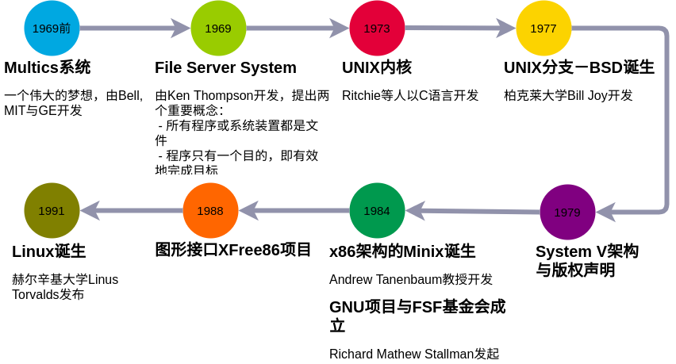

# 第 1 章 Linux 是什么

## 1.1 Linux 是什么

### 1.1.1 Linux 是什么

### 1.1.2 Linux 之前 UNIX 的历史

### 1.1.3 关于 GNU 项目

1. 自由软件的活动

2. 自由软件的版权 GNU GPL

3. 自由（Free）的真谛

4. 自由软件与商业行为

## 1.2 Torvalds 的 Linux 开发

### 1.2.1 Minix

### 1.2.2 对 386 硬件的多任务测试

### 1.2.3 初次释放出 Linux0.02

### 1.2.4 Linux 的开发：虚拟团队的产生

1. 单一个人维护阶段

2. 广大志愿者加入阶段

3. 内核功能细部分开发阶段

### 1.2.5 linux 的内核版本

1. 主、次版本为奇数

    开发中版本

2. 主、次版本为偶数

    稳定版本

### 1.2.6 linux distributions

## 1.3 linux 的特色

### 1.3.1 linux 的特色

-   自由与开放的使用与学习环境
-   配备需求低廉
-   内核功能强大而稳定
-   独立作业

### 1.3.2 Linux 的优缺点

1. 优点

    - 稳定的系统
    - 免费或少许费用
    - 安全性、漏洞的快速修补
    - 多任务、多用户
    - 用户与用户组的规划
    - 相对比较不耗资源的系统
    - 适合需要小内核程序的嵌入式系统
    - 整合度佳且多样的图形用户界面

2. 改进

    - 没有特定的支持厂商
    - 游戏的支持度不足
    - 专业软件的支持度不足

3. 关于授权

    - Open Source
    - Close Source
