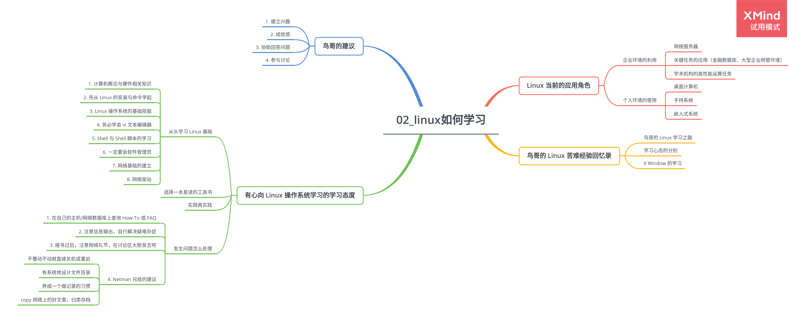

# 第 2 章 Linux 如何学习

## 2.1 Linux 当前的应用角色

### 2.1.1 企业环境的利用

-   网络服务器
-   关键任务的应用（金融数据库、大型企业网管环境）
-   学术机构的高性能运算任务

### 2.1.2 个人环境的使用

-   桌面计算机
-   手持系统
-   嵌入式系统

## 2.2 鸟哥的 Linux 苦难经验回忆录

### 2.2.1 鸟哥的 Linux 学习之路

### 2.2.2 学习心态的分别

### 2.2.3 X Window 的学习

## 2.3 有心向 Linux 操作系统学习的学习态度

### 2.3.1 从头学习 Linux 基础

1. 计算机概论与硬件相关知识
2. 先从 Linux 的安装与命令学起
3. Linux 操作系统的基础技能
4. 务必学会 vi 文本编辑器
5. Shell 与 Shell 脚本的学习
6. 一定要会软件管理员
7. 网络基础的建立
8. 网络架站

### 2.3.2 选择一本易读的工具书

### 2.3.3 实践再实践

### 2.3.4 发生问题怎么处理

1. 在自己的主机/网络数据库上查询 How-To 或 FAQ
2. 注意信息输出，自行解决疑难杂症
3. 搜寻过后，注意网络礼节，在讨论区大胆发言吧
4. Netman 兄给的建议

    - 不要动不动就直接关机或重启
    - 有系统地设计文件目录
    - 养成一个做记录的习惯
    - copy 网络上的好文章，归类存档

## 2.4 鸟哥的建议

1. 建立兴趣
2. 成就感
3. 协助回答问题
4. 参与讨论
