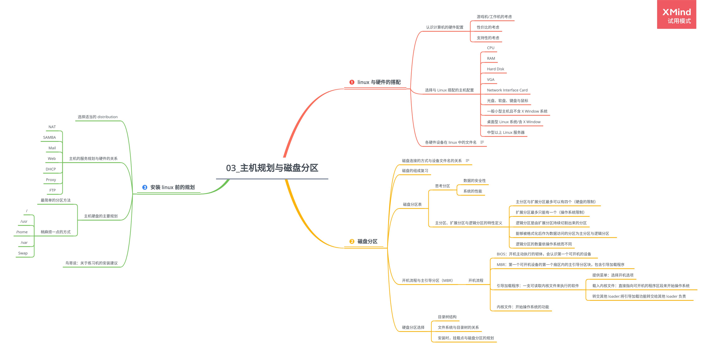

# 第 3 章 主机规划与磁盘分区

## 3.1 linux 与硬件的搭配

### 3.1.1 认识计算机的硬件配置

-   游戏机/工作机的考虑
-   性价比的考虑
-   支持性的考虑

### 3.1.2 选择与 Linux 搭配的主机配置

-   CPU
-   RAM
    **内存越大越好**。
-   Hard Disk
-   VGA
-   Network Interface Card
-   光盘、软盘、键盘与鼠标
-   一般小型主机且不含 X Window 系统
-   桌面型 Linux 系统/含 X Window
-   中型以上 Linux 服务器

### 3.1.3 各硬件设备在 linux 中的文件名

|                    |                          |
| ------------------ | ------------------------ |
| IDE 硬盘           | /dev/hd[a-d]             |
| SCSI/SATA/USB 硬盘 | /dev/sd[a-p]             |
| U 盘               | /dev/sd[a-p]             |
| 鼠标               | USB:/dev/usb/mouse[0-15] |
| 打印机             | USB:/dev/usb/lp[0-15]    |

## 3.2 磁盘分区

### 3.2.1 磁盘连接的方式与设备文件名的关系

| IDE             | Master(主设备) | Slave(从设备) |
| --------------- | -------------- | ------------- |
| IDE1(Primary)   | /dev/hda       | /dev/hdb      |
| IDE2(Secondary) | /dev/hdc       | /dev/hdd      |

### 3.2.2 磁盘的组成复习

### 3.2.3 磁盘分区表

1. 思考分区

    - 数据的安全性
    - 系统的性能

2. 主分区、扩展分区与逻辑分区的特性定义

    - 主分区与扩展分区最多可以有四个（硬盘的限制）
    - 扩展分区最多只能有一个（操作系统限制）
    - 逻辑分区是由扩展分区持续切割出来的分区
    - 能够被格式化后作为数据访问的分区为主分区与逻辑分区
    - 逻辑分区的数量依操作系统而不同

### 3.2.4 开机流程与主引导分区（MBR）

1. 开机流程

    - BIOS：开机主动执行的韧体，会认识第一个可开机的设备
    - MBR：第一个可开机设备的第一个扇区内的主引导分区块，包含引导加载程序
    - 引导加载程序：一支可读取内核文件来执行的软件

        - 提供菜单：选择开机选项
        - 载入内核文件：直接指向可开机的程序区段来开始操作系统
        - 转交其他 loader:将引导加载功能转交给其他 loader 负责

    - 内核文件：开始操作系统的功能

### 3.2.5 硬盘分区选择

-   目录树结构
-   文件系统与目录树的关系
-   安装时，挂载点与磁盘分区的规划

## 3.3 安装 linux 前的规划

### 3.3.1 选择适当的 distribution

### 3.3.2 主机的服务规划与硬件的关系

-   Windows 与 linux 共存的环境
-   NAT
-   SAMBA
-   Mail
-   Web
-   DHCP
-   Proxy
-   FTP

### 3.3.3 主机硬盘的主要规划

1. 最简单的分区方法
2. 稍麻烦一点的方式

    - /
    - /usr
    - /home
    - /var
    - Swap

### 3.3.4 鸟哥说：关于练习机的安装建议
