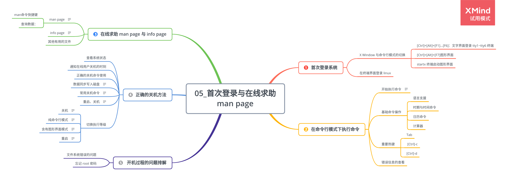

# 第 5 章 首次登录与在线求助 man page

## 5.1 首次登录系统

### 5.1.4 X Window 与命令行模式的切换

-   `[Ctrl]+[Alt]+[F1]...[F6]`：文字界面登录 tty1~tty6 终端
-   `[Ctrl]+[Alt]+[F7]`图形界面
-   startx 终端启动图形界面

### 5.1.5 在终端界面登录 linux

## 5.2 在命令行模式下执行命令

### 5.2.1 开始执行命令

> command [-options] parameter1 parameter2...

Tips:

-   **第一个被输入的数据绝对是命令或者是可执行文件。**
-   Linux 环境中，大小写字母是不一样的。

### 5.2.2 基础命令操作

1. 语言支援

    - 显示当前支持语言：

        > echo $LANG

    - 修改语言

        > LANG=en_US

        > LANG=zh_CN

2. 时期与时间命令

    - 显示日期与时间

        > date

        > date +%Y/%m/%d

        > date +%H:%M

3. 日历命令

    - 显示日历

        > cal

4. 计算器

    > bc

### 5.2.3 重要热键

1. Tab

    - 命令补全：Tab 接在一串命令的第一个命令后面

    - 文件补齐：Tab 接在一串命令的第二个命令以后

2. [Ctrl]-c

    - 中断目前程序

3. [Ctrl]-d

    - 键盘输入结束（End Of File, EOF 或 End Of Input）

### 5.2.4 错误信息的查看

## 5.3 在线求助 man page 与 info page

### 5.3.1 man page

`man date` 示例：

Tips:

1. `man` 命令快捷键

    - 空格键翻页
    - `q` 退出

2. 查询数据：

    - 先查看 NAME 项目，了解数据的意思
    - 仔细阅读 DESCRIPTION，了解资料与用法
    - 查询 OPTIONS 部分，执行比较细的命令内容

### 5.3.2 info page

`info info` 示例：

### 5.3.3 其他有用的文件

## 5.5 正确的关机方法

1. 查看系统状态

    - 在线情况

        > who

    - 网络联机状态

        > netstat -a

    - 后台执行程序

        > ps -aux

2. 通知在线用户关机的时刻

3. 正确的关机命令使用

### 5.5.1 数据同步写入磁盘

> sync

### 5.5.2 常用关机命令

> shutdown

### 5.5.3 重启、关机

> reboot
> halt
> poweroff

### 5.5.4 切换执行等级

1. 关机

> init 0

2. 纯命令行模式

> init 3

3. 含有图形界面模式

> init 5

4. 重启

> init 6

## 5.6 开机过程的问题排解

### 5.6.1 文件系统错误的问题

### 5.6.2 忘记 root 密码
