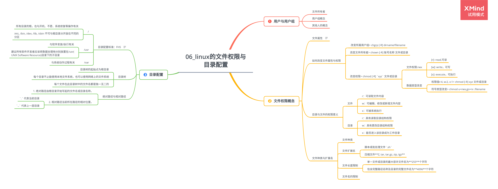

# 第 6 章 Linux 的文件权限与目录配置

## 6.1 用户与用户组

### 6.1.1 文件所有者

### 6.1.2 用户组概念

### 6.1.3 其他人的概念

## 6.2 文件权限概念

### 6.2.1 文件属性

ls 命令：

|         |                                                                                                                 |
| ------- | --------------------------------------------------------------------------------------------------------------- |
| 第 1 列 | 文件类型：[d]->目录，[-]->文件，[l]->连接文件，[b]->设备文件里可供存储的接口设备，[c]->设备文件里的串行端口设备 |
| 第 2 列 | 有多少文件名连接到此节点(i-node)                                                                                |
| 第 3 列 | 文件或目录的所有者账号                                                                                          |
| 第 4 列 | 文件的所属用户组                                                                                                |
| 第 5 列 | 文件容量大小                                                                                                    |
| 第 6 列 | 文件的创建日期或最近修改时期                                                                                    |
| 第 7 列 | 文件名                                                                                                          |

### 6.2.2 如何改变文件属性与权限

1.  改变所属用户组

    > chgrp [-R] dirname/filename

2.  改变文件所有者

    > chown [-R] 账号名称 文件或目录

3.  改变权限

    > chmod [-R] `xyz` 文件或目录

    -   文件权限:rwx

        -   \[r\]: read,可读
        -   \[w\]: write，可写
        -   \[x\]: execute，可执行

    -   数据类型改变

        -   权限值**r:4, w:2, x:1**

            > chmod [-R] xyz 文件或目录

        -   符号类型改变

            > chmod u=rwx,go=rx .filename

### 6.2.3 目录与文件的权限意义

1. 文件

    - r：可读取文件内容
    - w：可编辑、修改或新增文件内容
    - x：可被系统执行

2. 目录

    - r：具有读取目录结构权限
    - w：具有更改目录结构权限
    - x：能否进入该目录成为工作目录

### 6.2.4 文件种类与扩展名

1. 文件种类

    - 普通文件
    - 纯文本文件
    - 二进制文件
    - 数据格式文件
    - 目录
    - 连接文件
    - 设备与设备文件
    - 套接字
    - 管道

2. 文件扩展名

    - 脚本或批处理文件`.sh`

    - 压缩文件**Z, tar, tar.gz, zip, tgz**

3. 文件长度限制

    - 单一文件或目录的最大容许文件名为**255**个字符
    - 包含完整路径名称及目录的完整文件名为**4096**个字符

4. 文件名的限制

## 6.3 目录配置

### 6.3.1 目录配置标准：FHS

FHS(Filesystem Hierarchy Standard)的重点在于**规范每个特定目录下应放置的数据**。

|                  | 可分享(shareable)          | 不可分享(unshareable)    |
| ---------------- | -------------------------- | ------------------------ |
| 不变(static)     | /usr --> 软件              | /etc --> 配置文件        |
|                  | /opt --> 第三方软件        | /boot --> 开机与内核文件 |
| 可变动(variable) | /var/mail --> 用户邮件信箱 | /var/run --> 程序相关    |
|                  | /var/spool/news --> 新闻组 | /var/lock --> 程序相关   |

1. /

    - 所有目录的根，也与开机、不愿、系统修复等操作有关
    - /etc, /bin, /dev, /lib, /sbin 不可与根目录分开放在不同的分区

2. /usr

    - 与软件安装/执行有关
    - 建议所有软件开发者应该将数据合理地分别放置在/usr(UNIX Software Resource)目录下的子目录

3. /var

    - 与系统动作过程有关

### 6.3.2 目录树

-   目录树的起始点为根目录
-   每个目录不止能使用本地文件系统，也可以使用网络上的文件系统
-   每个文件在此目录树中的文件名都是独一无二的

### 6.3.3 绝对路径与相对路径

1. 绝对路径

    由根目录开始写起的文件名或目录名称。

2. 相对路径

    当前所在路径的相对位置。

    - `.` 代表当前目录
    - `..` 代表上一层目录
