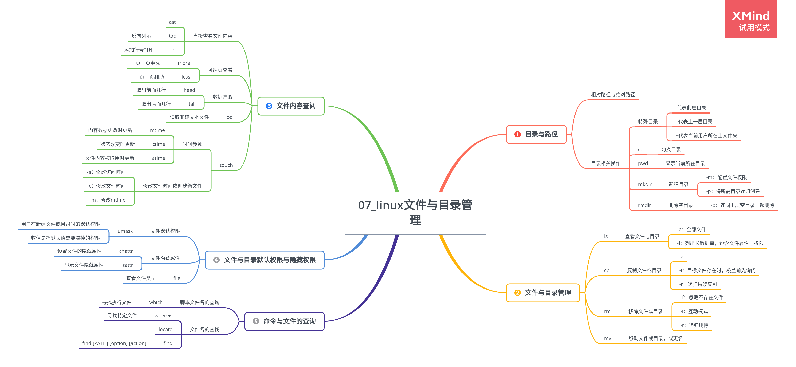

# 第 7 章 Linux 文件与目录管理

## 7.1 目录与路径

### 7.1.1 相对路径与绝对路径

### 7.1.2 目录相关操作

1.  特殊目录

    -   `.` 代表此层目录
    -   `..` 代表上一层目录
    -   `~` 代表当前用户主文件夹

2.  切换目录

    > cd directory-name

3.  显示当前所在目录

    > pwd

    参数：

    -   -P：显示出当前的路径，而非使用连接路径

4.  新建目录

    > mkdir directory-name

    参数：

    -   -m：配置文件权限
    -   -p：将所需目录递归创建

5.  删除空目录

    > rmdir

    参数：

    -   -p：连同上层空目录一起删除

### 7.1.3 关于执行文件路径的变量: $PATH

> each $PATH

## 7.2 文件与目录管理

### 7.2.1 查看文件与目录

> ls [-aAdfFhilnrRSt] directory-name

参数：

-   -a：全部文件
-   -l：列出长数据串，包含文件属性与权限

### 7.2.2 复制、删除与移动

1. 复制文件或目录

    > cp [-adfilprsu] source destination

    参数：

    - -a
    - -i：目标文件存在时，覆盖前先询问
    - -r：递归持续复制

2. 移除文件或目录

    > rm [-fir] file/directory

    参数：

    - -f：忽略不存在文件
    - -i：互动模式
    - -r：递归删除

3. 移动文件或目录，或更名

    > mv [-fiu] source destination

    参数：

    - -f 强制

### 7.2.3 取得路径的文件名与目录名称

> basename

> dirname

## 7.3 文件内容查阅

### 7.3.1 直接查看文件内容

1. cat(concatenate)

    > cat [-AbEnTv]

    参数：

    - -A 相当于-vET 的整合参数
    - -n 打印出行号，连同空白行也有行号

2. 反向列示

    > tac

3. 添加行号打印

    > nl [-bnw] file

### 7.3.2 可翻页查看

1. 一页一页翻动

    > more file

2. 一页一页翻动

    > less

### 7.3.3 数据选取

1. 取出前面几行

    > head [-n number] file

2. 取出后面几行

    > tail [-n number] file

### 7.3.4 读取非纯文本文件

> od [-t TYPE] file

### 7.3.5 修改文件时间或创建新文件

1. 三个主要的变动时间

    - mtime: 文件**内容数据更改**时更新
    - ctime: 文件**状态改变**时更新
    - atime: 文件**内容被取用**时更新

2. touch

    > touch [-acdmt] file

    参数：

    - -a 仅修改访问时间
    - -c 仅修改文件时间，若该文件不存在则不创建新文件
    - -m 仅修改 mtime

## 7.4 文件与目录默认权限与隐藏权限

### 7.4.1 文件默认权限

> umask

-   用户在新建文件或目录时的默认权限
-   数值是指默认值需要减掉的权限

### 7.4.2 文件隐藏属性

1. 设置文件的隐藏属性

    > chattr [+-=][asacdistu] file-name/directory-name

    符号：

    -   - 增加某一特殊参数，其他原本存在参数则不动
    -   - 删除某一特殊参数，其他原本存在参数则不动
    - = 仅有后面接的参数

    参数：

    - A 设置后访问该文件时 atime 将不会被修改

2. 显示文件隐藏属性

    > lsattr [-adR] file/directory

    参数：

    - -a 显示文件隐藏属性
    - -d 仅列出目录本身的属性
    - -R 连同子目录数据一并列出

### 7.4.3 文件特殊权限

1. SUID

2. SGID

3. SBIT

### 7.4.4 查看文件类型

> file

## 7.5 命令与文件的查询

### 7.5.1 脚本文件名的查询

1. 寻找执行文件

    > which [-a] command

    参数：

    - -a 列出所有由 PATH 目录中可以找到的命令

### 7.5.2 文件名的查找

1. 寻找特定文件

    > whereis [-bmsu] file-name/directory-name

2. locate

    > locate [-ir] keyword

    参数：

    - -i 忽略大小写差异
    - -r 可接正则表达式的显示方式

3. find

    > find [PATH] [option] [action]
