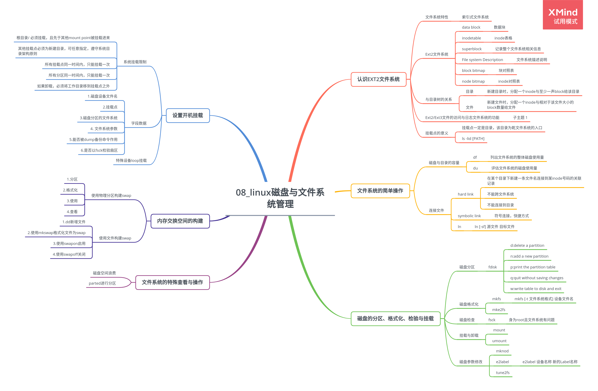

# 第 8 章 Linux 磁盘与文件系统管理

## 8.1 认识 EXT2 文件系统

### 8.1.1 硬盘组成与分区复习

### 8.1.2 文件系统特性

索引式文件系统：

-   super block: 记录文件系统的整体信息，包括 inode/block 的总量、使用量、剩余量
-   inode: 记录文件的属性，一个文件占用一个 inode，同时记录文件的数据所在 block 号码
-   block: 实际记录文件内容，文件太大时，占用多个 block

### 8.1.3 Ext2 文件系统

1. data block

2. inodetable

inode 表格

3. superblock

记录整个文件系统相关信息

4. File system Description

文件系统描述说明

5. block bitmap

块对照表

6. node bitmap

inode 对照表

### 8.1.4 与目录树的关系

1. 目录

新建目录时，分配一个 inode 与至少一声 block 给该目录

2. 文件

新建文件时，分配一个 inode 与相对于该文件大小的 block 数量给文件

3. 目录树读取

4. 文件系统大小与磁盘读取性能

### 8.1.5 Ext2/Ext3 文件的访问与日志文件系统的功能

1. 数据的不一致状态

2. 日志文件系统

### 8.1.6 文件系统的操作

### 8.1.7 挂载点的意义

**挂载点一定是目录，该目录为乾文件系统的入口**

### 8.1.8 其他 Linux 支持的文件系统与 VFS

## 8.2 文件系统的简单操作

### 8.2.1 磁盘与目录的容量

1. 列出文件系统的整体磁盘使用量 df

    > df [-ahikHTm] file-name/directory-name

    参数：

    - -h 以较易阅读的 GB、MB、KB 等格式自行显示
    - -i 不用硬盘容量，而以 inode 数量来显示

2. 评估文件系统的磁盘使用量 du

    > du [-ahskm] file-name/directory-name

    参数：

    - -s 列出总量
    - -a 列出所有的文件的与目录容量

### 8.2.2 连接文件

1. 硬连接或实际连接

    > ln /etc/crontab

    - 在某个目录下新建一条文件名连接到某 inode 号码的关联记录
    - 不能跨文件系统
    - 不能连接到目录

2. 符号连接，快捷方式

    > ln [-sf] 源文件 目标文件

## 8.3 磁盘的分区、格式化、检验与挂载

### 8.3.1 磁盘分区

> fdisk [-l] 设备名称

参数：

-   d:delete a partition
-   n:add a new partition
-   p:print the partition table
-   q:quit without saving changes
-   w:write table to disk and exit

### 8.3.2 磁盘格式化

1. mkfs

    > mkfs [-t 文件系统格式] 设备文件名

2. mke2fs

### 8.3.3 磁盘检查

1. fsck

    > fsck [-t 文件系统] [-ACay] 设备名称

    **Tips:**

    身为 root 且文件系统有问题时才用此命令

2. badblocks

    > badblocks -[svw] 设备名称

### 8.3.4 磁盘挂载与卸载

1. 注意

    - 单一文件系统不应该重复挂载在不同的挂载点
    - 单一目录不应该重复挂载多个文件系统
    - 作为挂载点的目录理论上应该都为空

2. 挂载 Ext2/Ext3 文件系统

    > mount /dev/hdc6 /mnt/hdc6

3. 挂载 CD 或 DVD 光盘

4. 格式化与挂载软盘

5. 挂载 U 盘

6. 卸载设备文件

    > umount [-fn] 设备文件名或挂载点

### 8.3.5 磁盘参数修改

1. mknod

    > mknod 设备文件名 [bcp] [Major] [Minor]

2. e2label

    > e2label 设备名称 新的 Label 名称

3. tune2fs

    > tune2fs [-jlL] 设备代号

4. hdparm

    > hdparm [-icdmXTt] 设备名称

## 8.4 设置开机挂载

### 8.4.1 开机挂载/etc/fstab 及/etc/mtab

1. 系统挂载限制：

    - 根目录/ 必须挂载，且先于其他 mount point 被挂载进来
    - 其他挂载点必须为新建目录，可任意指定，遵守系统目录架构原则
    - 所有挂载点同一时间内，只能挂载一次
    - 所有分区同一时间内，只能挂载一次
    - 如果卸载，必须将工作目录移到挂载点之外

2. 字段数据

    - 第一列：磁盘设备文件名 Label
    - 第二列：挂载点(mount point)
    - 第三列：磁盘分区的文件系统
    - 第四列：文件系统参数
    - 第五列：能否被 dump 备份命令作用
    - 第六列：是否以 fsck 检验扇区

### 8.4.2 特殊设备 loop 挂载

1. 挂载光盘/DVD 镜像文件

2. 新建大文件以制作 loop 设备文件

3. 创建大型文件

4. 格式化

## 8.5 内存交换空间的构建

### 8.5.1 使用物理分区构建 swap

1.分区

2.格式化

3.使用

4.查看

### 8.5.2 使用文件构建 swap

1.dd 新增文件

2.使用 mkswap 格式化文件为 swap

3.使用 swapon 启用

4.使用 swapoff 关闭

### 8.5.3 swap 使用上的限制

-   最多仅能创建 32 个 swap
-   swap 总量最大仅达 64GB

## 8.6 文件系统的特殊查看与操作

### 8.6.1 boot sector 与 super block 的关系

### 8.6.2 磁盘空间浪费

### 8.6.3 利用 GUN 的 parted 进行分区
