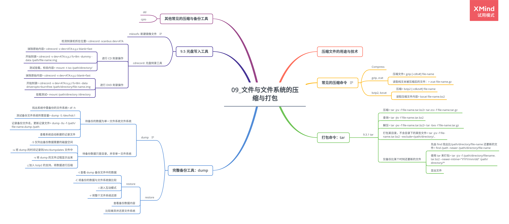
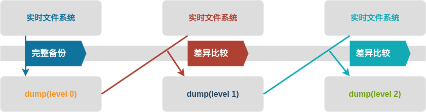

# 第 9 章 文件与文件系统的压缩与打包

## 9.1 压缩文件的用途与技术

## 9.2 常见的压缩命令

|          |                                       |          |
| -------- | ------------------------------------- | -------- |
| .Z       | compress 程序压缩的文件               | 不再流行 |
| .gz      | gzip 程序压缩的文件                   |
| .bz2     | bzip2 程序压缩的文件                  |
| .tar     | tar 程序打包的数据，没有压缩过        |
| .tar.gz  | tar 程序打包的文件，经过 gzip 的压缩  |
| .tar.bz2 | tar 程序打包的文件，经过 bzip2 的压缩 |

### 9.2.1 Compress

### 9.2.2 gzip, zcat

1. 压缩文件

    > gzip [-cdtv#] file-name

    参数：

    - -c 将压缩的数据输出到屏幕上，可通过数据流重定向处理
    - -t 检验压缩文件的一致性，查看文件有无错误
    - -v 显示出原文件/压缩文件的压缩比等信息

2. 读取纯文本被压缩后的文件：

    > zcat file-name.gz

### 9.2.3 bzip2, bzcat

1. 压缩

    > bzip2 [-cdkzv#] file-name

    参数：

    - -c 将压缩的数据输出到屏幕上，可通过数据流重定向处理
    - -t 检验压缩文件的一致性，查看文件有无错误
    - -v 显示出原文件/压缩文件的压缩比等信息

2. 读取压缩文件内容

    > bzcat file-name.bz2

## 9.3 打包命令：tar

### 9.3.1 tar

1. 压缩

    > tar -jcv -f file-name.tar.bz2

    > tar-zcv -f file-name.tar.gz

2. 查询

    > tar -jtv -f file-name.tar.bz2

3. 解压

    > tar -jxv -f file-name.tar.bz2

    > tar -bxv -f file-name.tar.gz

4. 打包某目录，不含目录下的某些文件

    > tar -jcv -f file-name.tar.bz2 --exclude=/path/directory/..

5. 仅备份比某个时刻还要新的文件

    - 先由 find 找出比/path/directory/file-name 还要新的文件

        > find /path -newer /path/directory/file-name

    - 使用 tar 来打包

        > tar -jcv -f /path/directory/filename.tar.bz2 --newer-mtime="YYYY/mm/dd" /path/directory/\*

    - 显出文件

## 9.4 完整备份工具：dump

### 9.4.1 dump

dump 首次进行备份后，再次 dump 时可指定不同的等级，新备份的数据只会记录与第一次备份所有差异的文件。

1. 待备份的数据为单一文件系统

    文件系统可以使用完整的 dump 功能，包括利用 0~9 个 level，同时备份时可以使用挂载点或设备文件名。

    备份方法：

    - 找出系统中需备份的文件系统

        > df -h

    - 测试备份文件系统所需容量

        > dump -S /dev/hdc1

    - 记录备份文件名，更新记录文件

        > dump -0u -f /path/file-name.dump /path

    - 查看系统自动新建的记录文件

2. 待备份数据只是目录，并非单一文件系统

    要备份/path/directory/时，备份有限制，主要有：

    - 所有的备份数据都必须要在该目录下
    - 仅能使用 level 0，即仅支持完整备份
    - 不支持-u 参数，即无法创建/etc/dumpdates 这个 level 备份的时间记录文件

    > dump [-Suvj] [-level] [-f 备份文件] 待备份数据

    参数：

    - -S 仅列出备份数据需要的磁盘空间
    - -u 将 dump 的时间记录到/etc/dumpdates 文件中
    - -v 将 dump 的文件过程显示出来
    - -j 加入 bzip2 的支持，将数据进行压缩
    - -level 等级，0~9 共 10 个

    示例：

    > dump -0j -f /root/etc.dump.bz2 /etc

### 9.4.2 restore

1. restore

    > restore [-tCir] [-f dumpfile] [-hfD]

    参数：

    - -t 查看 dump 备份文件中的数据
    - -C 将备份的数据与文件系统做比较
    - -i 进入互动模式
    - -r 将整个文件系统还原

2. 查看备份数据内容

    > restore -t -f /path/file-name.dump

3. 比较差异并还原文件系统

    - 查询文件系统与备份文件间的差异

        > restore -C -f /path/file-name.dump

    - 还原文件系统

        > mv backup-file-name file-name

## 9.5 光盘写入工具

### 9.5.1 mkisofs: 新建镜像文件

> mkisofs [-o isofile] [-rv] [-m file] file-name

### 9.5.2 cdrecord: 光盘刻录工具

1. 检测刻录机所在位置

    > cdrecord -scanbus dev=ATA

2. 进行 CD 刻录操作

    - 抹除原始内容
        > cdrecord -v dev=ATA:x,y,z blank=fast
    - 开始刻录

        > cdrecord -v dev=ATA:x,y,z fs=8m -dummy -data /path/file-name.img

    - 测试挂载，检验内容

        > mount -t iso /path/directory/

3. 进行 DVD 刻录操作

    - 抹除原始内容

        > cdrecord -v dev=ATA:x,y,z blank=fast

    - 开始刻录

        > cdrecord -v dev=ATA:x,y,z fs=8m -data driveropts=burnfree /path/directory/file-name.img

    - 挂载测试

        > mount /path/directory /directory

## 9.6 其他常见的压缩与备份工具

### 9.6.1 dd

### 9.6.2 cpio
