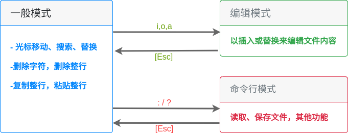

# 第 10 章 vim 程序编辑器

## 10.1 vi 与 vim

### 10.1.1 为何要学 vim

-   所有的 UNIX Like 系统都会内置 vi 文本编辑器
-   很多软件的编辑接口都会主动调用 vi
-   vim 具有程序编辑能力
-   程序简单，编辑速度相当快

## 10.2 vi 的使用

vi 模式

### 10.2.1 简单执行范例

1. 进入 vi 一般模式

    > vi test.md

2. 按下**i,I,o,O,a,A**键进入编辑模式

3. 按下**Esc**进入一般模式

4. 一般模式下保存退出

    > :wq

### 10.2.2 按键说明

1. 移动光标方法

    |            |                                           |
    | ---------- | ----------------------------------------- |
    | h / 左键   | 光标向左移动一个字符                      |
    | j / 下键   | 光标向下移动一个字符                      |
    | k / 上键   | 光标向上移动一个字符                      |
    | l / 右键   | 光标向右移动一个字符                      |
    | Ctrl + f   | 屏幕向下移动一页，相当于[PageDown]        |
    | Ctrl + b   | 屏幕向上移动一页，相当于[PageUp]          |
    | Ctrl + d   | 屏幕向下移动半页                          |
    | Ctrl + u   | 屏幕向上移动半页                          |
    | +          | 光标移动到非空格符的下一行                |
    | -          | 光标移动到非空格符的上一行                |
    | n [space]  | n 表示数字，光标向右移动这一行的 n 个字符 |
    | 0 / [Home] | 移动到本行的最前面                        |
    | $ / [End]  | 移动到本行的最后面                        |
    | H          | 光标移动到屏幕最上方那一行的第一个字符    |
    | M          | 光标移动到屏幕中央一行的第一个字符        |
    | L          | 光标移动到屏幕最下方一行的第一个字符      |
    | G          | 移动到文件的最后一行                      |
    | nG         | 移动到文件的第 n 行                       |
    | gg         | 移动到文件的第一行                        |
    | N [Enter]  | 向下移动 n 行                             |

2. 查找与替换

    |       |                                  |
    | ----- | -------------------------------- |
    | /word | 向下寻找一个名称为 word 的字符串 |
    | ?word | 向上寻找一个名称为 word 的字符串 |
    | n     | 重复前一个查找操作               |
    | N     | **反向**进行前一个查找操作       |

3. 删除、复制与粘贴

    |          |                                      |
    | -------- | ------------------------------------ |
    | x        | 向后删除一个字符                     |
    | X        | 向前删除一个字符                     |
    | nx       | 连续向后删除 n 个字符                |
    | dd       | 删除光标所在行                       |
    | ndd      | 删除光标所在向下 n 行                |
    | d1G      | 删除光标所在到第一行的所有数据       |
    | dG       | 删除光标所在到最后一行的所有数据     |
    | d$       | 删除光标所在处到该行的最后一个字符   |
    | d0       | 删除光标所在处到该行的最前面一个字符 |
    | yy       | 复制光标所在行                       |
    | nyy      | 复制光标所在向下 n 行                |
    | y1G      | 复制光标所在行到第一行的所有数据     |
    | yG       | 复制光标所在行到最后一行的所有数据   |
    | y$       | 复制光标所在字符到该行行尾的所有数据 |
    | y0       | 复制光标所在字符到该行行首的所有数据 |
    | p        | 将数据粘贴在光标下一行               |
    | P        | 将数据粘贴在光标上一行               |
    | J        | 将光标所在行与下一行数据结合成同一行 |
    | c        | 重复删除多个数据                     |
    | u        | 复原前一个操作                       |
    | Ctrl + r | 重做上一个操作                       |

### 10.2.3 模式切换

1. 一般模式与编辑模式切换

    |       |                                      |
    | ----- | ------------------------------------ |
    | i     | 从当前光标所在处插入                 |
    | I     | 从当前所在行第一个非空格符处开始插入 |
    | a     | 从当前光标所在的下一个字符处开始插入 |
    | A     | 从光标所在行最后一个字符开始插入     |
    | o     | 当前光标所在下一行处插入新的一行     |
    | O     | 当前光标所在上一行插入新的一行       |
    | r     | 替换模式－只替换光标所在字符一次     |
    | R     | 替换模式－一直替换光标所在的字符     |
    | [Esc] | 退出编辑模式，回到一般模式           |

2. 一般模式与命令模式切换

    |                      |                                                        |
    | -------------------- | ------------------------------------------------------ |
    | :w                   | 将编辑数据写入硬件文件                                 |
    | :w!                  | 若文件属性为“只读”，强制写入该文件                     |
    | :q                   | 退出                                                   |
    | :q!                  | 强制退出                                               |
    | :wq                  | 保存并退出                                             |
    | ZZ                   | 若文件没有更改，则不保存退出；若文件已更改，则保存退出 |
    | :w[file-name]        | 将编辑的数据另存为一个文件                             |
    | :r[file-name]        | 将 file-name 文件中的数据添加到光标所在行后面          |
    | : n1,n2 w[file-name] | 将 n1 行到 n2 行的内容保存为 file-name 文件            |
    | :! [command]         | 暂时离开 vi 到命令行模式下执行 command 的显示结果      |

### 10.2.4 vim 的保存、恢复与打开时的警告信息

vim 的工作被不正常中断，导致暂存盘无法通过正常流程结束，暂存文件就不会消失，可通过该文件恢复数据。

暂存盘警告信息参数：

|                    |                                                    |
| ------------------ | -------------------------------------------------- |
| [`O`]pen Read-Only | 打开文件成为只读文件，常用于查阅文件而不进行编辑时 |
| (`E`)dit anyway    | 正常方式打开要编辑的文件，并不会载入暂存文件内容   |
| (`R`)ecover:       | 加载暂存文件内容                                   |
| (`D`)elete it      | 删除暂存文件                                       |
| (`Q`)uit           | 退出 vim                                           |
| (`A`)bort          | 忽略编辑行为                                       |

## 10.3 vim 的功能

### 10.3.1 块选择

| | |
| | |
| v | 字符选择 |
| V | 行选择 |
| [Ctrl] + v | 块选择 |
| y | 复制所选择区域 |
| d | 删除所选择区域 |

### 10.3.2 多文件编辑

|        |                             |
| ------ | --------------------------- |
| :n     | 编辑下一个文件              |
| :N     | 编辑上一个文件              |
| :files | 列出目前 vim 打开的所有文件 |

### 10.3.3 多窗口功能

|                |                                                         |
| -------------- | ------------------------------------------------------- |
| :sp[file-name] | 在新窗口打开新文件                                      |
| [Ctrl]+w+j     | 按键：按下[Ctrl]不放，再按下 w 后放开所有按键，再按下 j |
| [Ctrl]+w+下键  | 操作：光标移动至下方窗口                                |
| [Ctrl]+w+k     | 操作：光标移动至上方窗口                                |
| [Ctrl]+w+上键  |                                                         |
| [Ctrl]+w+q     | 退出                                                    |

### 10.3.4 vim 环境设置与记录

### 10.3.5 vim 常用命令示意图

## 10.4 其他 vim 使用注意事项

### 10.4.1 中文编码的问题

### 10.4.2 DOS 与 Linux 的断行字符

### 10.4.3 语系编码转换
