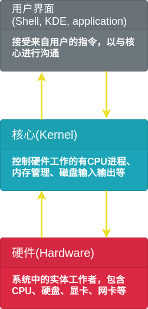

# 第 11 章 认识与学习 bash

## 11.1 认识 bash 这个 shell

### 11.1.1 硬件、内核与 shell

必须通过**Shell**将输入的命令与内核通信，让内核可以控制硬件正确工作。

### 11.1.2 为何要学命令行界面的 shell

-   命令行界面的 shell: 大家都一样
-   远程管理：命令行界面就是比较快
-   Linux 的任督二脉：shell 是也

### 11.1.3 系统的合法 shell 与/etc/shells 功能

1. 查看可以使用的 shell

    > cat /etc/shells

2. 查看默认取得的 shell

    > cat /etc/passwd

### 11.1.4 bash shell 的功能

-   命令记忆功能(history)
-   命令与文件补全功能([Tab])
-   命令别名设置功能(alias)
-   作业控制、前台、后台控制
-   程序脚本(shell script)
-   通配符

### 11.1.5 bash shell 的内置命令: type

1. 查看命令为内置或外部

    > type [-tpa] name

### 11.1.6 命令的执行

## 11.2 shell 的变量功能

### 11.2.1 什么是变量？

-   变量的可变性与方便性
-   影响 bash 环境操作的变量
-   脚本程序设计(shell script)的好帮手

变量：**以一组文字或符号等替代一些设置或者是一串保留的数据**。

#+## 11.2.2 变量的显示与设置：echo, unset

1. 变量的显示

    > echo $variable

    > echo $PATH

2. 变量的设置规则

    - 变量与变量内容以`=`连接，等号两边不能直接接空格符
    - 变量名只能是英文字母与数字，开头不能是数字
    - 变量内容若有空格符可使用双引号`"`或单绰号`'`将内容结合
    - 可用转义字符`\`将特殊字符（`[Enter]`, `$`, `\`, `!`等）变成一般字符
    - 变量为了增加内容时，可使用“\$变量名称”或${变量}累加内容
    - 若变量需要在其子进程执行，需要以 export 使变量变成环境变量

### 11.2.3 环境变量的功能

1. env 查看环境变量

    > env

    |          |                              |
    | -------- | ---------------------------- |
    | HOME     | 用户主文件夹                 |
    | SHELL    | 当前环境所使用的 shell       |
    | HISTSIZE | 历史命令数目                 |
    | MAIL     | 收信时系统读取的邮件信息文件 |
    | PATH     | 执行文件查找的路径           |
    | LANG     | 语系数据                     |
    | RANDOM   | 随机数变量                   |

2. set 查看所有变量

    > set

    - PS1(提示符的设置)
    - $(关于本 shell 的 PID)
    - ?(关于上个执行命令的回传码)
    - OSTYPE, HOSTTYPE, MACHTYPE(主机硬件与内核等级)

3. export 自定义变量转成环境变量

    子进程仅继承父进程的环境变量，子进程不会继承父进程的自定义变量。

    让自定义变量变成环境变量：

    > export 变量名称

### 11.2.4 影响显示结果的语系变量（locale)

1. 查看系统支持语系

    > locale -a

2. 查看系统默认语系

    > cat /etc/sysconfig/i18n

### 11.2.5 变量的有效范围

### 11.2.6 变量键盘读取、数组与声明：read, array, declare

1. read

    读取键盘输入：

    > read [-pt] variable

    参数：

    - -p 接提示符
    - -gt 接等待秒数

2. declare/typeset

    声明变量类型：

    > declare [-arxr] variable

    参数：

    - -a 数组类型
    - -i 整数类型
    - -x 环境变量
    - -r 只读类型

3. 数组变量

    > var[1] = "small min"

    建议直接以`${数组}`的方式来读取数组变量。
