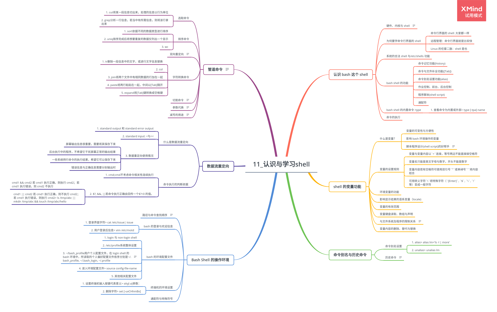
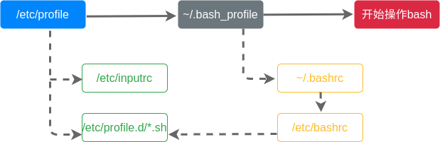

# 第 11 章 认识与学习 bash

## 11.1 认识 bash 这个 shell

### 11.1.1 硬件、内核与 shell

必须通过**Shell**将输入的命令与内核通信，让内核可以控制硬件正确工作。

### 11.1.2 为何要学命令行界面的 shell

-   命令行界面的 shell: 大家都一样
-   远程管理：命令行界面就是比较快
-   Linux 的任督二脉：shell 是也

### 11.1.3 系统的合法 shell 与/etc/shells 功能

1. 查看可以使用的 shell

    > cat /etc/shells

2. 查看默认取得的 shell

    > cat /etc/passwd

### 11.1.4 bash shell 的功能

-   命令记忆功能(history)
-   命令与文件补全功能([Tab])
-   命令别名设置功能(alias)
-   作业控制、前台、后台控制
-   程序脚本(shell script)
-   通配符

### 11.1.5 bash shell 的内置命令: type

1. 查看命令为内置或外部

    > type [-tpa] name

### 11.1.6 命令的执行

## 11.2 shell 的变量功能

### 11.2.1 什么是变量？

-   变量的可变性与方便性
-   影响 bash 环境操作的变量
-   脚本程序设计(shell script)的好帮手

变量：**以一组文字或符号等替代一些设置或者是一串保留的数据**。

#+## 11.2.2 变量的显示与设置：echo, unset

1. 变量的显示

    > echo $variable

    > echo $PATH

2. 变量的设置规则

    - 变量与变量内容以`=`连接，等号两边不能直接接空格符
    - 变量名只能是英文字母与数字，开头不能是数字
    - 变量内容若有空格符可使用双引号`"`或单绰号`'`将内容结合
    - 可用转义字符`\`将特殊字符（`[Enter]`, `$`, `\`, `!`等）变成一般字符
    - 变量为了增加内容时，可使用“\$变量名称”或${变量}累加内容
    - 若变量需要在其子进程执行，需要以 export 使变量变成环境变量

### 11.2.3 环境变量的功能

1. env 查看环境变量

    > env

    |          |                              |
    | -------- | ---------------------------- |
    | HOME     | 用户主文件夹                 |
    | SHELL    | 当前环境所使用的 shell       |
    | HISTSIZE | 历史命令数目                 |
    | MAIL     | 收信时系统读取的邮件信息文件 |
    | PATH     | 执行文件查找的路径           |
    | LANG     | 语系数据                     |
    | RANDOM   | 随机数变量                   |

2. set 查看所有变量

    > set

    - PS1(提示符的设置)
    - $(关于本 shell 的 PID)
    - ?(关于上个执行命令的回传码)
    - OSTYPE, HOSTTYPE, MACHTYPE(主机硬件与内核等级)

3. export 自定义变量转成环境变量

    子进程仅继承父进程的环境变量，子进程不会继承父进程的自定义变量。

    让自定义变量变成环境变量：

    > export 变量名称

### 11.2.4 影响显示结果的语系变量（locale)

1. 查看系统支持语系

    > locale -a

2. 查看系统默认语系

    > cat /etc/sysconfig/i18n

### 11.2.5 变量的有效范围

### 11.2.6 变量键盘读取、数组与声明：read, array, declare

1. read

    读取键盘输入：

    > read [-pt] variable

    参数：

    - -p 接提示符
    - -gt 接等待秒数

2. declare/typeset

    声明变量类型：

    > declare [-arxr] variable

    参数：

    - -a 数组类型
    - -i 整数类型
    - -x 环境变量
    - -r 只读类型

3. 数组变量

    > var[1] = "small min"

    建议直接以`${数组}`的方式来读取数组变量。

### 11.2.7 与文件系统及程序的限制关系

> ulimit [-SHacdfltu] [配额]

参数：

-   -H hard limit, 严格的设置，必定不能超过这个设置的数值
-   -S soft limit, 警告的设置，可以超过这个值，但超过后会有警告
-   -a 可列出所有的限制额度
-   -f 此 shell 可创建的最大文件容量，单位为 KB
-   -d 进程可使用的最大断裂内存容量
-   -l 用于锁定的内存量
-   -t 可使用的 CPU 最长时间，单位为秒
-   -u 单一用户可使用的最大进程数量

### 11.2.8 变量内容的删除、替代与替换

1. 变量内容的删除与替换

    - \# 符合替换文字**最短**的一个
    - \## 符合替换文字**最长**的一个

2. 变量的测试与内容替换

## 11.3 命令别名与历史命令

### 11.3.1 命令别名设置：alias, unalias

1. alias

    > alias lm='ls -l | more'

2. unalias

    > unalias lm

### 11.3.2 历史命令：history

列出最近的 n 条命令：

> history [n]

清除当前 shell 中的所有 history 内容：

> history [-c]

> history [-raw] histfiles

参数：

-   -a 将目前新增的 history 命令新增入 histfiles
-   -r 将 histfile 中的内容读入当前 shell 的 history 中
-   -w 将当前的 history 记忆内容写入 histfiles 中

## 11.4 Bash Shell 的操作环境

### 11.4.1 路径与命令查找顺序

命令运行的顺序：

-   以相对/绝对路径执行命令
-   由 alias 找到该命令来执行
-   由 bash 内置的命令来执行
-   通过`$PATH`这个变量的顺序找到的第一个命令来执行

### 11.4.2 bash 的登录与欢迎信息

1. 登录界面字符

    > cat /etc/issue

    | issue 内代码 | 意义                 |
    | ------------ | -------------------- |
    | \\d          | 本地端时间的日期     |
    | \\l          | 显示第几个终端机接口 |
    | \\m          | 显示硬件的等级       |
    | \\n          | 显示主要的网络名称   |
    | \\o          | 显示 domain name     |
    | \\r          | 显示操作系统版本     |
    | \\t          | 显示本地端时间的时间 |
    | \\s          | 操作系统名称         |
    | \\v          | 操作系统的版本       |

2. 用户登录后信息

    > vim /etc/motd

### 11.4.3 bash 的环境配置文件

1. login 与 non-login shell

    - login shell

        取得 bash 时需要完整的登录流程

    - non-login shell

        取得 bash 接口的方法不需要重复登录

2. /etc/profile

    系统整体设置，主要变量：

    | 变量     |                                                         |
    | -------- | ------------------------------------------------------- |
    | PATH     | 会依据 UID 决定 PATH 变量要不要含有 sbin 的系统命令目录 |
    | MAIL     | 依据账号设置好用户的 mailbox 到/var/spool/mail/账号名   |
    | USER     | 根据用户的账号设置内容                                  |
    | HOSTNAME | 依据主机 hostname 命令决定变量内容                      |
    | HISTSIZE | 历史命令记录条数                                        |

3. ~/bash_profile

    用户个人配置文件，在 login shell 的 bash 环境中，所读取的个人偏好配置文件依序分别是~/.bash_profile, ~/.bash_login, ~/.profile

4. 读入环境配置文件

    > source config-file-name

5. 其他相关配置文件

    - /etc/man.config

        使用 man 时 man page 的路径

    - ~/.bash_history

    - ~/.bash_logout

### 11.4.4 终端机的环境设置

1. 设置终端机输入按键代表意义

    > stty[-a]

    参数：

    - -a 列出所有的 stty 参数

2. 删除字符

    > set [-uvCHhmBx]

### 11.4.5 通配符与特殊符号

1. 通配符

    | 符号  | 意义                       |
    | ----- | -------------------------- |
    | \*    | 0 个到无穷多个任意字符     |
    | ?     | 一定有一个任意字符         |
    | []    | 一定有一个在中括号内的字符 |
    | \[-\] | 在编码顺序内的所有字符     |
    | \[^\] | 原向选择                   |

2. 特殊符号

    | 符号  | 意义                                     |
    | ----- | ---------------------------------------- |
    | #     | 批注符号，常使用在 script 中             |
    | \\    | 转义符号                                 |
    | \|    | 管道，分隔两个管道命令的界定             |
    | ;     | 连续执行命令分隔符                       |
    | $     | 使用变量前导符                           |
    | &     | 作业控制，将命令变成背景下工作           |
    | !     | 逻辑非                                   |
    | /     | 目录符号                                 |
    | >, >> | 数据流重定向，输出导向，分别是替换与累加 |
    | <, << | 数据流重定向，输入导向                   |
    | \''   | 单引号                                   |
    | ""    | 具有变量转换功能                         |

## 11.5 数据流重定向

### 11.5.1 什么是数据流重定向

1. standard output 和 standard error output

    标准输出是命令执行所回传的正确信息，标准错误输出为命令执行失败后回传的错误信息。

    数据流重定向可以将 standard output 与 standard error output 分别传送到其他的文件或设备去，传送所用的特殊字符为：

    |                      | 代码 | 字符      |
    | -------------------- | ---- | --------- |
    | 标准输入(stdin)      | 0    | \< 或 \<< |
    | 标准输出(stdout)     | 1    | > 或 >>   |
    | 标准错误输出(stderr) | 2    | 2> 或 2>> |

    > ll / > listfile

    数据重定向文件的创建方式：

    - 若文件不存在，系统会自动创建
    - 若文件存在，系统先将文件内容清空，再写入数据
    - 以>输出到一个已存在的文件，该文件会被覆盖
    - 以>>输出到一个已存在的文件，该数据会累加在文件上

2. standard input: <与<<

    > cat > catfile

    > cat > catfile << "eof"

3. 数据重定向使用情况

    - 屏幕输出信息很重要，需要将其保存下来
    - 后台执行中的程序，不希望它干扰屏幕正常的输出结果
    - 一些系统例行命令的执行结果，希望它可以保存下来
    - 错误信息与正确信息需要分别输出时

### 11.5.2 命令执行的判断依据

1. cmd;cmd

    不考虑命令相关性连续执行

2. $?, &&, ||

    若命令执行正确会回传一个$?=0 的值。

    - cmd1 && cmd2 若 cmd1 执行正确，则执行 cmd2；若 cmd1 执行错误，则 cmd2 不执行
    - cmd1 || cmd2 若 cmd1 执行正确，则不执行 cmd2；若 cmd1 执行错误，则执行 cmd2

    > ls /tmp/abc || mkdir /tmp/abc && touch /tmp/abc/hello

## 11.6 管道命令

管道命令`|`仅能处理经由前一个命令回传的正确信息，即 standard output 的信息，对于 standard error 没有直接处理能力。

    > ls -al /etc | less

### 11.6.1 选取命令

1. cut

    将某一段信息切出来，处理的信息以行为单位。主要用于将同一行里的数据进行分解，最常使用在分析一些数据或文字数据的时候。

    > cut -d'分隔符' -f fields

    参数：

    - -d 后接分隔符，与-f 一起使用
    - -f 依据-d 分隔字符将一段信息切割成为数段，用-f 取出第几段
    - -c 以字符的单位取出固定字符区间

    > echo $PATH | cut -d':' -f 5

2. grep

    分析一行信息，若当中有所需信息，则将该行拿出来。

    > grep [-acinv] [--color=auto] '查找字符串' filename

    参数：

    - -a 将 binary 文件以 text 文件的方式查找数据
    - -c 计算找到'查找字符串'的次数
    - -i 忽略大小写的不同
    - -n 输出行号
    - -v 反向选择
    - --color=auto 将找到的关键字部分加上颜色显示

### 11.6.2 排序命令

1. sort

    依据不同的数据类型进行排序。

    > sort [-fbmnrtuk] [file or stdin]

    参数：

    - -f 忽略大小写差异
    - -b 忽略最前面空格符部分
    - -M 以月份的名字排序
    - -n 使用纯数字排序
    - -r 反向排序
    - -u 相同数据中仅出现一行代表
    - -t 分隔符，默认用[Tab]分隔
    - -k 以区间进行排序

    > cat /etc/passwd | sort

    > cat /etc/passwd | sort -t ':' -k 3

2. uniq

    排序完成后将想要重复的数据仅列出一个显示。

    > uniq [-ic]

    参数：

    - -i 忽略大小写字符的不同
    - -c 进行计数

3. wc

    > wc [-lwm]

    - -l 仅列出行
    - -w 仅列出多少字
    - -m 多少字符

    > cat /etc/man.config | wc

### 11.6.3 双向重定向

tee 会同时将数据流送与文件和屏幕。

### 11.6.4 字符转换命令

1. tr

    删除一段信息中的文字，或进行文字信息替换。

    > tr [-ds] SET1...

    参数：

    - -d 删除信息中的 SET1 字符串
    - -s 替换掉重复的字符

2. col

    > col [-xb]

    参数：

    - -x 将[Tab]转换成对等的空格键
    - -b 在文字内有反斜杠(/)时，保留反斜杠最后接的字符

3. join

    将两个文件中有相同数据的行加在一起。

    > join [-ti12] file1 file2

    参数：

    - -t 默认以空格分隔数据，并且对比“第一个字段”的数据
    - -i 忽略大小写差异
    - -1 file1 文件要用哪个字段来分析
    - -2 file2 文件要用哪个字段来分析

4. paste

    将两行粘贴在一起，中间以[Tab]隔开。

    > paste [-d] file1 file2

    参数：

    - -d 后面接分隔符，默认以[Tab]分隔

5. expand

    将[Tab]键转换成空格键。

    > expand [-t] file

    参数：

    - -t 接数字，自定义一个[Tab]代表多少个字符

### 11.6.5 切割命令

> split [-bl] file PREFIX

参数：

-   -b 后面可接欲切割成的文件大小
-   -l 以行数进行切割

> ls -al / | split -l 10 - lsroot

### 11.6.6 参数代换

> xargs [-0epn] command

参数：

-   -0 将特殊字符还原成一般字符
-   -e 即 EOF，后面可接字符串，分析到该字符串时停止工作
-   -p 在执行每个命令参数时，都会询问用户意思
-   -n 后面接数字，每次 command 命令执行时要使用几个参数

### 11.6.7 减号的用途

管道命令中常使用前一个命令的 stdout 作为这次的 stdin，某些命令用到文件名进行处理时，该 stdin 与 stdout 可用`-`来替代。

> tar -cvf - /home | tar -xvf -
