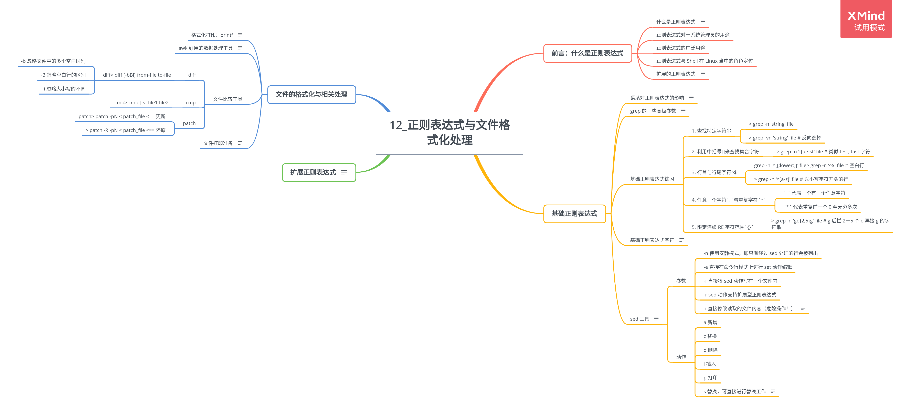

# 第 12 章 正则表达式与文件格式化处理

## 12.1 前言：什么是正则表达式

### 12.1.1 什么是正则表达式

正则表达式是处理字符串的方法，它以行为单位，通过特殊符号的辅助，可以让用户轻易达到查找、删除、替换某特定字符串的处理程序。

### 12.1.2 正则表达式对于系统管理员的用途

### 12.1.3 正则表达式的广泛用途

### 12.1.4 正则表达式与 Shell 在 Linux 当中的角色定位

### 12.1.5 扩展的正则表达式

**正则表达式与通配符是完全不一样的东西。**

## 12.2 基础正则表达式

### 12.2.1 语系对正则表达式的影响

正则表达式的特殊符号：

| 特殊符号   | 代表意义                   | 备注                |
| ---------- | -------------------------- | ------------------- |
| [:alnum:]  | 英文大小字字符及数字       | 0-9, A-Z, a-z       |
| [:alpha:]  | 任何英文大小写字符         | A-Z,a-z             |
| [:blank:]  | 空格键与[Tab]键            |                     |
| [:cntrl:]  | 键盘上的控制按键           | CR, LF, Tab, Del 等 |
| [:digit:]  | 数字                       | 0-9                 |
| [:graph:]  | 除了空格答外的其他所有按键 |                     |
| [:lower:]  | 小写字符                   | a-z                 |
| [:print:]  | 任何可以被打印出来的字符   |                     |
| [:punct:]  | 标点符号                   | ?!;:                |
| [:upper:]  | 大写字符                   | A-Z                 |
| [:space:]  | 任何会产生空白的字符       |                     |
| [:xdigit:] | 十六进制数字               |                     |

### 12.2.2 grep 的一些高级参数

> grep [-A] [-B] [--color=auto] 'search-string' filename

参数：

-   -A 后面可加数字，为 after，除了该行外，后续的 n 行也列出来
-   -B 后面可加数字，为 before，除了该行外，前面 n 行也列出来
-   --color=auto 将选取数据列出颜色

示例：

-   > dmesg | grep -n -A3 -B2 --color=auto 'eth'

### 12.2.3 基础正则表达式练习

1. 查找特定字符串

    > grep -n 'string' file

    > grep -vn 'string' file # 反向选择

2. 利用中括号[]来查找集合字符

    > grep -n 't[ae]st' file # 类似 test, tast 字符

    > grep -n '[^a-z]oo' file # oo 前面没有小写字符

3. 行首与行尾字符^$

    > grep -n '^[a-z]' file # 以小写字符开头的行
    > grep -n '^[[:lower:]]' file

    > grep -n '^$' file # 空白行

4. 任意一个字符`.`与重复字符`*`

    - `.` 代表一个有一个任意字符
    - `*` 代表重复前一个 0 至无穷多次

    > grep -n 'g..d' file # g??d

    > grep -n 'ooo\*' file # 至少两个以上 o 的字符串

    > grep -n '[0-9][0-9]\*' file # 任意数字的行

5. 限定连续 RE 字符范围`{}`

    > grep -n 'go\{2,5\}g' file # g 后拦 2－5 个 o 再接 g 的字符串

### 12.2.4 基础正则表达式字符

| RE 字符  | 意义                                                                                                | 示例                        | 说明                                        |
| -------- | --------------------------------------------------------------------------------------------------- | --------------------------- | ------------------------------------------- |
| ^word    | 待查找的字符串在行首                                                                                | `grep -n '^#' file`         | 查找行首为#开始的行，并列出行号             |
| word$    | 待查找字符串在行尾                                                                                  | `grep -n '!$' file`         | 查找行尾为!的行，并打印出行号               |
| .        | 一定有一个任意字符                                                                                  | `grep -n 'e.e' file`        | 查找类似 eve,eae,ee 的字符串                |
| \\       | 转义字符                                                                                            |                             |                                             |
| \*       | 重复零个到无穷多个前一个字符                                                                        | `grep -n 'ess*' file`       | 查找含有 es, ess, esss 等字符串             |
| [list]   | 从字符集合中找出想要选取的字符                                                                      | `grep -n 'g[ld]' file`      | 查找含有 gl,gd 的行                         |
| [n1-n2]  | 从字符集合中查找想要选取的字符范围                                                                  | ` grep -n '[0-9]' file`     | 查找含有任意数字的行                        |
| [^list]  | 从字符集合中查找不要的字符串或范围                                                                  | `grep -n 'oo[^t]' file`     | 查找字符串不能是 oot                        |
| \{n, m\} | 连续 n 个到 m 个前一个字符，若为\{n\}则为连续 n 个前一个字符，若为\{n,\}则为连续 n 个以上前一个字符 | `grep -n 'go\{2,3\}g' file` | 在 g 和 g 之间有 2 个到 3 个 o 存在的字符串 |

### 12.2.5 sed 工具

> sed [-nefr] [options]

参数：

-   -n 使用安静模式，即只有经过 sed 处理的行会被列出
-   -e 直接在命令行模式上进行 set 动作编辑
-   -f 直接将 sed 动作写在一个文件内
-   -r sed 动作支持扩展型正则表达式
-   -i 直接修改读取的文件内容（危险操作！）

options 说明：

-   a 新增
-   c 替换
-   d 删除
-   i 插入
-   p 打印
-   s 替换，可直接进行替换工作

示例：

1. 以行为单位新增/删除

    > nl /etc/passwd | sed '2,5d'

    > nl /etc/passwd | sed '2a drink tea'

2. 以行为单位替换与显示

    > nl /etc/passwd | sed '2,5c No 2-5 number'

    > nl /etc/passwd | sed -n '5,7p'

3. 部分数据的查找替换

    > sed 's/要被替换的字符串/新字符串/g'

## 12.3 扩展正则表达式

| RE 字符 | 意义                         | 命令                          | 说明                         |
| ------- | ---------------------------- | ----------------------------- | ---------------------------- |
| +       | 重复一个或一个以上前一个字符 | `egrep -n 'go+d' file`        | 查找 god,good,goood 等字符串 |
| ?       | 零个或一个前一个字符         | `egrep -n 'go?d' file`        | 查找 gd,god 字符串           |
| \|      | 用或的方式找出若干字符串     | ` egrep -n 'gd \| good' file` | 查找 gd 或 good 字符串       |
| ()      | 找出组字符串                 | `egrep -n 'g(la \| oo)d' file | 查找 glad 或 good 字符串     |
| ()+     | 多个重复组的判别             |                               |                              |

## 12.4 文件的格式化与相关处理

### 12.4.1 格式化打印：printf

> printf '%10s %5i %5i %8.2f\n' $(cat printf.txt)

### 12.4.2 awk 好用的数据处理工具

> last -n 5 | awk '{print $1 "\t" $3}'

### 12.4.3 文件比较工具

1. diff

    > diff [-bBi] from-file to-file

    参数：

    - -b 忽略文件中的多个空白区别
    - -B 忽略空白行的区别
    - -i 忽略大小写的不同

2. cmp

    > cmp [-s] file1 file2

3. patch

    > patch -pN < patch_file <== 更新

    > patch -R -pN < patch_file <== 还原

### 12.4.4 文件打印准备

> pr /etc/man.config
