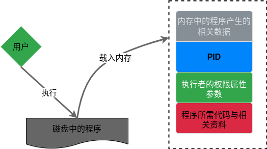
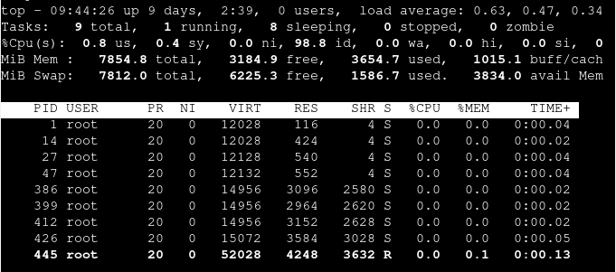

# 第 17 章 程序管理与 SELinux 初探

## 17.1 什么是进程

触发任何一个事件时，系统都会将它定义为一个进程，并且给予这个进程一个 ID，同时依据触发进程的用户与相关属性关系，设置 PID 的一组有效权限。

### 17.1.1 进程与程序

-   程序：通常为二进制程序放置在存储媒介中，以物理文件的形式存在；
-   进程：程序被触发后，执行者的权限与属性、程序的代码与所需数据等都会被加载到内存中，操作系统给予内存内的单元一个标识符(PID)

1. 子进程与父进程

    > ps -l

2. fork and exec：过程调用的流程

3. 系统或网络服务：常驻在内存中的进程

### 17.1.2 Linux 的多用户、多任务环境

1. 多用户环境

2. 多任务行为

3. 多重登录环境的七个基本终端窗口

    可使用[Alt]+[F1]~[F7]来切换不同的终端窗口。

4. 特殊的进程管理行为

5. bash 环境下的工作管理

6. 多用户、多任务的系统资源分配问题考虑

## 17.2 工作管理

### 17.2.1 什么是工作管理

在进行工作管理的行为中，每个工作都是目前 bash 的子进程，即彼此之间是有相关性的。

job control 的限制：

-   工作所触发的进程必须来自 shell 的子进程；
-   前台：控制与执行命令的环境；
-   后台：可自行运行的工作，无法用[Ctrl]+c 终止，可使用 bg/fg 调用工作；
-   后台执行的进程不能等待 terminal/shell 的输入。

### 17.2.2 job control 管理

1. 将命令丢到后台执行

    > tar -zpcf /tmp/etc.tar.gz /etc &

2. 将目前的工作丢到后台中“暂停”

    > [Ctrl]+z

3. 查看目前的后台工作状态

    > jobs [-lrs]

    参数：

    - -l 列出 job number 与命令串的同时列出 PID 号码
    - -r 仅列出后台 run 的工作
    - -s 列出后台中暂停的工作

4. 将后台工作拿到前台来处理

    > fg (%)job_number

5. 让工作在后台下的状态变成运行

    > bg (%)job_number

6. 管理后台中的工作

    > kill -signal (%)job_number

    signal 参数：

    - -1 重新读取一次参数的配置文件
    - -2 与由键盘输入[Ctrl]+c 同样的操作
    - -9 立刻强制删除一个工作
    - -15 以正常的程序方式终止一项工作

### 17.2.3 脱机管理问题

> nohup [命令与参数] <==在终端机前台中工作

> nohup [命令与参数] & <==在终端机后台中工作

### 17.3 进程管理

### 17.3.1 进程的查看

1. ps

    将某个时间点的进程运行情况选取下来：

    - 查看系统所有的进程数据

    > ps aux

    - 仅查看自己的 bash 相关进程

    > ps -l

2. top

    动态查看进程变化：

    > top [-d number] | top [-bnp]

    参数：

    - -d 接秒数，整个进程界面更新的秒数，默认 5 秒
    - -b 以批次的方式执行 top
    - -n 与-b 搭配，为 top 输出结果的次数
    - -p 指定某个 PID 进进行监测

3. pstree

    > pstree [-A\|U] [-up]

    参数：

    - -A 各进程树之间的连接以 ASCII 字符来连接
    - -U 各进程树之间的连接以 utf8 字符来连接
    - -p 同时列出每个进程的 PID
    - -u 同时列出每个进程的所属账号名称

### 17.3.2 进程的管理

1. kill

    > kill -signal PID

2. killall

    > killall [-iIe] [command]

### 17.3.3 关于进程的执行顺序

1. Priority 与 Nice 值

    PRI(new) = PRI(old) + nice

2. nice

    > nice [-n number] command

    参数：

    -n 数值范围为-20~19

3. renice

    已存在进程的 nice 重新调整

    > renice [number] PID

### 17.3.4 系统资源查看

1. free

    查看内存使用情况：

    > free [-b|-k|-m|-g] [-t]

    参数：

    - -t 在输出的最终结果中显示物理内存与 swap 的总量

2. uname

    查看统与内核相关信息：

    > uname [-asrmpi]

    参数：

    - -a 所有系统相关的信息

3. uptime

    查看系统启动时间与工作负载：

    > uptime

4. netstat

    跟踪网络：

    > netstat [-atunlp]

    参数：

    - -a 将目前系统上的连接、监听、Socket 数据都列出来
    - -t 列出 tcp 网络数据包的数据
    - -u 列出 udp 网络数据包的数据
    - -n 不列出进程的服务名称
    - -l 列出目前正在网络监听的服务
    - -p 列出网络服务的进程 PID

5. dmesg

    分析内核产生的信息：

    > dmesg | more

6. vmstat

    检测系统资源变化：

    > vmstat [-afsSdp]

    参数：

    - -a 使用 inactive/active 替代 buffer/cache 的内存输出信息
    - -f 开机到目前为止导致的内存变化情况列表说明
    - -a 将一些事件导致的内存变化情况列表说明
    - -S 让显示的数据有单位
    - -d 列出磁盘的读写总量统计表
    - -p 显示分区的读写总量统计表

## 17.4 特殊文件与程序

### 17.4.1 具有 SUID/SGID 权限的命令执行状态

### 17.4.2 /proc/\* 代表的意义

> ls -al /proc

### 17.4.3 查询已打开文件或已执行程序打开的文件

1. fuser

    通过文件（或文件系统）找出正在使用该文件的程序：

    > fuser [-umv] [-k [i] [-signal]] file/dir

    参数：

    - -u 列出进程的 PID 及进程所有者
    - -m
    - -v 列出每个文件与程序及命令的完整相关性
    - -k 找出使用文件/目录的 PID
    - -i 必须与-k 配合，删除 PID 前询问用户意愿

2. lsof

    列出被进程所打开的文件名：

    lsof [-aUu] [+d]

    参数：

    - -a 多项数据需要同时成立才显示出结果时
    - -U 仅列出 Unix like 系统的 socket 文件类型
    - -u 后接 username，列出该用户相关进程所打开的文件
    - +d 后面接目录，找出某个目录下面已经被打开的文件

3. pidof

    找出某个正在执行的进程 PID：

    > pidof [-sx] program_name

    参数：

    - -s 仅列出一个 PID 而不列出所有的
    - -x 同时列出该 program_name 可能的 PPID 进程的 PID

## 17.5 SELinux 初探

### 17.5.1 什么是 SELinux

1. 当初的设计目标：避免资源的误用

2. 传统的文件权限

3. 以策略规则制定特定程序读取特定文件：委托访问控制，MAC

### 17.5.2 SELinux 的运行模式

1. 相关性

    - 主体
    - 目标
    - 策略
    - 安全上下文

2. 安全上下文字段

    - 身份标识
    - 角色
    - 类型

3. 进程与文件 SELinux type 字段的相关性

### 17.5.3 SELinux 的启动、关闭与查看

1. SELinux 的模式

    - enforcing: 强制模式
    - permissive: 宽容模式
    - disabled: 关闭

2. SELinux 的启动与关闭

### 17.5.4 SELinux 网络服务运行范例

1. 网络服务的启动与查看

2. 错误的 SELinux 安全上下文

3. 重设 SELinux 安全上下文

### 17.5.5 SELinux 所需的服务

### 17.5.6 SELinux 的策略与规则管理

1. 策略查阅

2. 布尔值的查询与修改

3. 默认目录的安全上下文查询与修改
